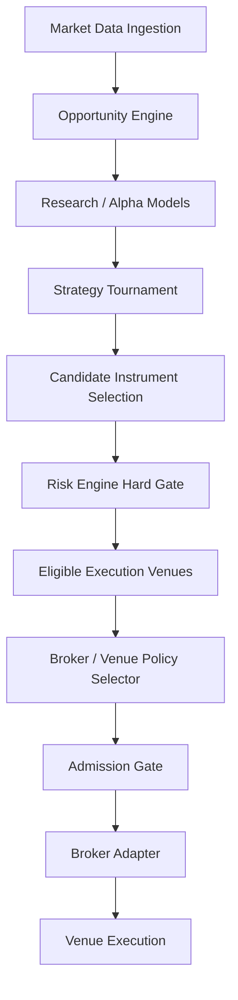

# ACASH — Multi-Broker & Multi-Asset Architecture Decision (ADR-021)

**Document:** `docs/architecture/multi_broker_multi_asset_decision.md`  
**Related ADR:** `ADR-021` in [`docs/DECISIONS.md`](../DECISIONS.md)  
**Status:** Approved Architecture Decision (Documentation Only — Zero Production Modification)  
**Scope:** Architecture & Design Specification  
**Current Phase Baseline:** Phase 13 (Live Small Capital Deployment Preparation — Gate A Active)  
**Date:** 2026-09-04  

---

## 1. Executive Summary & Context

ACASH is an autonomous, quantitative trading infrastructure designed around mathematical rigor, sovereign risk controls, fail-closed boundaries, and authoritative multi-dimensional reconciliation.

A fundamental design goal of ACASH is to prevent architectural coupling to any single broker, trading technology, or asset class:
$$\boxed{\mathbf{ACASH\ Core} \neq \mathbf{Forex\ Bot} \quad \land \quad \mathbf{ACASH\ Core} \neq \mathbf{Broker\ Client}}$$

The broker is strictly an **Execution Venue**. The opportunity universe, mathematical modeling, alpha generation, risk bounds, portfolio state, and ledger authority belong exclusively to **ACASH Core**.

---

## 2. Core Architectural Principles

### 2.1 Asset-Class Agnostic Core
ACASH Core must **never** become coupled to the asset classes or instruments supported by the first broker that is integrated:
- **Pepperstone + MT5 $\neq$ ACASH is a Forex-only system.** MetaTrader 5 with Pepperstone is an initial external execution venue candidate, not an architectural boundary on ACASH asset scope.
- **Alpaca $\neq$ ACASH is an equities-only system.** Alpaca is an existing integration and future candidate for US Equities / ETFs, not a constraint on ACASH capabilities.

### 2.2 End-to-End Operational Lifecycle
In normal operations, the autonomous lifecycle follows a strict forward-directed sequence:

```
Market Data / Feeds
        │
        ▼
Opportunity Discovery (Market Scanner / Opportunity Engine)
        │
        ▼
Validation (Data Quality / Statistical Robustness / PBO / DSR)
        │
        ▼
Research / Alpha Generation
        │
        ▼
Strategy Tournament (Cross-Validation / Model Selection)
        │
        ▼
Risk Engine (Hard Deterministic Non-Negotiable Gate)
        │
        ▼
Admission (Cryptographic Multi-Gate Authority Check)
        │
        ▼
Instrument & Execution Venue Routing (Policy-Driven Deterministic Selector)
        │
        ▼
Broker Adapter (Canonical Normalization & Lineage Sealing)
        │
        ▼
Execution Venue (Physical Market Order / Resting Placement)
        │
        ▼
Real-Time Telemetry & Monitoring (SLA / Drift Tracking)
        │
        ▼
6-Dimensional Reconciliation (Balance, Equity, Margin, Positions, Orders, Deals)
        │
        ▼
Portfolio State & Performance Attribution
```

### 2.3 Separation of Human Governance vs Operational Automation
ACASH automates standard trading and execution workflows. Human involvement is strictly maintained at foundational governance boundaries:
- Capital allocation authorizations (e.g. Gate B multi-sig sign-off)
- Sovereign Risk Policy calibration and mandate adjustments
- Cryptographic quorum resets of the Sovereign Kill Switch
- Emergency manual interventions and post-incident operational recovery approvals

---

## 3. Opportunity Discovery Independence

### 3.1 Principle of Discovery Decoupling
The long-term architecture strictly separates opportunity evaluation from broker connectivity.

The Opportunity Engine **must never** ask:
$$\text{“Which broker do I have connected?”} \implies \text{Restrict opportunity universe to that broker}$$

Instead, the Opportunity Engine operates under an unbiased, top-down discovery sequence:

```
1. "Which opportunities exist across global market data?"
                     ↓
2. "Which instruments are mathematically and economically eligible?"
                     ↓
3. "Which execution venues support this instrument and execution policy?"
                     ↓
4. "Which venue should ACASH allocate capital to and dispatch through?"
```



### 3.2 Multi-Asset Horizon
Future opportunity discovery is architecturally designed to potentially encompass multiple asset classes, contingent upon active data pipelines, alpha models, risk parameters, and execution venue support:
- Foreign Exchange (FX Spot / Forward)
- US Equities (NMS Equities)
- Exchange Traded Funds (ETFs)
- Futures (Commodities, Index, Interest Rates)
- Options (Equity, Index Derivatives)
- Digital Assets / Crypto

> [!IMPORTANT]
> This list defines an **architectural direction**, not a claim that every asset class is currently implemented or tradeable. ACASH governance strictly forbids claiming support for an asset class until the repository has canonical data contracts, empirical validation, risk policies, and verified execution adapters in place.

---

## 4. Instrument & Venue Routing Architecture

The long-term system conceptually introduces a deterministic, auditable, policy-driven **Instrument & Venue Routing Layer** positioned between Risk/Admission and Broker Adapters:

```
                         ┌─────────────────────────┐
                         │       ACASH CORE        │
                         │                         │
                         │ Opportunity Discovery   │
                         │ Research / Alpha        │
                         │ Strategy Tournament     │
                         │ Risk Engine             │
                         │ Portfolio Authority     │
                         │ 6-D Reconciliation      │
                         │ Sovereign Kill Switch   │
                         │ Admission Gate          │
                         └────────────┬────────────┘
                                      │
                         Instrument / Venue Routing
                                      │
                         ┌────────────┴────────────┐
                         │                         │
                  Eligible Venues             Capital /
                  for Instrument              Risk Policy
                         │
          ┌──────────────┼──────────────────┐
          │              │                  │
          ▼              ▼                  ▼
     MT5 Adapter    Alpaca Adapter    OANDA Adapter
          │              │                  │
          ▼              ▼                  ▼
     MT5 Broker        Alpaca             OANDA

                    Future:
                       │
                       ▼
                  IBKR Adapter
```

### 4.1 Routing Examples by Instrument Class
- **Equity Example:**
  $$\text{AAPL} \to \text{US Equity} \to \text{Eligible: [Alpaca, IBKR]} \to \text{Venue Policy Selection} \to \text{Alpaca Adapter} \to \text{Execution}$$
- **Foreign Exchange Example:**
  $$\text{EURUSD} \to \text{FX} \to \text{Eligible: [MT5/Pepperstone, OANDA]} \to \text{Venue Policy Selection} \to \text{MT5 Adapter} \to \text{Execution}$$

### 4.2 Routing Invariants
The Instrument & Venue Routing Layer must satisfy:
1. **Deterministic:** Given identical market state, risk budget, and venue health, routing decisions must be bitwise reproducible.
2. **Auditable:** Every routing choice records cryptographic provenance in the execution manifest.
3. **Capability-Aware:** Evaluates venue-specific minimum lot sizes, tick steps, execution modes (FOK/IOC), and session hours.
4. **Policy-Driven:** Honors venue counterparty risk limits and fee structures.

---

## 5. Broker Priority & Integration Roadmap

```
┌─────────────────────────────────────────────────────────────────────────────────────────────┐
│ 1. MetaQuotes MT5 Demo                                                                      │
│    Role: Active Development & Phase 13 Gate A Certification Baseline                        │
├─────────────────────────────────────────────────────────────────────────────────────────────┤
│ 2. Pepperstone + MT5                                                                        │
│    Role: Primary External MT5 Execution Venue Candidate                                    │
├─────────────────────────────────────────────────────────────────────────────────────────────┤
│ 3. Alpaca                                                                                   │
│    Role: Existing Integration / Testing + Future US Equities & ETF Execution Candidate       │
├─────────────────────────────────────────────────────────────────────────────────────────────┤
│ 4. OANDA API (REST v20)                                                                     │
│    Role: Secondary Direct-API Native FX Execution Candidate                                 │
├─────────────────────────────────────────────────────────────────────────────────────────────┤
│ 5. Interactive Brokers (IBKR Client Portal / TWS API)                                       │
│    Role: Future Multi-Asset Execution Candidate (US Stocks, ETFs, Futures, Options)         │
├─────────────────────────────────────────────────────────────────────────────────────────────┤
│ 6. Multiple Simultaneous Live Brokers                                                       │
│    Role: STRICTLY NOT APPROVED at current stage                                             │
└─────────────────────────────────────────────────────────────────────────────────────────────┘
```

### 5.1 Primary External MT5 Candidate — Pepperstone + MT5
- **Purpose:**
  - First external retail MT5 execution-venue candidate.
  - Validates that the ACASH MT5 abstraction layer operates robustly beyond default MetaQuotes demo server infrastructure.
  - Confirms broker-observed order lifecycles, fill reporting, and 6-D reconciliation against an external institutional retail venue.
- **Critical Boundary:** Pepperstone is an MT5 execution venue candidate; it **does not define** ACASH's asset-class scope.
- **Progression Sequence:**
  $$\text{MetaQuotes Demo} \to \text{Gate A Certified} \to \text{Pepperstone Demo} \to \text{Re-Certification} \to \text{Human Review} \to \text{Potential Live}$$

### 5.2 Existing & Future Candidate — Alpaca
- **Role:** Existing Testing Candidate + Future US Equities / ETF Execution Candidate.
- **Status:** Alpaca is **not** discarded or relegated to test-only status. It was the target of Phase 7 paper verification (`SPY`).
- **Production Prerequisite:** Prior to future live production use, the Alpaca integration must be audited against current Phase 12/13 architectural standards:
  - 6-D Reconciliation conformance
  - Fail-closed timeout handling (`UNKNOWN` state semantics)
  - Sovereign Kill Switch hard lockout
  - Paper vs Live physical credential and endpoint isolation

### 5.3 Secondary API Candidate — OANDA
- **Purpose:**
  - Proves ACASH is genuinely broker-agnostic by connecting a direct HTTP REST / streaming API without Windows MT5 terminal mediation.
  - Exercises distinct order/trade/transaction semantics and direct broker-event streams.

### 5.4 Future Multi-Asset Candidate — Interactive Brokers (IBKR)
- **Purpose:**
  - Expands execution reach across global multi-asset domains (US Equities, ETFs, CME Futures, Options).
  - Validates the multi-asset abstraction layer across distinct asset classes within a single institutional broker framework.

---

## 6. Critical Architectural Invariant: Zero Automatic Order Duplication

> [!CAUTION]
> **STRICT INVARIANT: NEVER DUPLICATE OR MIRROR ORDERS ACROSS BROKERS.**
>
> ACASH must **NEVER** be designed to replicate an order intent across all available venues:
> $$\text{ACASH Core} \not\to (\text{Venue}_A\ \text{BUY} \quad \land \quad \text{Venue}_B\ \text{BUY} \quad \land \quad \text{Venue}_C\ \text{BUY})$$

Multi-broker capability is an **Execution-Venue Routing and Capital Allocation** architecture:
1. Strategy generates an order intent for a specific portfolio target.
2. Routing layer selects **one eligible venue** based on asset class, liquidity, and allocated capital budget.
3. Total portfolio exposure remains strictly bounded by the Risk Engine. Exposure must never multiply simply because multiple broker adapters exist.

---

## 7. Canonical Broker Abstraction & Reconciliation Contract

All future broker adapters must strictly adhere to the ACASH sovereign boundary:

```
Authoritative Broker Reality
           │
           ▼
     Broker Adapter
           │ (Canonical Normalization — Zero Synthetic Fills)
           ▼
    ACASH Reality State
           │
           ▼
  6-D Reconciliation Engine
  (Balance, Equity, Margin, Positions, Resting Orders, Historical Deals)
           │
           ▼
    Sovereign Shadow Ledger
           │
           ▼
   Safety & Portfolio State
```

### Invariants for All Adapters:
1. **Zero Lifecycle Authority:** Adapters only emit raw observations (`BrokerObservation`). The adapter never transitions order lifecycle state autonomously.
2. **Fail-Closed Startup:** Adapters instantiate in `DEGRADED` state with `is_reconciled=False`.
3. **Absorbing BLOCKED:** If 6-D reconciliation detects unresolvable discrepancies or safety violations, the adapter transitions to `BLOCKED`. `BLOCKED` cannot be bypassed by health checks.
4. **Zero Synthetic Events:** Adapters never fabricate fills, synthetic intent IDs, or fake order executions to mask gaps.
5. **Traceable Provenance:** Every broker-assigned ticket, deal ID, and execution timestamp is preserved and cryptographically bound to the originating ACASH `intent_id`.

---

## 8. Current Operational Phase & Safety Lockouts

At the time of this decision:
- **Active Phase:** Phase 13 — Live Small Capital Deployment Preparation.
- **Active Certification Baseline:** MetaTrader 5 Demo broker connection (`112040157`).
- **Live Capital Authority:** **$0.00 (STRICTLY HARD-LOCKED)**.
- **Execution Rule:** This document records future architectural strategy only. Zero broker adapters (Pepperstone, OANDA, IBKR) are implemented or activated in this task. Zero source code changes in `src/` are authorized.
