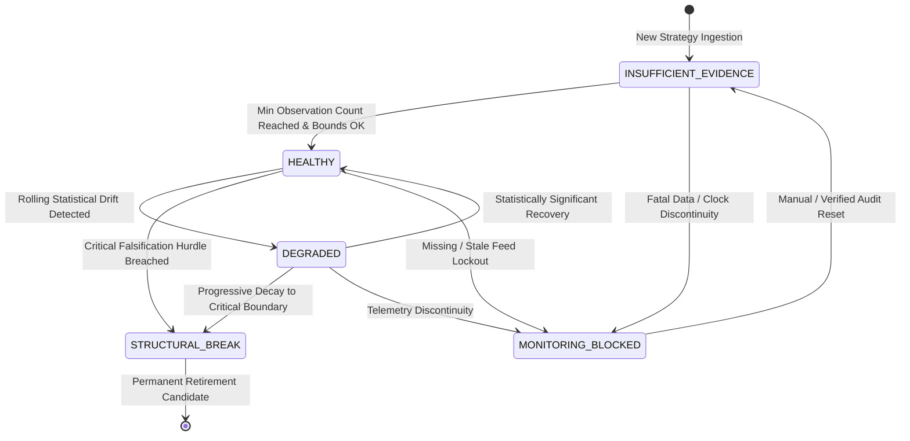

# Phase 11 Canonical Contract Specification v1.0
## Online Strategy Drift Detection & Execution Reality Attribution

> **Document:** `docs/phase11/contract_specification.md`  
> **Status:** CONTRACT SPECIFICATION (v1.0 DRAFT)  
> **Baseline Commit:** `eb06b84` (`HEAD == origin/main`, 904 passed tests, MyPy clean)  
> **Frozen Baselines:** Phase 7 (Frozen), Phase 8 (`e6f1d04`), Phase 8.5 (`9ce1365`), Phase 9 (`6bd40d8`), Phase 10 (`3955bf6`)  
> **Authority:** `AGENTS.md` (Zero Unverified Claims, Strict Fail-Closed, Separation of Concerns)

---

## 1. Executive Summary & Sovereign Decoupling Matrix

$$\boxed{\mathbf{Research\ (8.5)} \neq \mathbf{Forward\ Monitoring\ (11)} \neq \mathbf{Allocation\ (8)} \neq \mathbf{Supervisor\ (10)} \neq \mathbf{Risk\ (9)} \neq \mathbf{Execution\ (7)} \neq \mathbf{Broker}}$$

Phase 11 introduces the **Online Evidence Monitoring & Execution Reality Attribution Engine** for ACASH. Operating as an independent observational plane, Phase 11 continuously evaluates forward execution performance against historical statistical assertions without altering historical research facts or claiming sovereign allocation authority.

```
                              ACASH SOVEREIGN AUTHORITY MATRIX
┌───────────────────────┬───────────────────────────────────┬──────────────────────────────────────────┐
│ Phase Layer           │ Sovereign Authority               │ Non-Authority / Strictly Prohibited     │
├───────────────────────┼───────────────────────────────────┼──────────────────────────────────────────┤
│ Phase 8.5 (Research)  │ Historical Research Qualification │ Forward Monitoring, Trading Authority    │
│ Phase 11 (Monitoring) │ Forward Drift & Cost Attribution  │ Historical Mutation, Allocation Overwrite│
│ Phase 8 (Allocation)  │ Portfolio Weights & Governance    │ Execution, Sovereign Risk Veto           │
│ Phase 10 (Supervisor) │ 5-Stage Pulse Lifecycle Dispatch  │ Alpha Calculation, Direct Broker Wire    │
│ Phase 9 (Risk)        │ Deterministic Veto & Kill Switch  │ Strategy Search, Broker Execution        │
│ Phase 7 (Execution)   │ Broker Adapter & Admission Guard  │ Research Qualification, Capital Sizing   │
└───────────────────────┴───────────────────────────────────┴──────────────────────────────────────────┘
```

---

## 2. Core Architectural Invariants

### Invariant 1: Historical Qualification $\neq$ Current Forward Health
$$\boxed{\mathbf{AlphaQualificationDossier}_{\text{historical}} \neq \mathbf{ForwardStrategyHealth}_{\text{current}}}$$
- Phase 8.5 qualification is an immutable historical record certifying that a strategy passed rigorous econometric hurdles on in-sample and out-of-sample research datasets.
- Forward performance degradation under paper or live execution does **not** rewrite historical research dossiers.
- Phase 11 owns an independent **Forward Health State Machine** (`ForwardHealthState`).

### Invariant 2: Metric Calculation $\neq$ Evidence Detection $\neq$ Governance Action
$$\boxed{\mathbf{Statistical\ Metric} \longrightarrow \mathbf{Evidence\ Detection\ (Drift)} \longrightarrow \mathbf{Governance\ Recommendation}}$$
- Metric calculation computes rolling statistics (Sharpe, Volatility, IC decay, t-stat decay).
- Evidence detection determines if configured statistical bounds have been breached.
- Governance recommendation produces actionable recommendations (`NO_ACTION`, `DEGRADED_WARNING`, `EXCLUDE_FROM_TOURNAMENT`, `RETIREMENT_RECOMMENDED`) based on explicit policy configs.

### Invariant 3: Empirical Cost Evidence $\neq$ Allocation Policy Direct Overwrite
$$\boxed{\mathbf{ExecutionCostEvidence}\ (\text{Phase 11}) \nRightarrow \text{Direct Parameter Mutation in Phase 8}}$$
- Phase 11 measures realized execution friction (spread drag, slippage, commission, timing drag).
- It emits versioned `ExecutionCostEvidence` cryptographic DTOs.
- Phase 8 allocation models consume versioned, approved friction inputs through explicit governance interfaces; Phase 11 never silently mutates Phase 8 configuration.

### Invariant 4: Zero Direct Broker Wire Access
$$\boxed{\mathbf{Phase\ 11} \nRightarrow \text{Broker Sockets / Order Wires / Live Execution Access}}$$
- Phase 11 has **0 broker socket connections** and **0 order submission methods**.
- It ingests read-only execution events from Phase 7 (`ExecutionManifest`, `OrderIntent`).

---

## 3. Track A: Strategy Forward Drift & Decay Monitoring Contract

### A. Forward Health State Machine



#### States:
1. `INSUFFICIENT_EVIDENCE`: Observation count $N < N_{\text{min}}$ required for rolling statistical significance.
2. `HEALTHY`: $N \ge N_{\text{min}}$ and all rolling metrics fall within configured governance tolerances.
3. `DEGRADED`: Statistically significant performance decay detected (e.g., rolling Sharpe drop $> \Delta_{\text{sharpe}}$, IC decay slope $< \theta_{\text{ic}}$).
4. `STRUCTURAL_BREAK`: Critical falsification threshold breached (e.g., max drawdown $> \text{DD}_{\text{max}}$, cumulative return $< \text{Hurdle}_{\text{min}}$).
5. `MONITORING_BLOCKED`: Observation sequence missing, corrupted, or inverted in time.

---

### B. Track A Domain Schemas

#### 1. `ForwardObservation` (Atomic Daily/Bar Observation)
```python
class ForwardObservation(BaseModel):
    """Immutable single-period forward performance observation for an active strategy."""
    model_config = ConfigDict(frozen=True, extra="forbid")

    observation_id: str                      # Unique deterministic SHA-256 identifier
    strategy_id: str                         # Originating strategy identifier
    dossier_digest: str                      # Phase 8.5 qualification dossier reference
    as_of_utc: datetime                      # Discrete evaluation timestamp
    wall_clock_utc: datetime                 # Recording NTP timestamp
    
    realized_return: Decimal                 # Actual period return (net of execution drag)
    expected_return: Optional[Decimal]       # Model expected signal return (if emitted)
    benchmark_return: Decimal                # Neutral market/cash benchmark return
    gross_pnl_usd: Decimal                   # Realized gross PnL
    net_pnl_usd: Decimal                     # Realized net PnL after friction
    turnover_ratio: Decimal                  # Portfolio weight turnover in period
    
    observation_sequence: int                # Monotonic sequence counter (0, 1, 2, ...)
    observation_digest: str                  # Canonical SHA-256 digest
```

#### 2. `ForwardWindowMetrics` (Rolling Econometric Decomposition)
```python
class ForwardWindowMetrics(BaseModel):
    """Deterministically calculated rolling window econometric metrics."""
    model_config = ConfigDict(frozen=True, extra="forbid")

    window_size: int                         # Number of observations in rolling window
    observation_count: int                   # Effective valid observations
    
    mean_realized_return_annualized: Decimal # Annualized arithmetic return
    realized_volatility_annualized: Decimal  # Annualized standard deviation
    realized_sharpe_ratio: Decimal           # Annualized Sharpe ratio (zero-risk floor)
    max_drawdown: Decimal                    # Peak-to-trough drawdown in window [0, 1]
    hit_rate: Decimal                        # Fraction of positive return periods [0, 1]
    
    # Statistical Decay Metrics
    tracking_error_annualized: Decimal       # Deviation from expected return stream
    information_coefficient: Optional[Decimal] # Correlation(signal, forward_return)
    ic_decay_slope: Optional[Decimal]        # Linear slope of rolling IC over time
    t_stat_decay: Decimal                    # Student's t-statistic of excess returns
    expected_vs_realized_divergence_bps: Decimal # Return drag vs research expectation
```

#### 3. `ForwardHealthPolicy` (Configurable Governance Thresholds)
```python
class ForwardHealthPolicy(BaseModel):
    """Governance-controlled statistical drift and falsification thresholds."""
    model_config = ConfigDict(frozen=True, extra="forbid")

    policy_id: str
    min_observations: int = Field(default=30, ge=10)
    rolling_window_size: int = Field(default=60, ge=20)
    
    # Degradation Boundaries (Configurable Policy, NOT hardcoded math constants)
    max_allowed_drawdown: Decimal = Field(default=Decimal("0.15"))
    min_acceptable_sharpe: Decimal = Field(default=Decimal("0.50"))
    max_sharpe_decay_pct: Decimal = Field(default=Decimal("0.50"))     # 50% drop from research Sharpe
    min_acceptable_hit_rate: Decimal = Field(default=Decimal("0.45"))
    max_ic_decay_slope: Decimal = Field(default=Decimal("-0.05"))      # Max allowable negative slope
    min_t_stat_threshold: Decimal = Field(default=Decimal("1.65"))     # 10% one-tailed significance
    
    policy_digest: str
```

#### 4. `StrategyForwardDriftEvidence` (Cryptographic Forensic DTO)
```python
class StrategyForwardDriftEvidence(BaseModel):
    """Forensic evidence document containing forward health status and drift signals."""
    model_config = ConfigDict(frozen=True, extra="forbid")

    evidence_id: str
    strategy_id: str
    dossier_digest: str                      # Proof of historical qualification
    as_of_utc: datetime
    wall_clock_utc: datetime
    
    health_state: ForwardHealthState
    governance_verdict: ForwardHealthVerdict
    metrics: ForwardWindowMetrics
    policy_digest: str
    
    drift_flags: Tuple[str, ...]             # Set of triggered degradation reasons
    is_tournament_eligible: bool             # True only if HEALTHY or INSUFFICIENT_EVIDENCE
    evidence_digest: str                     # SHA-256 canonical digest
```

---

## 4. Track B: Execution Reality Attribution Contract

### A. Execution Reality Pipeline

```
Phase 7 Execution Coordinator
           │
           ▼
[ExecutionManifest / OrderIntent]
           │
           ▼
ExecutionObservation (Atomic Fill Record)
           │
           ▼
RealizedExecutionDrag (Decomposed Bps)
  ├── Spread Drag (Mid vs Quoted)
  ├── Slippage Drag (Arrival vs Fill)
  ├── Commission & Fee Drag
  └── Latency / Timing Drag
           │
           ▼
ExecutionCostEvidence (Aggregated Empirical Distribution)
           │
           ▼
Phase 8 Governance Review (Versioned Friction Parameter Input)
```

---

### B. Track B Domain Schemas

#### 1. `ExecutionObservation` (Ingested from Phase 7 `ExecutionManifest`)
```python
class ExecutionObservation(BaseModel):
    """Normalized execution observation record ingested from Phase 7 ExecutionManifest."""
    model_config = ConfigDict(frozen=True, extra="forbid")

    observation_id: str
    execution_id: str                        # Linked Phase 7 ExecutionManifest ID
    intent_id: str                           # Linked Phase 7 OrderIntent ID
    strategy_id: str
    venue: str                               # Venue identifier (e.g., 'ALPACA_PAPER')
    symbol: str
    order_side: str                          # 'BUY' | 'SELL'
    
    decision_timestamp_utc: datetime         # Moment OrderIntent was generated
    submission_timestamp_utc: datetime       # Moment packet sent to broker socket
    fill_timestamp_utc: datetime             # Broker observed execution timestamp
    
    requested_qty: Decimal
    filled_qty: Decimal
    
    decision_mid_price: Decimal              # Benchmark mid-price at decision time
    arrival_price: Decimal                   # Quoted price at broker receipt
    executed_fill_price: Decimal             # Volume-weighted average fill price
    commission_fee_usd: Decimal              # Total broker & exchange fees paid
    rebate_usd: Decimal                      # Total maker rebates received
    
    network_latency_ms: Optional[float]
    execution_digest: str
```

#### 2. `RealizedExecutionDrag` (Granular Decomposed Costs)
```python
class RealizedExecutionDrag(BaseModel):
    """Decomposed basis point drag attributed to discrete execution friction components."""
    model_config = ConfigDict(frozen=True, extra="forbid")

    observation_id: str
    symbol: str
    
    spread_drag_bps: Decimal                 # Cost paid across bid/ask spread
    slippage_drag_bps: Decimal               # Adverse market movement between arrival and fill
    timing_latency_drag_bps: Decimal         # Price drift between decision and socket dispatch
    commission_fee_bps: Decimal              # Broker/exchange fees in basis points
    rebate_benefit_bps: Decimal              # Maker rebate reduction in basis points
    
    total_realized_drag_bps: Decimal         # Sum(spread + slippage + timing + fee - rebate)
    expected_vs_realized_drag_bps: Decimal   # Divergence from model backtest friction
```

#### 3. `ExecutionCostEvidence` (Forensic Empirical Friction Document)
```python
class ExecutionCostEvidence(BaseModel):
    """Aggregated empirical execution cost distribution for an asset/venue."""
    model_config = ConfigDict(frozen=True, extra="forbid")

    evidence_id: str
    venue: str
    symbol: str
    sample_window_days: int
    fill_count: int                          # Number of executed orders in sample
    total_notional_traded_usd: Decimal
    
    mean_drag_bps: Decimal                   # Empirical mean realized drag
    median_drag_bps: Decimal                 # Empirical median realized drag
    p95_tail_drag_bps: Decimal               # 95th percentile worst-case execution drag
    std_drag_bps: Decimal                    # Drag standard deviation
    
    mean_spread_bps: Decimal
    mean_slippage_bps: Decimal
    mean_commission_bps: Decimal
    mean_latency_ms: float
    
    calculated_at_utc: datetime
    evidence_digest: str                     # SHA-256 canonical digest
```

---

## 5. Cross-Phase Interaction & Authority Seam Matrix

| Interacting Phases | Data Flow | Authority Owner | Invariant Preserved |
| :--- | :--- | :--- | :--- |
| **Phase 8.5 $\to$ Phase 11** | Ingest `AlphaQualificationDossier` and research metrics. | **Phase 8.5** | Phase 11 CANNOT mutate historical dossiers or revoke historical research status. |
| **Phase 7 $\to$ Phase 11** | Ingest `ExecutionManifest` and broker fill telemetry. | **Phase 7** | Phase 11 CANNOT place orders or modify broker adapters. |
| **Phase 11 $\to$ Phase 10** | Export `StrategyForwardDriftEvidence` for Stage 2 Census filtering. | **Phase 10** | Phase 10 Supervisor uses forward health to exclude degraded alphas from tournament. |
| **Phase 11 $\to$ Phase 8** | Export `ExecutionCostEvidence` as versioned governance input. | **Phase 8** | Phase 8 retains sole authority over portfolio optimizer rebalance penalties. |
| **Phase 11 $\to$ Phase 9** | Informational telemetry only. | **Phase 9** | Phase 9 retains absolute sovereign risk veto and kill-switch control. |

---

## 6. Dual-Clock & Idempotency Rules

1. **Temporal Separation:**
   $$\boxed{\mathbf{as\_of\_utc} \neq \mathbf{wall\_clock\_utc}}$$
   - All rolling econometric statistics and window indices operate strictly on `as_of_utc`.
   - Telemetry latency, queue delays, and disk persistence operate on `wall_clock_utc`.
2. **Idempotent Observation Ingestion:**
   $$\text{Ingest}(\text{Observation}_k) \land \text{observation\_id} \in \text{ObservedSet} \implies \text{DataContractError("DUPLICATE\_OBSERVATION")}$$
3. **Monotonic Sequence Enforcement:**
   - Observations for a strategy must arrive with strictly increasing sequence numbers: $\text{Seq}[k] = \text{Seq}[k-1] + 1$.
   - Out-of-order or inverted timestamps fail closed immediately.

---

## 7. Unsupported / Deferred Capabilities

The following capabilities are explicitly identified as **unsupported** in Phase 11 and deferred to future phases:
1. **Multi-Venue Execution Aggregation:** Pinned exclusively to single-venue execution (`ALPACA_PAPER`).
2. **Dynamic Live Capital Allocation:** Phase 11 is strictly paper/forward monitoring ($0.00 capital authority).
3. **Prometheus / OpenTelemetry Daemon Streaming:** Telemetry is persisted via canonical JSON Lines ledgers; daemon streaming dashboards are deferred.
4. **Automatic Policy Optimization:** Thresholds are explicit governance configurations; no machine learning is used to tune falsification hurdles.
