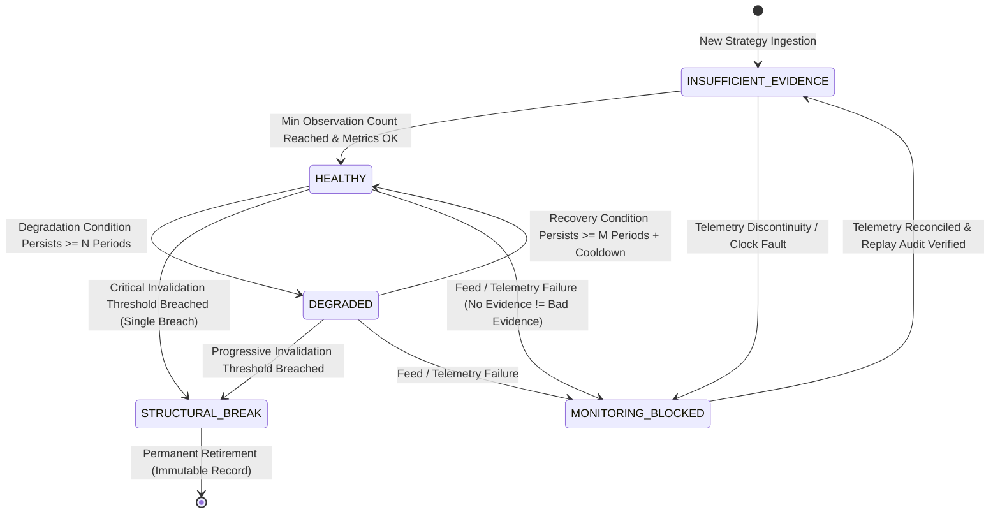

# Phase 11 Canonical Contract Specification v1.1
## Online Strategy Drift Detection & Execution Reality Attribution

> **Document:** `docs/phase11/contract_specification.md`  
> **Status:** CONTRACT SPECIFICATION (v1.1 REFINED DRAFT - TARGETED CONTRACT REFINEMENT)  
> **Baseline Commit:** `6f084a9` (`HEAD == origin/main`, 904 collected tests, MyPy clean)  
> **Frozen Baselines:** Phase 7 (Frozen), Phase 8 (`e6f1d04`), Phase 8.5 (`9ce1365`), Phase 9 (`6bd40d8`), Phase 10 (`3955bf6`)  
> **Authority:** `AGENTS.md` (Zero Unverified Claims, Strict Fail-Closed, Separation of Concerns, Evidence $\neq$ Policy $\neq$ Decision)

---

## 1. Executive Summary & Sovereign Decoupling Matrix

$$\boxed{\mathbf{Research\ (8.5)} \neq \mathbf{Forward\ Monitoring\ (11)} \neq \mathbf{Allocation\ (8)} \neq \mathbf{Supervisor\ (10)} \neq \mathbf{Risk\ (9)} \neq \mathbf{Execution\ (7)} \neq \mathbf{Broker}}$$

Phase 11 introduces the **Online Evidence Monitoring & Execution Reality Attribution Engine** for ACASH. Operating as a strictly independent observational and evidence-generating plane, Phase 11 continuously evaluates forward execution performance against historical statistical assertions without altering historical research facts, mutating allocation parameters, or claiming operational execution authority.

```
                              ACASH SOVEREIGN AUTHORITY MATRIX
┌───────────────────────┬───────────────────────────────────┬──────────────────────────────────────────┐
│ Phase Layer           │ Sovereign Authority               │ Non-Authority / Strictly Prohibited     │
├───────────────────────┼───────────────────────────────────┼──────────────────────────────────────────┤
│ Phase 8.5 (Research)  │ Historical Research Qualification │ Forward Monitoring, Live Trading         │
│ Phase 11 (Monitoring) │ Forward Drift & Cost Attribution  │ Historical Mutation, Allocation Overwrite│
│                       │ (Evidence & Recommendation Only)  │ Direct Strategy Exclusion, Broker Wire   │
│ Phase 8 (Allocation)  │ Portfolio Weights & Governance    │ Execution Wires, Sovereign Risk Veto     │
│ Phase 10 (Supervisor) │ 5-Stage Pulse Lifecycle Dispatch  │ Alpha Calculation, Direct Broker Wire    │
│ Phase 9 (Risk)        │ Deterministic Veto & Kill Switch  │ Strategy Search, Broker Execution        │
│ Phase 7 (Execution)   │ Broker Adapter & Admission Guard  │ Research Qualification, Capital Sizing   │
└───────────────────────┴───────────────────────────────────┴──────────────────────────────────────────┘
```

---

## 2. Core Architectural Invariants

### Invariant 1: Historical Qualification $\neq$ Current Forward Health
$$\boxed{\mathbf{AlphaQualificationDossier}_{\text{historical}} \neq \mathbf{ForwardStrategyHealth}_{\text{current}}}$$
- Phase 8.5 qualification is an immutable historical record certifying that a strategy passed rigorous econometric hurdles on historical research datasets.
- Forward performance decay or market regime drift under paper or live execution does **never** rewrite, revoke, or mutate historical research dossiers (`AlphaQualificationDossier`).
- Phase 11 owns an independent **Forward Health State Machine** (`ForwardHealthState`) and forensic evidence records (`StrategyForwardDriftEvidence`).

### Invariant 2: Decoupled Authority Funnel: Calculation $\neq$ Detection $\neq$ Evidence $\neq$ Recommendation $\neq$ Decision $\neq$ Consequence
$$\boxed{\mathbf{Metric\ Calculation} \longrightarrow \mathbf{Detection} \longrightarrow \mathbf{Evidence} \longrightarrow \mathbf{Recommendation} \longrightarrow \mathbf{Governance\ Decision} \longrightarrow \mathbf{Eligibility\ Consequence}}$$
- **Metric Calculation:** Computes deterministic rolling econometric estimators (Sharpe, Volatility, IC decay, t-stat decay).
- **Evidence Detection:** Evaluates whether rolling metrics cross configured statistical boundaries.
- **Evidence DTO:** Packages observed empirical performance and drift indicators into immutable, cryptographically sealed records (`StrategyForwardDriftEvidence`).
- **Governance Recommendation:** Generates an advisory recommendation (`CONTINUE_UNRESTRICTED`, `DEGRADED_PROBATION`, `RECOMMEND_EXCLUSION`, `RECOMMEND_RETIREMENT`, `MONITORING_BLOCKED_FLAG`).
- **Consuming Governance Decision (Phase 10/8):** Phase 11 **never commands or executes strategy exclusion**. Strategy eligibility for tournament entry is decided solely by the consuming layer (Phase 10 Stage 2 Census) through its own explicit `CensusGovernancePolicy`.
- **Eligibility Consequence:** Strategy state within the active runtime is mutated only by the authoritative supervisor or allocation engine, preserving complete separation of detection from operational authority.

### Invariant 3: No Evidence $\neq$ Negative Evidence (Monitoring Integrity $\neq$ Strategy Degradation)
$$\boxed{\mathbf{No\ Evidence} \neq \mathbf{Negative\ Evidence}}$$
- Missing, delayed, stale, corrupt, out-of-order, or clock-inconsistent observations represent **monitoring and data telemetry failures**, not evidence of alpha degradation.
- Telemetry or feed disruptions transition the monitoring state machine to `MONITORING_BLOCKED`.
- Ingestion failures or sequence gaps fail closed immediately via `DataContractError`. They must **never** be silently converted into zero returns, negative returns, artificial drawdown, or degraded alpha status.

### Invariant 4: Separation of Realized Execution Economics from Research Alpha Validity
$$\boxed{\mathbf{Realized\ Net\ Execution\ Drag} \neq \mathbf{Manufactured\ Research\ Alpha}}$$
- Realized execution economics can produce negative net execution drag when maker rebates exceed spread, slippage, and fees:
  $$\text{Net Realized Execution Cost} = \text{Gross Execution Drag} - \text{Maker Rebates}$$
  If $\text{Maker Rebates} > \text{Gross Drag}$, $\text{Net Realized Cost} < 0$. This represents factual economic benefit, not an invalid mathematical state or corrupted data.
- **Phase 8.5 Preserved Principle:** Maker rebates must not manufacture backtested algorithmic alpha. However, Phase 11 measures real-world execution reality and must report true realized costs without applying artificial floors (`max(0.0, drag)`).
- Consuming layers (e.g., Phase 8 Rebalance Planner) may apply versioned conservative governance policies (such as a zero-cost floor for future rebalance penalties) according to their own policy contracts.

### Invariant 5: Empirical Cost Evidence $\neq$ Allocation Policy Overwrite
$$\boxed{\mathbf{ExecutionCostEvidence}\ (\text{Phase 11}) \nRightarrow \text{Direct Parameter Mutation in Phase 8}}$$
- Phase 11 continuously measures realized execution drag and emits versioned, tamper-evident `ExecutionCostEvidence` cryptographic DTOs.
- Phase 8 portfolio optimizers consume approved, versioned friction parameters through explicit governance reviews; Phase 11 has zero direct write access to Phase 8 configurations.

### Invariant 6: Zero Direct Broker Wire Access
$$\boxed{\mathbf{Phase\ 11} \nRightarrow \text{Broker Sockets / Order Wires / Live Execution Access}}$$
- Phase 11 contains **0 broker socket connections**, **0 order submission endpoints**, and **0 account balance write methods**.
- Phase 11 ingests read-only execution events from Phase 7 (`ExecutionManifest`, `OrderIntent`).

---

## 3. Track A: Strategy Forward Drift & Decay Monitoring Contract

### A. Forward Health State Machine & Anti-Whipsaw Hysteresis

To prevent high-frequency state oscillation ("whipsawing") between `HEALTHY` and `DEGRADED`, forward health state transitions are governed by strict **Hysteresis Persistence Windows** and an explicit semantic distinction between temporary degradation and structural invalidation.



#### State Definitions & Semantic Boundaries:
1. `INSUFFICIENT_EVIDENCE`:
   - Number of valid sequential observations $N < N_{\text{min}}$ (where $N_{\text{min}} = \text{policy.min\_observations}$).
   - Rolling econometric metrics cannot be reliably calculated; conservative default priors are maintained.
2. `HEALTHY`:
   - $N \ge N_{\text{min}}$ and all rolling econometric metrics fall within configured governance tolerances.
3. `DEGRADED` (Temporary Deterioration):
   - Performance metrics fall outside degradation bounds, and the degradation condition has persisted for at least $N_{\text{degrade}}$ consecutive observations.
   - Represents temporary factor headwinds, transient adverse regimes, or moderate parameter decay.
   - Reversible: Can transition back to `HEALTHY` only if performance strictly satisfies recovery hurdles for at least $M_{\text{recover}}$ consecutive observations and elapsed cooldown $\ge T_{\text{cooldown}}$.
4. `STRUCTURAL_BREAK` (Structural Invalidation):
   - Critical falsification threshold breached (e.g., maximum allowable drawdown $\text{DD} > \text{policy.critical\_drawdown\_limit}$ or cumulative loss $> \text{policy.critical\_cumulative\_loss\_bps}$).
   - Represents irrecoverable regime invalidation, broken strategy assumptions, or fundamental data leakage failure in research.
   - Irreversible: Transitions strategy to permanent retirement candidate.
5. `MONITORING_BLOCKED` (Data / Telemetry Integrity Fault):
   - Triggered by missing observation sequences, timestamp inversions, corrupted digests, or stale data feeds.
   - **Crucial Boundary:** `MONITORING_BLOCKED` denotes an infrastructure or telemetry failure. It is strictly decoupled from strategy performance and does **not** signify strategy decay.

---

### B. Anti-Whipsaw Hysteresis Governance Contract

Transitions between `HEALTHY` and `DEGRADED` must enforce configurable persistence counts rather than hard-coded magic constants:

$$\text{Transition to DEGRADED} \iff \sum_{t=k-N_{\text{degrade}}+1}^{k} \mathbb{I}(\text{Metric}_t \notin \text{Tolerance}) = N_{\text{degrade}}$$

$$\text{Transition to HEALTHY} \iff \left( \sum_{t=k-M_{\text{recover}}+1}^{k} \mathbb{I}(\text{Metric}_t \in \text{RecoveryBounds}) = M_{\text{recover}} \right) \land (\text{CooldownElapsed} \ge T_{\text{cooldown}})$$

Where:
- $N_{\text{degrade}}$ (`degradation_persistence_n`): Number of consecutive degrading observations required to enter `DEGRADED`.
- $M_{\text{recover}}$ (`recovery_persistence_m`): Number of consecutive healthy observations required to exit `DEGRADED` ($M_{\text{recover}} > N_{\text{degrade}}$ to induce asymmetric hysteresis).
- $T_{\text{cooldown}}$ (`recovery_cooldown_periods`): Minimum observations elapsed since entering `DEGRADED` before recovery evaluation is permitted.

---

### C. Track A Domain Schemas

#### 1. `ForwardObservation` (Atomic Discrete Daily/Bar Observation)
```python
class ForwardObservation(BaseModel):
    """Immutable single-period forward performance observation for an active strategy."""
    model_config = ConfigDict(frozen=True, extra="forbid")

    observation_id: str                      # Unique deterministic SHA-256 identifier
    strategy_id: str                         # Target strategy identifier
    dossier_digest: str                      # Phase 8.5 qualification dossier reference (immutable)
    as_of_utc: datetime                      # Discrete evaluation period timestamp
    wall_clock_utc: datetime                 # Recording NTP timestamp
    
    realized_return: Decimal                 # Actual period return net of realized friction
    expected_return: Optional[Decimal]       # Ex-ante model expected signal return (if emitted)
    benchmark_return: Decimal                # Neutral cash/market benchmark return
    gross_pnl_usd: Decimal                   # Realized gross PnL
    net_pnl_usd: Decimal                     # Realized net PnL
    turnover_ratio: Decimal                  # Portfolio turnover in period [0, 2.0]
    
    observation_sequence: int                # Strictly monotonic sequence counter (0, 1, 2, ...)
    is_telemetry_valid: bool                 # True only if execution feeds passed integrity validation
    observation_digest: str                  # Canonical SHA-256 digest
```

#### 2. `ForwardWindowMetrics` (Rolling Econometric Estimators)
```python
class ForwardWindowMetrics(BaseModel):
    """Deterministically calculated rolling window econometric metrics."""
    model_config = ConfigDict(frozen=True, extra="forbid")

    window_size: int                         # Configured window capacity
    observation_count: int                   # Valid consecutive observations in window
    
    mean_realized_return_annualized: Decimal # Annualized arithmetic return
    realized_volatility_annualized: Decimal  # Annualized sample volatility
    realized_sharpe_ratio: Decimal           # Annualized Sharpe ratio
    max_drawdown: Decimal                    # Peak-to-trough drawdown in window [0, 1]
    hit_rate: Decimal                        # Fraction of positive return periods [0, 1]
    
    # Statistical Decay Estimators
    tracking_error_annualized: Decimal       # Deviation from expected return stream
    information_coefficient: Optional[Decimal] = None # Explicitly deferred (Option B) pending cross-sectional telemetry contract
    ic_decay_slope: Optional[Decimal] = None        # Explicitly deferred (Option B) pending cross-sectional telemetry contract
    t_stat_decay: Decimal                    # Student's t-statistic of excess returns
    expected_vs_realized_divergence_bps: Decimal # Divergence from research baseline expectation
```

#### 3. `ForwardHealthPolicy` (Configurable Governance Thresholds)
```python
class ForwardHealthPolicy(BaseModel):
    """Governance-controlled statistical drift, hysteresis, and falsification thresholds."""
    model_config = ConfigDict(frozen=True, extra="forbid")

    policy_id: str
    min_observations: int = Field(default=30, ge=10)
    rolling_window_size: int = Field(default=60, ge=20)
    
    # Anti-Whipsaw Hysteresis Controls (Configurable Governance Policy, NOT universal constants)
    degradation_persistence_n: int = Field(default=3, ge=1)
    recovery_persistence_m: int = Field(default=10, ge=2)
    recovery_cooldown_periods: int = Field(default=5, ge=0)
    
    # Temporary Degradation Boundaries (Configurable Governance Policy)
    min_acceptable_sharpe: Decimal = Field(default=Decimal("0.50"))
    max_sharpe_decay_pct: Decimal = Field(default=Decimal("0.50"))     # 50% drop from research Sharpe
    min_acceptable_hit_rate: Decimal = Field(default=Decimal("0.45"))
    max_ic_decay_slope: Decimal = Field(default=Decimal("-0.05"))
    min_t_stat_threshold: Decimal = Field(default=Decimal("1.65"))
    
    # Structural Invalidation Boundaries (Configurable Governance Policy)
    critical_drawdown_limit: Decimal = Field(default=Decimal("0.20"))  # Structural break hurdle
    critical_cumulative_loss_bps: Decimal = Field(default=Decimal("2500")) # 25% cumulative loss
    
    policy_digest: str
```

#### 4. `ForwardGovernanceRecommendation` & `StrategyForwardDriftEvidence`
```python
class ForwardGovernanceRecommendation(str, Enum):
    """Explicit advisory recommendations emitted by Phase 11 (Non-authoritative)."""
    CONTINUE_UNRESTRICTED = "CONTINUE_UNRESTRICTED"
    DEGRADED_PROBATION = "DEGRADED_PROBATION"
    RECOMMEND_EXCLUSION = "RECOMMEND_EXCLUSION"
    RECOMMEND_RETIREMENT = "RECOMMEND_RETIREMENT"
    MONITORING_BLOCKED_FLAG = "MONITORING_BLOCKED_FLAG"


class StrategyForwardDriftEvidence(BaseModel):
    """Forensic evidence document containing forward health status and governance recommendations."""
    model_config = ConfigDict(frozen=True, extra="forbid")

    evidence_id: str
    strategy_id: str
    dossier_digest: str                      # Proof of historical qualification lineage
    as_of_utc: datetime
    wall_clock_utc: datetime
    
    health_state: ForwardHealthState         # HEALTHY, DEGRADED, STRUCTURAL_BREAK, etc.
    recommendation: ForwardGovernanceRecommendation # Advisory recommendation for consuming governance
    metrics: ForwardWindowMetrics
    policy_digest: str
    
    # Hysteresis Telemetry
    consecutive_degraded_periods: int        # Counter tracking degradation persistence
    consecutive_recovery_periods: int        # Counter tracking recovery persistence
    drift_flags: Tuple[str, ...]             # Explanatory forensic triggers
    
    evidence_digest: str                     # SHA-256 canonical digest
```

---

## 4. Track B: Execution Reality Attribution Contract

### A. Execution Reality Pipeline & Sign Conventions

```
Phase 7 Execution Coordinator
           │
           ▼
[ExecutionManifest / OrderIntent]
           │
           ▼
ExecutionObservation (Atomic Fill Record)
           │
           ▼
RealizedExecutionDrag (Granular Decomposed Costs)
  ├── Spread Drag (>= 0.0 bps)
  ├── Slippage Drag (Signed bps; positive = adverse)
  ├── Timing / Latency Drag (Signed bps; positive = adverse)
  ├── Commission & Fee Drag (>= 0.0 bps)
  ├── Maker Rebate (>= 0.0 bps)
  │
  ├── Gross Execution Drag = Spread + max(0, Slippage) + max(0, Timing) + Fees (>= 0.0 bps)
  └── Net Realized Execution Cost = Gross Drag - Maker Rebates (Signed; may be negative)
           │
           ▼
ExecutionCostEvidence (Aggregated Empirical Distribution + Confidence Metadata)
           │
           ▼
Phase 8 Governance Review (Approved Friction Parameters for Portfolio Rebalance)
```

---

### B. Mathematical Definitions & Sign Conventions

To avoid conflating transit market movement (timing) with broker execution slippage and spread, `ExecutionObservation` ingests discrete price milestones (`decision_mid`, `arrival_mid`, `arrival_bid`, `arrival_ask`, `executed_fill`). The following deterministic formulas and sign conventions are established:

1. **Quoted Spread Drag ($\text{bps}$):**
   Half-spread quoted upon order arrival at the execution venue:
   $$\text{SpreadDrag} = \frac{\text{arrival\_ask\_price} - \text{arrival\_bid\_price}}{2 \cdot \text{arrival\_mid\_price}} \times 10{,}000 \ge 0.0$$

2. **Timing / Pre-Arrival Market Movement Drag ($\text{bps}$):**
   Price drift between decision authorization and venue arrival:
   $$\text{TimingDrag} = \text{SideSign} \times \frac{\text{arrival\_mid\_price} - \text{decision\_mid\_price}}{\text{decision\_mid\_price}} \times 10{,}000$$
   *(Where $\text{SideSign} = +1$ for BUY and $-1$ for SELL. Adverse market movement produces positive drag; favorable drift produces negative drag).*

3. **Execution Slippage Drag ($\text{bps}$):**
   Execution price achieved relative to expected execution quote at arrival:
   $$P_{\text{arrival\_quoted}} = \begin{cases} \text{arrival\_ask\_price} & \text{for BUY} \\ \text{arrival\_bid\_price} & \text{for SELL} \end{cases}$$
   $$\text{SlippageDrag} = \text{SideSign} \times \frac{\text{executed\_fill\_price} - P_{\text{arrival\_quoted}}}{P_{\text{arrival\_quoted}}} \times 10{,}000$$
   *(Measures execution impact and broker slippage beyond the quoted spread at arrival).*

4. **Commission & Exchange Fee Drag ($\text{bps}$):**
   $$\text{FeeDrag} = \frac{\text{TotalFeesUSD}}{\text{FilledNotionalUSD}} \times 10{,}000 \ge 0.0$$

5. **Maker Rebate Benefit ($\text{bps}$):**
   $$\text{RebateBenefit} = \frac{\text{TotalRebateUSD}}{\text{FilledNotionalUSD}} \times 10{,}000 \ge 0.0$$

6. **Gross Execution Drag ($\text{bps}$):**
   $$\text{GrossDrag} = \text{SpreadDrag} + \max(0.0, \text{TimingDrag}) + \max(0.0, \text{SlippageDrag}) + \text{FeeDrag} \ge 0.0$$

7. **Net Realized Execution Cost ($\text{bps}$):**
   $$\text{NetRealizedCost} = \text{GrossDrag} - \text{RebateBenefit}$$
   *(May legitimately be negative if $\text{RebateBenefit} > \text{GrossDrag}$. Represents factual net execution economics).*

---

### C. Track B Domain Schemas

#### 1. `ExecutionObservation` (Ingested from Phase 7 `ExecutionManifest`)
```python
class ExecutionObservation(BaseModel):
    """Normalized atomic fill observation with discrete price milestones ingested from Phase 7."""
    model_config = ConfigDict(frozen=True, extra="forbid")

    observation_id: str
    execution_id: str                        # Linked Phase 7 ExecutionManifest ID
    intent_id: str                           # Linked Phase 7 OrderIntent ID
    strategy_id: str
    venue: str                               # Venue identifier (e.g., 'ALPACA_PAPER')
    symbol: str
    order_side: str                          # 'BUY' | 'SELL'
    
    decision_timestamp_utc: datetime         # Moment OrderIntent was authorized
    arrival_timestamp_utc: datetime          # Moment order arrived at broker socket
    fill_timestamp_utc: datetime             # Broker observed execution timestamp
    
    requested_qty: Decimal
    filled_qty: Decimal
    
    decision_mid_price: Decimal              # Benchmark mid-price at decision authorization
    arrival_mid_price: Decimal               # Benchmark mid-price at broker receipt
    arrival_bid_price: Decimal               # Quoted bid at arrival
    arrival_ask_price: Decimal               # Quoted ask at arrival
    executed_fill_price: Decimal             # Volume-weighted average fill price
    commission_fee_usd: Decimal              # Total broker & exchange fees paid (>= 0.0)
    rebate_usd: Decimal                      # Total maker rebates received (>= 0.0)
    
    network_latency_ms: Optional[float]
    is_partial_fill: bool
    execution_digest: str
```

#### 2. `RealizedExecutionDrag` (Granular Decomposed Costs)
```python
class RealizedExecutionDrag(BaseModel):
    """Decomposed basis point drag attributed to discrete execution friction components."""
    model_config = ConfigDict(frozen=True, extra="forbid")

    observation_id: str
    symbol: str
    
    spread_drag_bps: Decimal                 # Cost paid across bid/ask spread (>= 0.0)
    timing_drag_bps: Decimal                 # Price drift between decision and arrival (Signed)
    slippage_drag_bps: Decimal               # Adverse market impact beyond arrival quote (Signed)
    commission_fee_bps: Decimal              # Broker/exchange fees in basis points (>= 0.0)
    rebate_benefit_bps: Decimal              # Maker rebate reduction in basis points (>= 0.0)
    
    gross_execution_drag_bps: Decimal        # Sum of non-negative friction components (>= 0.0)
    net_realized_execution_cost_bps: Decimal # Gross drag minus rebates (Signed; may be negative)
    expected_vs_realized_drag_bps: Decimal   # Divergence from model backtest friction assumption
```

#### 3. `ExecutionAttributionPolicy` (Configurable Governance Policy for Execution Reality)
```python
class ExecutionAttributionPolicy(BaseModel):
    """Governance-controlled sample size, coverage, and tail reliability thresholds."""
    model_config = ConfigDict(frozen=True, extra="forbid")

    policy_id: str
    sample_window_days: int = Field(default=30, ge=5)
    
    # Reliability Boundaries (Configurable Governance Policy, NOT hardcoded mathematical truth)
    min_reliable_sample_count: int = Field(default=100, ge=10)
    min_reliable_coverage_ratio: Decimal = Field(default=Decimal("0.95"), ge=Decimal("0.50"), le=Decimal("1.00"))
    critical_fail_closed_coverage_ratio: Decimal = Field(default=Decimal("0.80"), ge=Decimal("0.10"))
    
    # Tail Estimation Percentile (Configurable Governance Policy)
    tail_percentile: Decimal = Field(default=Decimal("0.95"), ge=Decimal("0.80"), le=Decimal("0.999"))
    
    policy_digest: str
```

#### 4. `ExecutionCostEvidence` (Aggregated Forensic Friction DTO with Confidence Semantics)
```python
class ExecutionCostEvidence(BaseModel):
    """Aggregated empirical execution cost distribution with explicit sample and confidence metadata."""
    model_config = ConfigDict(frozen=True, extra="forbid")

    evidence_id: str
    venue: str
    symbol: str
    
    # Observation Scope & Coverage Metadata
    sample_window_days: int
    fill_count: int                          # Number of executed fills in sample
    effective_sample_count: Decimal          # Sample count adjusted for temporal clustering
    coverage_ratio: Decimal                  # Fraction of executed orders with valid attribution [0, 1]
    coverage_start_utc: datetime
    coverage_end_utc: datetime
    total_notional_traded_usd: Decimal
    
    # Drag Statistics (Basis Points)
    mean_gross_drag_bps: Decimal             # Empirical mean gross drag
    median_gross_drag_bps: Decimal           # Empirical median gross drag
    p95_gross_drag_bps: Decimal              # 95th percentile worst-case gross drag
    std_gross_drag_bps: Decimal              # Standard deviation of gross drag
    
    mean_net_cost_bps: Decimal               # Empirical mean net cost (can be negative under rebates)
    median_net_cost_bps: Decimal             # Empirical median net cost
    p95_net_cost_bps: Decimal                # 95th percentile net cost
    
    # Uncertainty & Confidence Metadata (Evaluated against ExecutionAttributionPolicy)
    standard_error_bps: Decimal              # Standard error of the mean drag estimate
    confidence_interval_95_half_width_bps: Decimal # 1.96 * standard_error_bps
    is_statistically_reliable: bool          # Evaluated via policy: fill_count >= policy.min_reliable_sample_count
                                             # and coverage_ratio >= policy.min_reliable_coverage_ratio
    
    # Component Averages
    mean_spread_bps: Decimal
    mean_slippage_bps: Decimal
    mean_commission_bps: Decimal
    mean_rebate_bps: Decimal
    mean_latency_ms: float
    
    # Cryptographic Lineage Binding
    policy_id: str
    policy_digest: str
    source_manifest_count: int
    lineage_digest: str                      # Merkle root of constituent execution observation digests
    calculated_at_utc: datetime
    evidence_digest: str                     # SHA-256 canonical digest
```

---

### D. Formal Classification of Numeric Thresholds

To eliminate any ambiguity between universal mathematical truths and configurable policies, all numeric thresholds are strictly classified:

```
┌──────────────────────────────────────┬────────────────────────────────────┬────────────────────────────────────────────────────────┐
│ Classification Level                 │ Parameters / Rules                 │ Authority & Modification Rules                         │
├──────────────────────────────────────┼────────────────────────────────────┼────────────────────────────────────────────────────────┤
│ 1. Mathematical Invariants           │ • NetRealizedCost = Gross - Rebate │ Non-negotiable algebraic identities.                   │
│    (Unbreakable Truths)              │ • SpreadDrag >= 0.0                │ Immutable across all phases.                           │
│                                      │ • GrossDrag >= 0.0                 │ Cannot be overridden by policy.                        │
│                                      │ • Seq[k] = Seq[k-1] + 1            │                                                        │
│                                      │ • as_of_utc != wall_clock_utc      │                                                        │
│                                      │ • No Evidence != Negative Evidence │                                                        │
├──────────────────────────────────────┼────────────────────────────────────┼────────────────────────────────────────────────────────┤
│ 2. Configurable Governance Policies  │ • degradation_persistence_n (3)    │ Configured via ForwardHealthPolicy and                 │
│    (Versioned Governance DTOs)       │ • recovery_persistence_m (10)      │ ExecutionAttributionPolicy. Bound cryptographically     │
│                                      │ • recovery_cooldown_periods (5)    │ by policy_digest. Numbers are sensible defaults,       │
│                                      │ • min_reliable_sample_count (100)  │ NEVER universal constants.                             │
│                                      │ • min_reliable_coverage_ratio (95%)│                                                        │
│                                      │ • critical_fail_closed_cov (80%)   │                                                        │
│                                      │ • critical_drawdown_limit (20%)    │                                                        │
├──────────────────────────────────────┼────────────────────────────────────┼────────────────────────────────────────────────────────┤
│ 3. Illustrative Test Fixtures        │ • Sample returns, fixture feeds    │ Used solely in Red-Team adversarial attack suites      │
│    (Test Suite Only)                 │ • Example trade amounts & fees     │ to verify boundary enforcement.                        │
└──────────────────────────────────────┴────────────────────────────────────┴────────────────────────────────────────────────────────┘
```

---

## 5. Cross-Phase Interaction & Authority Seam Matrix

| Interacting Phases | Data Flow | Authority Owner | Invariant Preserved |
| :--- | :--- | :--- | :--- |
| **Phase 8.5 $\to$ Phase 11** | Ingest `AlphaQualificationDossier` and research baseline metrics. | **Phase 8.5** | Phase 11 CANNOT mutate historical dossiers, revoke research status, or alter in-sample facts. |
| **Phase 7 $\to$ Phase 11** | Ingest `ExecutionManifest` and broker fill telemetry. | **Phase 7** | Phase 11 CANNOT place orders, cancel orders, or modify broker adapters. |
| **Phase 11 $\to$ Phase 10** | Export `StrategyForwardDriftEvidence` and advisory `ForwardGovernanceRecommendation`. | **Phase 10** | Phase 10 Stage 2 Census evaluates its own `CensusGovernancePolicy` to determine strategy tournament eligibility. Phase 11 NEVER commands exclusion. |
| **Phase 11 $\to$ Phase 8** | Export `ExecutionCostEvidence` as versioned friction evidence. | **Phase 8** | Phase 8 retains sole authority over portfolio optimizer rebalance penalties. Phase 11 CANNOT write or mutate Phase 8 configuration. |
| **Phase 11 $\to$ Phase 9** | Informational telemetry and drift flags only. | **Phase 9** | Phase 9 retains absolute sovereign risk veto and kill-switch control. |

---

## 6. Dual-Clock, Stream Scope, & Idempotency Rules

1. **Temporal Separation:**
   $$\boxed{\mathbf{as\_of\_utc} \neq \mathbf{wall\_clock\_utc}}$$
   - All rolling econometric statistics and window indices operate strictly on `as_of_utc`.
   - Telemetry latency, queue delays, and disk persistence operate on `wall_clock_utc`.
2. **Per-Strategy Stream Scope & Duplicate Gating:**
   - **Stream Identity:** Sequence and timestamp monotonicity are scoped strictly **per-strategy**:
     $$\text{Stream Identity} \equiv \text{strategy\_id}$$
     $$\text{Seq}_s[k] = \text{Seq}_s[k-1] + 1 \quad \text{and} \quad t_{\text{as\_of}, s}[k] > t_{\text{as\_of}, s}[k-1]$$
   - **Authoritative Duplicate Key:** Evaluated on Composite Key `(strategy_id, observation_sequence)` AND SHA-256 `observation_id`. Any seen duplicate fails closed with `DataContractError("DUPLICATE_OBSERVATION")`.
3. **Monitoring Lockout Fail-Closed:**
   - When a sequence gap is detected ($\text{Seq}_s[k] \neq \text{Seq}_s[k-1] + 1$) or timestamps are inverted, transition immediately to `MONITORING_BLOCKED`.
   - Never substitute missing periods with zero or fabricated return values (`No Evidence != Negative Evidence`).
4. **Structural Break Drawdown Reference Window:**
   - `ForwardWindowMetrics.max_drawdown` measures peak-to-trough drawdown **within the rolling $W$-period window** (e.g. $W=60$).
   - `policy.critical_drawdown_limit` (triggering `STRUCTURAL_BREAK`) is measured against the **Forward-Monitoring Inception High-Water Mark (HWM)**:
     $$\text{HWM}_{\text{inception}}(t) = \max_{0 \le \tau \le t} \text{CumulativeEquity}_{\text{forward}}(\tau)$$
     $$\text{Drawdown}_{\text{inception}}(t) = \frac{\text{HWM}_{\text{inception}}(t) - \text{CumulativeEquity}_{\text{forward}}(t)}{\text{HWM}_{\text{inception}}(t)}$$
   - A strategy immediately trips `STRUCTURAL_BREAK` when $\text{Drawdown}_{\text{inception}}(t) \ge \text{policy.critical\_drawdown\_limit}$.

---

## 7. Unsupported / Deferred Capabilities

The following capabilities are explicitly identified as **unsupported** in Phase 11 and deferred to future phases:
1. **Multi-Venue Execution Aggregation:** Pinned exclusively to single-venue execution (`ALPACA_PAPER`).
2. **Direct Strategy Exclusion Authority:** Phase 11 generates evidence and recommendations; exclusion decisions are strictly the domain of Phase 10.
3. **Direct Portfolio Optimizer Friction Parameter Write:** Phase 11 generates evidence DTOs; friction parameter adoption is strictly Phase 8 governance.
4. **Dynamic Live Capital Allocation:** Phase 11 is strictly observational ($0.00 capital authority).
5. **Prometheus / OpenTelemetry Daemon Streaming:** Telemetry is persisted via canonical JSON Lines ledgers; daemon streaming dashboards are deferred.
6. **Automatic Policy Optimization:** Thresholds and hysteresis counts are explicit governance configurations; no heuristic machine learning is used to tune falsification hurdles.
