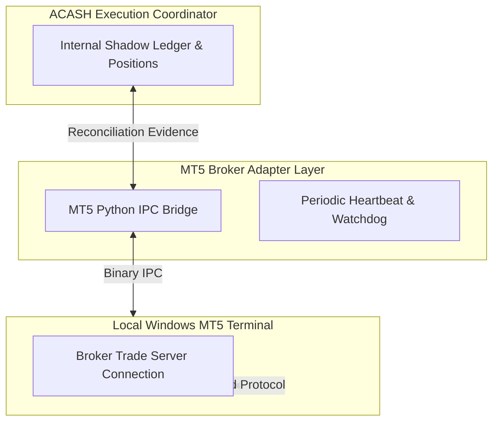

# Phase 12 Architecture & Capability Inventory (Revision 3)
## Multi-Venue Execution Topology, MetaTrader 5 (MT5) Adapter & TradingView Integration

> **Document:** `docs/phase12/source_architectural_inventory.md`  
> **Status:** APPROVED ARCHITECTURAL INVENTORY (Pre-Contract Specification v1.0)  
> **Baseline Commit:** `bca72aa` (`HEAD == origin/main`, 1,020 collected: 1,017 passed, 3 skipped, 0 failed, MyPy clean)  
> **Frozen Baselines:** Phase 7 (Frozen), Phase 8 (`e6f1d04`), Phase 8.5 (`9ce1365`), Phase 9 (`6bd40d8`), Phase 10 (`3955bf6`), Phase 11 (`092a2b1`)  
> **Authority:** `AGENTS.md` (Zero Unverified Claims, Strict Fail-Closed, Sovereign Authority Separation)

---

## 1. Executive Summary & Sovereign Decoupling Matrix

$$\boxed{\mathbf{Research\ (8.5)} \neq \mathbf{Monitoring\ (11)} \neq \mathbf{Allocation\ (8)} \neq \mathbf{Supervisor\ (10)} \neq \mathbf{Risk\ (9)} \neq \mathbf{Execution\ (7/12)} \neq \mathbf{Broker}}$$

Phase 12 expands the sovereign execution plane established in Phase 7 by introducing a **Multi-Venue Execution Topology** with **MetaTrader 5 (MT5) as Execution Adapter #1** and establishing a strict, decoupled boundary for **TradingView as an Optional Auxiliary Ingress / Visualization Interface**.

```
                                      ACASH CORE
                                          │
                             Sovereign Execution Engine
                            (Phase 7 ExecutionCoordinator)
                                          │
                     ┌────────────────────┴────────────────────┐
                     │                                         │
            AlpacaPaperAdapter                          MT5BrokerAdapter
             (Phase 7 Venue)                           (Phase 12 Adapter #1)
                     │                                         │
             Alpaca REST / SSE                              MT5 IPC Bridge
                     │                                         │
             Alpaca Paper Venue                          MT5 Terminal
                                                               │
                                                          Broker Trade Server
```

### Sovereign Non-Negotiable Invariants:
1. **ACASH is the Sole Execution Authority & Source-of-Truth:**
   $$\boxed{\mathbf{ACASH} \equiv \text{Sole Execution Authority} \quad \land \quad \mathbf{BrokerAdapter} \neq \mathbf{StateAuthority}}$$
   - The broker adapter is strictly a **command sink + observation source**.
   - It translates broker reality onto canonical `BrokerRawEvent` observations and **never** mutates state machine transitions directly.
2. **MT5-First Execution Architecture:**
   - Direct, deterministic communication via the official Python IPC bridge (`MetaTrader5`) to the local MT5 terminal.
   - Full support for Orders, Deals, Positions, Margin Accounting, Requotes, Partial Fills, and Broker Reconciliations.
3. **TradingView Decoupled Boundary (Auxiliary Ingress & Visualization Only):**
   - TradingView is **NEVER** an execution authority and **NEVER** sits in the critical execution path.
   - **Strictly Prohibited:** $\text{ACASH} \to \text{TradingView} \to \text{MT5} \to \text{Broker}$.
   - Webhook alerts serve strictly as unvalidated candidate signal inputs that must pass through Research $\to$ Validation $\to$ Tournament $\to$ Risk $\to$ Admission before any order is submitted.
   - ACASH core execution has **zero dependency on TradingView plan tiers**; ACASH maintains its own internal terminal visualization dashboard.

---

## 2. MT5 Execution Lifecycle & Technical Semantics

### A. First-Class Multi-Tier Lifecycle: Order $\longrightarrow$ Deal $\longrightarrow$ Position

MT5 strictly separates requests, executions, and exposures into distinct entities:

```
ACASH OrderIntent (intent_id, intent_digest)
        │
        ▼
MT5 Order / TradeRequest (order_ticket)
        │
        ├───────────────────────────────────────┐
        ▼                                       ▼
  MT5 Deal #1 (deal_ticket_1)             MT5 Deal #2 (deal_ticket_2)
  [Volume: 0.4 Lot, Price: 1.0850]        [Volume: 0.6 Lot, Price: 1.0851]
        │                                       │
        └───────────────────┬───────────────────┘
                            │
                            ▼
                  Position State Snapshot
                 (position_ticket / symbol)
                            │
                            ▼
             ReconciliationEvidence vs ACASH
```

#### Invariant: One OrderIntent $\longrightarrow$ Many Deals
- An `OrderIntent` generates an MT5 order ticket.
- Market execution or sweeping resting liquidity may result in **$0..N$ discrete Deal tickets** (partial fills, multi-level fills).
- `ExecutionManifest` in ACASH natively accumulates all linked `deal_ticket` records to compute exact Volume-Weighted Average Price (VWAP), total realized commissions, and slippage drag.

#### Lineage 9-Tuple Semantics & Nullability Matrix:
To prevent collisions across multi-account, multi-strategy, or concurrent deployments, all execution observations are bound to the 9-tuple:
$$\boxed{(\text{broker\_id}, \text{account\_id}, \text{terminal\_instance\_id}, \text{strategy\_id}, \text{cycle\_id}, \text{intent\_id}, \text{mt5\_order\_ticket}, \text{mt5\_deal\_ticket}, \text{position\_id})}$$

```
┌─────────────────────────────────────────────────────────────────────────────────────────────┐
│                       9-TUPLE LIFECYCLE & NULLABILITY SPECIFICATION                         │
├──────────────────────────┬───────────────────┬─────────────────────────┬────────────────────┤
│ Lifecycle Stage          │ `mt5_order_ticket`│ `mt5_deal_ticket`       │ `position_id`      │
├──────────────────────────┼───────────────────┼─────────────────────────┼────────────────────┤
│ 1. Pre-Submission        │ `None`            │ `None`                  │ `None` / `pos_ref*`│
│ 2. Order Placed/Resting  │ `int` (ticket > 0)│ `None`                  │ `None` / `pos_ref*`│
│ 3. Single Complete Fill  │ `int` (ticket > 0)│ `(int,)` (single deal)  │ `int` (pos_ticket) │
│ 4. Partial / Multi-Fill  │ `int` (ticket > 0)│ `(int, int, ...)` (>=1) │ `int` (pos_ticket) │
│ 5. Position Close/Reduce │ `int` (ticket > 0)│ `(int, ...)` (close deal│ `int` (pos_target) │
│ 6. Order Rejected/Expired│ `int` or `None`   │ `None`                  │ `None`             │
└──────────────────────────┴───────────────────┴─────────────────────────┴────────────────────┘
* Note: When an order is intentionally closing or reducing an existing position, position_id contains
  the target position reference; for new opening positions, position_id is None until first deal creation.
```

---

### B. Request Retcode $\neq$ Sovereign Lifecycle Authority

`mt5.order_send()` returns an `MqlTradeResult` structure containing a return code (`retcode`).

$$\boxed{\mathbf{MT5\ Retcode} \equiv \text{Adapter-Level Request Processing Observation} \neq \mathbf{Terminal\ Lifecycle\ Event}}$$

```
mt5.order_send() Result (Observation)
           │
           ▼
BrokerRawEvent (e.g. SUBMISSION_ACKNOWLEDGED / IMMEDIATE_FILL_OBSERVED / REJECT_OBSERVED)
           │
           ▼
ExecutionCoordinator.apply()  [Phase 7 Engine]
           │
           ▼
transition_order()  [SOLE State Machine Authority]
```

- **Invariant:** `order_send() response is a transport/request-processing observation, never a terminal lifecycle event`.
- A retcode of `10009` (`TRADE_RETCODE_DONE`) indicates only that the trade server accepted/processed the request packet. It is treated as an **adapter observation**, which is then reconciled against authoritative `orders_get()`, `history_deals_get()`, and `positions_get()` streams before reaching terminal `FILLED` state in ACASH.
- Retcodes `10004` (`REQUOTE`), `10006` (`REJECT`), `10018` (`MARKET_CLOSED`), and `10031` (`CONNECTION_LOST`) emit structured raw observations triggering deterministic fail-closed coordination.

---

### C. MQL5 Canonical Filling-Mode Resolution Matrix & BOC Semantics

Selecting a filling mode requires evaluating official MQL5 trade execution rules across 4 dimensions:

$$\text{Filling Mode} = f(\text{Symbol Trade Execution Mode}, \text{Symbol Filling Flags}, \text{Order Type}, \text{Execution Policy})$$

#### Official MQL5 Hard Compatibility Rules:
1. **Generic Pending Orders Rule (Standard Baseline):**
   - When placing standard pending orders (`BUY_LIMIT`, `SELL_LIMIT`, `BUY_STOP`, `SELL_STOP`, `BUY_STOP_LIMIT`, `SELL_STOP_LIMIT`), the standard execution filling mode is **strictly `ORDER_FILLING_RETURN`** across all trade execution modes (`MARKET`, `INSTANT`, `REQUEST`, `EXCHANGE`).
   - Standard pending orders do not execute immediately upon submission and rest on the broker order book; `FOK` and `IOC` are strictly invalid for pending orders.
2. **Explicit Passive-Maker Exception (`ORDER_FILLING_BOC`):**
   - MQL5 defines `ORDER_FILLING_BOC` (Book or Cancel) as an explicit execution policy for passive liquidity provision (maker-only).
   - **Order Type Restriction:** `ORDER_FILLING_BOC` is **strictly restricted to Limit and Stop-Limit orders** (`ORDER_TYPE_BUY_LIMIT`, `ORDER_TYPE_SELL_LIMIT`, `ORDER_TYPE_BUY_STOP_LIMIT`, `ORDER_TYPE_SELL_STOP_LIMIT`).
   - **Execution Mode Requirement:** Requires `symbol_info.trade_execution_mode == "EXCHANGE"`.
   - **Forbidden Order Types:** `ORDER_FILLING_BOC` is **strictly forbidden for market orders (`BUY`, `SELL`) and breakout stop orders (`BUY_STOP`, `SELL_STOP`)**.
   - **Capability Requirement:** Requires the broker symbol's `symbol_info.filling_mode` bitmask to explicitly enable `SYMBOL_FILLING_BOC` alongside `SYMBOL_ORDER_LIMIT` / `SYMBOL_ORDER_STOP_LIMIT` capability.
   - **Price-Side Passive Invariant (MQL5 Standard):** A BOC order can be placed **strictly in the Depth of Market (DOM)**. The placed limit price must be strictly passive relative to prevailing market and trigger quotes:
     - For `ORDER_TYPE_BUY_LIMIT`: `limit_price < current_ask`.
     - For `ORDER_TYPE_SELL_LIMIT`: `limit_price > current_bid`.
     - For `ORDER_TYPE_BUY_STOP_LIMIT`: stop trigger `trigger_price > current_ask` and resting limit `limit_price < trigger_price` (ensuring the activated order rests passively on DOM).
     - For `ORDER_TYPE_SELL_STOP_LIMIT`: stop trigger `trigger_price < current_bid` and resting limit `limit_price > trigger_price` (ensuring the activated order rests passively on DOM).
     If the order price crosses or equals the market quote (which would cause an immediate fill upon placement/activation), the trade server cancels the request. The contract normalizer enforces this invariant pre-flight.
3. **Execution Mode Compatibility for Market Orders (`BUY`, `SELL`):**
   - **`SYMBOL_TRADE_EXECUTION_REQUEST` & `SYMBOL_TRADE_EXECUTION_INSTANT`:**
     - `ORDER_FILLING_FOK`, `ORDER_FILLING_IOC`, and `ORDER_FILLING_RETURN` are **all available regardless of symbol filling flags** (MQL5 trade server standard).
   - **`SYMBOL_TRADE_EXECUTION_MARKET` (Market Execution):**
     - `ORDER_FILLING_RETURN` is **strictly forbidden for market orders** under Market Execution mode.
     - `ORDER_FILLING_FOK` is available **only if `SYMBOL_FILLING_FOK` is set** in `symbol_info.filling_mode`.
     - `ORDER_FILLING_IOC` is available **only if `SYMBOL_FILLING_IOC` is set** in `symbol_info.filling_mode`.
   - **`SYMBOL_TRADE_EXECUTION_EXCHANGE` (Exchange Execution):**
     - `ORDER_FILLING_RETURN` is **always available** (standard exchange order book behavior).
     - `ORDER_FILLING_FOK` and `ORDER_FILLING_IOC` are available subject to `SYMBOL_FILLING_FOK` / `SYMBOL_FILLING_IOC` flags.
   - *Note on MQL5 Bitmask Identifiers:* The `SYMBOL_FILLING_MODE` bitmask contains flags strictly for `SYMBOL_FILLING_FOK`, `SYMBOL_FILLING_IOC`, and `SYMBOL_FILLING_BOC`. There is **no `SYMBOL_FILLING_RETURN` flag** in MQL5; `ORDER_FILLING_RETURN` availability is governed by execution mode and order semantics.

```
┌─────────────────────────────────────────────────────────────────────────────────────────────┐
│                            MT5 FILLING MODE RESOLUTION MATRIX                               │
├────────────────────────────┬─────────────────────────────┬──────────────────────────────────┤
│ Symbol Execution Mode      │ Order Category & Type       │ MQL5 Allowed Filling Modes       │
├────────────────────────────┼─────────────────────────────┼──────────────────────────────────┤
│ Any Execution Mode         │ Generic Pending Orders      │ `ORDER_FILLING_RETURN` strictly  │
│                            │ (Limit, Stop, Stop-Limit)   │ (*Standard pending baseline)     │
├────────────────────────────┼─────────────────────────────┼──────────────────────────────────┤
│ Exchange Execution Mode    │ Passive Maker Limit Orders  │ `ORDER_FILLING_BOC`              │
│ (with `SYMBOL_FILLING_BOC`)│ (`BUY/SELL_LIMIT`,          │ (*Explicit Maker-only exception) │
│                            │  `BUY/SELL_STOP_LIMIT`)     │                                  │
├────────────────────────────┼─────────────────────────────┼──────────────────────────────────┤
│ `SYMBOL_TRADE_EXEC_MARKET` │ Market Orders (`BUY`/`SELL`)│ `ORDER_FILLING_FOK` (if flag),   │
│ (Market Execution)         │                             │ `ORDER_FILLING_IOC` (if flag)    │
│                            │                             │ (*RETURN strictly forbidden)     │
├────────────────────────────┼─────────────────────────────┼──────────────────────────────────┤
│ `SYMBOL_TRADE_EXEC_REQUEST`│ Market Orders (`BUY`/`SELL`)│ `ORDER_FILLING_RETURN`, `_FOK`,  │
│ / `INSTANT`                │                             │ or `_IOC` (all available)        │
├────────────────────────────┼─────────────────────────────┼──────────────────────────────────┤
│ `SYMBOL_TRADE_EXEC_EXCHANGE`│ Market Orders (`BUY`/`SELL`)│ `ORDER_FILLING_RETURN` (always), │
│ (Exchange Execution)       │                             │ `_FOK` (if flag), `_IOC` (if flag│
└────────────────────────────┴─────────────────────────────┴──────────────────────────────────┘
```

#### Deterministic Resolution Algorithm:
1. **Passive Maker Request Check (BOC Exception):** If `execution_policy == "PASSIVE_MAKER"`:
   - Verify `order_type` $\in$ {`BUY_LIMIT`, `SELL_LIMIT`, `BUY_STOP_LIMIT`, `SELL_STOP_LIMIT`}. If not, fail closed with `DataContractError("BOC_INVALID_FOR_ORDER_TYPE")`.
   - Verify `symbol_info.trade_execution_mode == "EXCHANGE"`. If not, fail closed with `DataContractError("BOC_REQUIRES_EXCHANGE_EXECUTION_MODE")`.
   - Verify `symbol_info.filling_mode` bitmask contains `SYMBOL_FILLING_BOC`. If not, fail closed with `DataContractError("SYMBOL_DOES_NOT_SUPPORT_BOC")`.
   - Verify order capability: if limit order, verify `symbol_info.order_mode` contains `SYMBOL_ORDER_LIMIT`; if stop-limit, verify `SYMBOL_ORDER_STOP_LIMIT`. If not, fail closed with `DataContractError("SYMBOL_ORDER_MODE_NOT_PERMITTED")`.
   - Verify price-side passive conditions:
     - If `BUY_LIMIT`: verify `limit_price < current_ask`.
     - If `SELL_LIMIT`: verify `limit_price > current_bid`.
     - If `BUY_STOP_LIMIT`: verify `trigger_price > current_ask` and `limit_price < trigger_price`.
     - If `SELL_STOP_LIMIT`: verify `trigger_price < current_bid` and `limit_price > trigger_price`.
     If order price crosses or touches the market spread (triggering immediate taker fill), fail closed with `DataContractError("BOC_PRICE_NOT_PASSIVE")`.
   - Return `ORDER_FILLING_BOC`.
2. **Generic Pending Orders Path:** If `order_type` is pending (`BUY_LIMIT`, `SELL_LIMIT`, `BUY_STOP`, `SELL_STOP`, `BUY_STOP_LIMIT`, `SELL_STOP_LIMIT`) without passive BOC override:
   - Return `ORDER_FILLING_RETURN` strictly (MQL5 universal pending-order standard).
3. **Market Orders Path:** If `order_type` is Market (`BUY`, `SELL`):
   - Query `mode = symbol_info.trade_execution_mode`.
   - **Case `REQUEST` or `INSTANT`:**
     - All three modes (`RETURN`, `IOC`, `FOK`) are supported by MQL5 trade server.
     - If `execution_policy == "TAKER_SWEEP"` $\implies$ return `ORDER_FILLING_IOC`.
     - Otherwise $\implies$ return `ORDER_FILLING_RETURN`.
   - **Case `MARKET` (Market Execution):**
     - `ORDER_FILLING_RETURN` is strictly forbidden.
     - Evaluate supported flags: check `SYMBOL_FILLING_IOC` and `SYMBOL_FILLING_FOK`.
     - If `execution_policy == "TAKER_SWEEP"` and `SYMBOL_FILLING_IOC` is set $\implies$ return `ORDER_FILLING_IOC`.
     - If `SYMBOL_FILLING_FOK` is set $\implies$ return `ORDER_FILLING_FOK`.
     - If `SYMBOL_FILLING_IOC` is set $\implies$ return `ORDER_FILLING_IOC`.
     - Else fail closed with `DataContractError("NO_COMPATIBLE_FILLING_MODE")`.
   - **Case `EXCHANGE` (Exchange Execution):**
     - `ORDER_FILLING_RETURN` is always supported.
     - If `execution_policy == "TAKER_SWEEP"` and `symbol_info.filling_mode` contains `SYMBOL_FILLING_IOC` $\implies$ return `ORDER_FILLING_IOC`.
     - Otherwise $\implies$ return `ORDER_FILLING_RETURN`.
4. **Fail-Closed:** If no compatible filling mode exists for the symbol and order type, reject order pre-flight with `DataContractError("NO_COMPATIBLE_FILLING_MODE")`.

---

### D. Magic Numbers & Comments: Non-Cryptographic Routing Metadata

$$\boxed{\mathbf{Tier\ 1:\ Canonical\ SHA-256\ Digest} \equiv \mathbf{Cryptographic\ Lineage\ Authority}}$$
$$\boxed{\mathbf{MT5\ Magic\ Number} \equiv \mathbf{Non-Authoritative\ Subsystem\ Routing\ Namespace}}$$
$$\boxed{\mathbf{MT5\ Comment} \equiv \mathbf{Transport\ Correlation\ Metadata\ Only}}$$

- `magic` (32-bit uint): Used strictly by the local MT5 terminal to partition orders and prevent interference across sub-systems. **Magic numbers are NOT cryptographic identifiers** (32-bit collision space is insufficient).
- `comment` (string, max 31 chars): Encodes human/transport correlation hints (e.g. `intent_digest[:16]`).
- All cryptographic lineage, signing, and verification remain anchored in ACASH Tier 1 canonical SHA-256 digests (`intent_digest`, `execution_digest`, `decision_digest`). Collisions or truncations in MT5 magic/comment fields do **not** compromise ACASH authorization or cryptographic integrity.

---

## 3. Symbol Mapping & Versioned Contract Specification Normalization

Symbol mapping is **not** a plain string prefix/suffix replacement. It is a formal, versioned `BrokerSymbolSpec` object:

```python
class BrokerSymbolSpec(BaseModel):
    """Immutable, versioned specification of broker-side instrument mechanics."""
    model_config = ConfigDict(frozen=True, extra="forbid")

    canonical_symbol: str                    # e.g. 'EURUSD', 'XAUUSD', 'SPX500'
    broker_symbol: str                       # e.g. 'EURUSD.r', 'GOLD', 'US500.cash'
    contract_size: Decimal                   # e.g. 100000 for FX, 100 for Gold
    volume_min: Decimal                      # e.g. 0.01 Lot
    volume_max: Decimal                      # e.g. 100.00 Lot
    volume_step: Decimal                     # e.g. 0.01 Lot
    digits: int                              # e.g. 5
    point_size: Decimal                      # e.g. 0.00001
    trade_execution_mode: str                # 'MARKET', 'INSTANT', 'REQUEST', 'EXCHANGE'
    allowed_filling_modes: Tuple[str, ...]   # ('FOK', 'IOC', 'RETURN', 'BOC')
    stops_level_points: int                  # Minimum stop distance in points
    margin_currency: str                     # e.g. 'USD'
    profit_currency: str                     # e.g. 'USD'
    spec_digest: str                         # SHA-256 canonical digest of specification
```

### Contract Normalizer Responsibilities:
1. Validates requested volume against `[volume_min, volume_max]` and snaps to nearest `volume_step`.
2. Converts canonical cash notional / base units $\longleftrightarrow$ MT5 Lots.
3. Quantizes limit/stop prices to valid `digits` and `point_size`.
4. Enforces broker stop-level distance constraints.

---

## 4. Reconciliation, Multi-Account & Terminal Resilience



### Fail-Closed Operational Invariants:
1. **Terminal Disconnect / IPC Socket Collapse:**
   - If `mt5.terminal_info()` reports `connected == False` or IPC call times out $\implies$ immediately transition in-flight orders to `OrderLifecycleState.UNKNOWN`.
   - Halts all further submissions until full terminal reconnection and **6-Dimensional Broker Reconciliation** (`ReconciliationReport`) verify balance, equity, and positions against the internal shadow ledger.
2. **Multi-Account & Multi-Broker Isolation:**
   - Multiple MT5 terminal instances run concurrently via distinct installation paths (`path="C:/Program Files/.../terminal64.exe"`) and portable configurations.
   - Each account binds strictly to an isolated `ExecutionCoordinator` instance identified by `(broker_id, account_id)`.

---

## 5. Security & DPAPI Operational Identity Architecture

- **Windows DPAPI User-Context Bound:**
  - Credentials (`login`, `password`, `server`, `terminal_path`) are encrypted via **Windows DPAPI** (`CurrentUser` scope) and saved strictly at `$env:USERPROFILE\.acash\mt5_credentials.dpapi`.
  - **Operational Constraint:** The DPAPI vault is cryptographically bound to the Windows user account running the process. A service account or different Windows user **cannot** transparently decrypt a user-scoped vault.
  - Required Identity Triad:
    $$\boxed{\text{Credential Owner Identity} \equiv \text{Adapter Runtime Identity} \equiv \text{Terminal Process Owner}}$$
  - **Fail-Closed Behavior:** If the vault cannot be decrypted (e.g. wrong user profile, missing DPAPI key), startup fails closed immediately with `DataContractError("CREDENTIAL_VAULT_DECRYPTION_FAILED")`.
  - **Zero Plaintext Leakage:** `BrokerCredentials` redacts all credentials in `__repr__` and `__str__` (`********`); zero passwords in logs, exceptions, or git commits.

---

## 6. TradingView Decoupled Boundary & Operational Limitations

### A. Webhook Signal Ingress Architecture
```
TradingView Alert (Chart/Indicator)
           │
      HTTP POST (JSON)
           │
           ▼
TradingViewIngressGateway
  ├── HMAC-SHA256 Secret Verification
  ├── IP Whitelist / Timestamp Nonce Check
  ├── Schema Validation (Symbol, Timeframe, Signal Direction)
  └── Envelope Dispatcher
           │
           ▼
CandidateSignalEvent (Raw External Proposal)
           │
           ▼
[ACASH Research -> Validation -> Tournament -> Risk -> Admission]
           │
           ▼
MT5BrokerAdapter (Execution Only if Approved)
```

### B. Operational Limitations & Plan Tier Separation:
1. **Unreliable Auxiliary Ingress:**
   - TradingView webhooks use standard HTTP POST without delivery guarantees or retransmission protocols. Webhook delivery can fail or be delayed under network congestion.
   - The ACASH ingress endpoint is strictly fail-safe: malformed, delayed, or unverified webhook payloads are dropped without disrupting internal cycle schedules.
2. **Zero Inherent Authority:**
   - TradingView signals are **unvalidated proposals**. They enter with **$0.00 capital authority** and must navigate Phase 8.5 qualification, Phase 8 tournament, Phase 9 sovereign risk veto, and Phase 7 execution admission before touching MT5.
3. **Plan Tier Nuances (Free vs. Premium/Ultimate):**
   - **Core ACASH execution does not depend on TradingView plan tiers.**
   - However, TradingView standard alerts (Free/Essential) have a **maximum lifetime of 2 months**, whereas Premium/Ultimate alerts support open-ended continuous operation. ACASH documentation records this constraint so operators do not assume standard tier alerts persist indefinitely.
4. **Visualization:**
   - ACASH maintains its own internal offline visualization dashboard. TradingView chart markers are an optional presentation layer.

---

## 7. Proposed Phase 12 Implementation Slices

```
Slice 1: MT5 Domain Schemas, Enums & Broker Mapping (BMAP-MT5)
   │
   ▼
Slice 2: Symbol Specification Normalizer (BrokerSymbolSpec) & Unit Sizer
   │
   ▼
Slice 3: MT5 Terminal Driver & IPC Transport Bridge (Windows Local)
   │
   ▼
Slice 4: MT5 Broker Adapter (MT5BrokerAdapter) & 6-D Reconciliation Engine
   │
   ▼
Slice 5: TradingView Ingress Gateway (HMAC Sanitizer & Candidate Signal DTO)
   │
   ▼
Slice 6: Full Multi-Venue Integration, 20-Vector Red-Team & Freeze
```

---

## 8. Verification & Next Steps

- **Active Baseline Commit:** `bca72aa` (`HEAD == origin/main`)
- **Full Test Suite:** 1,020 collected (1,017 passed, 3 skipped, 0 failed, exit code 0).
- **Static Type Checker:** MyPy clean across all active modules (0 errors).
- **Rule:** Do NOT write production code for Phase 12 until this revised Inventory is approved and **Phase 12 Contract Specification v1.0** is drafted and locked.
