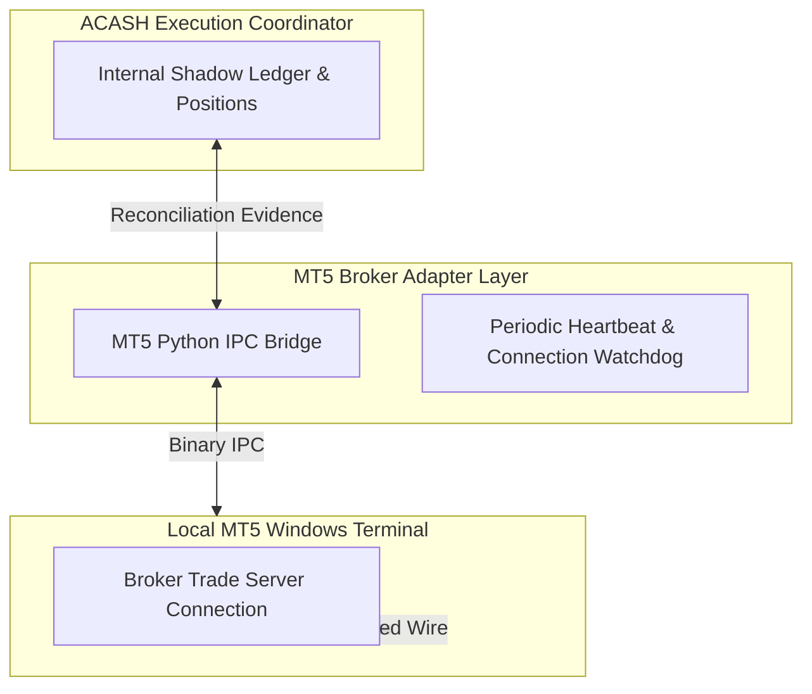

# Phase 12 Architecture & Capability Inventory
## Multi-Venue Execution Topology, MetaTrader 5 (MT5) Adapter & TradingView Integration

> **Document:** `docs/phase12/source_architectural_inventory.md`  
> **Status:** ARCHITECTURAL INVENTORY & PRE-SPECIFICATION  
> **Baseline Commit:** `049e155` (`HEAD == origin/main`, 1,020 tests passed, MyPy clean)  
> **Frozen Baselines:** Phase 7 (Frozen), Phase 8 (`e6f1d04`), Phase 8.5 (`9ce1365`), Phase 9 (`6bd40d8`), Phase 10 (`3955bf6`), Phase 11 (`092a2b1`)  
> **Authority:** `AGENTS.md` (Zero Unverified Claims, Strict Fail-Closed, Sovereign Authority Separation)

---

## 1. Executive Summary & Core Architectural Framing

$$\boxed{\mathbf{Research\ (8.5)} \neq \mathbf{Monitoring\ (11)} \neq \mathbf{Allocation\ (8)} \neq \mathbf{Supervisor\ (10)} \neq \mathbf{Risk\ (9)} \neq \mathbf{Execution\ (7/12)} \neq \mathbf{Broker}}$$

Phase 12 expands the sovereign execution plane established in Phase 7 by introducing a **Multi-Venue Execution Topology** with **MetaTrader 5 (MT5) as Execution Adapter #1** and establishing a strict, decoupled boundary for **TradingView as an Optional Auxiliary Ingress / Visualization Interface**.

```
                                      ACASH CORE
                                          │
                             Sovereign Execution Engine
                            (Phase 7 ExecutionCoordinator)
                                          │
                     ┌────────────────────┴────────────────────┐
                     │                                         │
            AlpacaPaperAdapter                          MT5BrokerAdapter
             (Phase 7 Venue)                           (Phase 12 Adapter #1)
                     │                                         │
             Alpaca REST / SSE                              MT5 IPC Bridge
                     │                                         │
             Alpaca Paper Venue                          MT5 Terminal
                                                               │
                                                          Broker Trade Server
```

### Sovereign Non-Negotiable Invariants:
1. **ACASH is the Sole Execution Authority & Source-of-Truth:**
   $$\boxed{\mathbf{ACASH} \equiv \text{Sole Execution Authority} \quad \land \quad \mathbf{BrokerAdapter} \neq \mathbf{StateAuthority}}$$
2. **MT5-First Execution Architecture:**
   - Direct, deterministic communication via the official Python IPC bridge (`MetaTrader5`) to local MT5 terminal.
   - Full support for Orders, Deals, Positions, Margin Accounting, Requotes, Partial Fills, and Broker Reconciliations.
3. **TradingView Decoupled Boundary (Observation / Ingress Only):**
   - TradingView is **NEVER** an execution authority and **NEVER** sits in the critical execution path.
   - **Never:** $\text{ACASH} \to \text{TradingView} \to \text{MT5} \to \text{Broker}$.
   - Webhook alerts serve strictly as unvalidated candidate signal inputs that must pass through Research $\to$ Validation $\to$ Tournament $\to$ Risk $\to$ Admission before any order is submitted.
   - Zero dependency on TradingView Premium tiers; ACASH maintains its own internal visualization dashboard.

---

## 2. MT5 Execution Lifecycle & Technical Semantics

### A. MT5 Entity Hierarchy: Orders vs. Deals vs. Positions

MT5 uses a three-tier execution hierarchy that differs fundamentally from simple REST brokers:

```
┌─────────────────────────────────────────────────────────────────────────────┐
│                          MT5 THREE-TIER ENTITY MODEL                        │
├───────────────────┬─────────────────────────────────────────────────────────┤
│ 1. Order (Request)│ An instruction sent to the trade server (Market request,│
│                   │ pending Limit, Stop, Stop-Limit). Has status (Placed,   │
│                   │ Filled, Partially Filled, Canceled, Rejected, Expired). │
├───────────────────┼─────────────────────────────────────────────────────────┤
│ 2. Deal (Fill)    │ The actual execution transaction record. Contains the   │
│                   │ executed volume, fill price, commission, swap, and fee. │
│                   │ Every fill creates one or more discrete Deal tickets.   │
├───────────────────┼─────────────────────────────────────────────────────────┤
│ 3. Position (State│ The current open market exposure on an instrument.      │
│    Snapshot)      │ Netting Mode: exactly 1 position per symbol.            │
│                   │ Hedging Mode: multiple independent positions per symbol.│
└───────────────────┴─────────────────────────────────────────────────────────┘
```

#### Mapping to ACASH Domain Entities:
- ACASH `OrderIntent` $\longrightarrow$ MT5 `TradeRequest` (`MqlTradeRequest`).
- MT5 `Deal` $\longrightarrow$ ACASH `ExecutionManifest` / `CoordinatorEvent.FILL`.
- MT5 `Position` snapshot $\longrightarrow$ ACASH `ReconciliationEvidence` (checked against internal `PortfolioState`).

---

### B. MT5 Order Types & Filling Modes

#### Order Types (`ENUM_ORDER_TYPE`):
- `ORDER_TYPE_BUY` / `ORDER_TYPE_SELL`: Instantaneous market execution.
- `ORDER_TYPE_BUY_LIMIT` / `ORDER_TYPE_SELL_LIMIT`: Pending resting limit.
- `ORDER_TYPE_BUY_STOP` / `ORDER_TYPE_SELL_STOP`: Pending breakout stop.
- `ORDER_TYPE_BUY_STOP_LIMIT` / `ORDER_TYPE_SELL_STOP_LIMIT`: Two-stage stop-limit.

#### Filling Execution Policies (`ENUM_ORDER_TYPE_FILLING`):
- `ORDER_FILLING_FOK` (Fill or Kill): Order must be executed in full volume immediately; otherwise, completely canceled.
- `ORDER_FILLING_IOC` (Immediate or Cancel): Execute available volume immediately; remaining unfilled volume is canceled.
- `ORDER_FILLING_RETURN`: Execute available volume; remaining volume remains active in the book (standard for exchange/ECN markets).

> **Architectural Decision:** `MT5BrokerAdapter` queries broker symbol execution properties (`SYMBOL_FILLING_MODE`) to dynamically select supported filling policies and avoid silent order rejections.

---

### C. Return Codes, Requotes & Slippage Control

When sending orders via `mt5.order_send()`, MT5 returns an `MqlTradeResult` with return codes (`retcode`):

| MT5 Retcode | Meaning | ACASH Action / Mapping |
| :--- | :--- | :--- |
| `10009` (`TRADE_RETCODE_DONE`) | Request executed successfully in full | `CoordinatorEvent.FILL` / `OrderLifecycleState.FILLED` |
| `10010` (`TRADE_RETCODE_DONE_PARTIAL`)| Partially executed | `CoordinatorEvent.FILL` / `OrderLifecycleState.PARTIALLY_FILLED` |
| `10004` (`TRADE_RETCODE_REQUOTE`) | Requote (market price moved) | Log slippage anomaly $\to$ Retry / Reject based on policy |
| `10006` (`TRADE_RETCODE_REJECT`) | Request rejected by dealer/server | `CoordinatorEvent.REJECT` / `OrderLifecycleState.REJECTED` |
| `10018` (`TRADE_RETCODE_MARKET_CLOSED`)| Market is closed | Fail-closed pre-market lockout |
| `10027` (`TRADE_RETCODE_AUTOTRADING_DISABLED`)| Automated trading disabled in terminal | Adapter Health $\to$ `UNHEALTHY` $\to$ Block submission |
| `10031` (`TRADE_RETCODE_CONNECTION`) | No connection with the trade server | `CONNECTION_LOST` $\to$ `UNKNOWN` $\to$ Mandatory Reconciliation |

#### Slippage Tolerance (`deviation`):
- Specified in points (integer). Configured per asset class from Phase 11 `ExecutionCostEvidence` empirical distributions.

---

### D. Cryptographic Lineage & Magic Numbers

MT5 orders carry two metadata fields utilized for cryptographic lineage:
1. `magic` (32-bit uint): Set to a deterministic 32-bit hash of `strategy_id` + `cycle_id` to partition orders and prevent interference across sub-systems.
2. `comment` (string, max 31 chars): Encodes `intent_digest[:16]` + sequence ID, creating an immutable audit trail link back to the originating `OrderIntent`.

---

## 3. Symbol Mapping & Contract Specification Normalization

Brokers on MT5 frequently use proprietary suffix/prefix notations for instruments:

```
┌─────────────────────────────────────────────────────────────────────────────┐
│                           SYMBOL NORMALIZATION MATRIX                       │
├─────────────────────┬───────────────────┬───────────────────────────────────┤
│ Canonical Symbol    │ Broker Symbol     │ Normalization Rule                │
├─────────────────────┼───────────────────┼───────────────────────────────────┤
│ `EURUSD`            │ `EURUSD.r`        │ Raw ECN account suffix strip      │
│ `XAUUSD`            │ `GOLD` / `XAUUSDm`│ Commodity alias & micro suffix    │
│ `BTCUSD`            │ `BTCUSD.crypto`   │ Digital asset venue routing       │
│ `SPX500`            │ `US500.cash`      │ Index CFD normalization           │
└─────────────────────┴───────────────────┴───────────────────────────────────┘
```

### Contract Normalizer Engine:
- Translates canonical volume (e.g. 100,000 EUR or 10.5 Units) $\longleftrightarrow$ MT5 Lots (`volume_min`, `volume_max`, `volume_step`, `contract_size`).
- Validates price quantization against `point_size` and `digits`.
- Enforces min/max stop levels (`SYMBOL_TRADE_STOPS_LEVEL`).

---

## 4. Reconciliation, Multi-Account & Terminal Resilience



### Fail-Closed Operational Resilience:
1. **Terminal Disconnect / IPC Crash:**
   - If `mt5.terminal_info()` reports `connected == False` or IPC socket times out $\implies$ immediate transition of in-flight orders to `OrderLifecycleState.UNKNOWN`.
   - Halts all further submissions until full terminal reconnection and **6-Dimensional Broker Reconciliation** (`ReconciliationReport`) verify balance, equity, and positions against the internal shadow ledger.
2. **Multi-Account / Multi-Broker Topology:**
   - Supports multiple independent terminal instances via unique `path` and `portable` flags:
     ```python
     mt5.initialize(path="C:/Program Files/BrokerA_MT5/terminal64.exe", login=123456, server="BrokerA-Demo")
     ```
   - Each account binds strictly to a sovereign `ExecutionCoordinator` instance.

---

## 5. TradingView Decoupled Ingress & Visualization Boundary

### A. Webhook Signal Ingress Architecture
```
TradingView Alert (Chart/Indicator)
           │
      HTTP POST (JSON)
           │
           ▼
TradingViewIngressGateway
  ├── HMAC-SHA256 Secret Verification
  ├── IP Whitelist / Timestamp Nonce Check
  ├── Schema Validation (Symbol, Timeframe, Signal Direction)
  └── Envelope Dispatcher
           │
           ▼
CandidateSignalEvent (Raw External Proposal)
           │
           ▼
[ACASH Research -> Validation -> Tournament -> Risk -> Admission]
           │
           ▼
MT5BrokerAdapter (Execution Only if Approved)
```

#### Non-Negotiable Invariant:
- **TradingView signals are unvalidated proposals.** They are treated with zero inherent capital authority ($0.00) and must navigate the full Phase 8.5 qualification, Phase 8 tournament, Phase 9 sovereign risk veto, and Phase 7 execution admission gates.

---

### B. Visualization Channel
- ACASH exports read-only trade markers, fill executions, and performance equity curves to webhook/charting listeners.
- The system maintains its own sovereign offline terminal dashboard; TradingView is an optional presentation enhancement.

---

## 6. Credential & Security Architecture

- **Windows DPAPI User Vault:** Credentials (`login`, `password`, `server`, `path`) are stored in encrypted form outside Git at `$env:USERPROFILE\.acash\mt5_credentials.dpapi` via `scripts/setup_mt5_credentials.ps1`.
- **Zero Plaintext Leakage:** `BrokerCredentials` redacts all credentials in `__repr__` and `__str__` (`********`); zero passwords in logs, exceptions, or git commits.

---

## 7. Proposed Phase 12 Implementation Slices

```
Slice 1: MT5 Domain Schemas, Enums & Broker Mapping (BMAP-MT5)
   │
   ▼
Slice 2: Symbol Mapping & Contract Specification Normalizer
   │
   ▼
Slice 3: MT5 Terminal Driver & IPC Transport Bridge
   │
   ▼
Slice 4: MT5 Broker Adapter (MT5BrokerAdapter) & Event Normalizer
   │
   ▼
Slice 5: TradingView Webhook Ingress Gateway & Signal Sanitizer
   │
   ▼
Slice 6: Full Multi-Venue Integration, 20-Vector Red-Team & Freeze
```

---

## 8. Verification & Next Steps

- **Active Baseline Commit:** `049e155` (`HEAD == origin/main`)
- **Full Test Suite:** 1,020 passed, 0 failures, 2 warnings.
- **Static Type Checker:** MyPy clean across all active modules.
- **Rule:** Do NOT write production code for Phase 12 until this Inventory and the subsequent **Phase 12 Contract Specification v1.0** are reviewed and locked.
