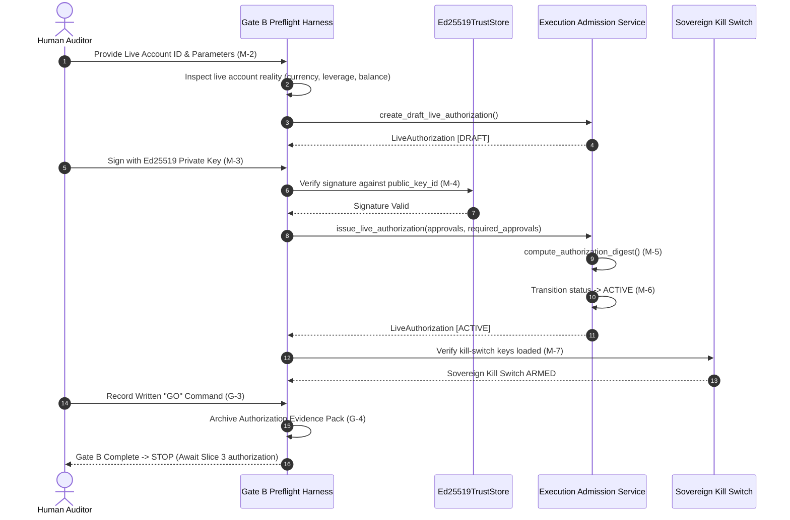

# Phase 13 Slice 2: Gate B Mandatory Human Authorization Plan
## Preflight & Implementation Plan (Plan Only — Zero Execution)

> **Document:** `docs/phase13/slice2_gate_b_plan.md`  
> **Status:** PROPOSED — PENDING HUMAN AUDITOR APPROVAL  
> **Authority:** `AGENTS.md` (Strict Fail-Closed, Zero Unverified Claims, Implementation Correctness $\neq$ Mathematical Validity)  
> **Governing Specifications:**
> - `docs/phase13/PHASE13-LIVE-SMALL-CAPITAL-PLAN-REV3.md` (§3, §4, §14, §15, §16, §18)
> - `docs/phase13/consolidated_gate_a_audit.md` (Gate A CERTIFIED baseline)
> - `docs/SESSION_HANDOFF.md`
> **Current Baseline:**
> - Phase 13 Slice 1 (Gate A): `✅ CERTIFIED`
> - Gate B: `🔒 STRICTLY LOCKED`
> - Slice 3 (First Live Order): `⛔ BLOCKED`
> - Live Capital Authority: `💰 $0.00`
> - Broker Reality (Demo 112040157): `🟢 100% FLAT`

---

## User Review Required

> [!CAUTION]
> **CRITICAL GOVERNANCE BOUNDARY: PLAN ONLY — ZERO EXECUTION**  
> This document establishes ONLY the preflight plan and architectural contract for Gate B. It **DOES NOT**:
> 1. Create or fund any live broker account.
> 2. Connect to any live broker for trading.
> 3. Transmit any `order_send` or order mutation.
> 4. Activate any `LiveAuthorization` (`status` remains strictly un-activated).
> 5. Sign any `AuthorizationApproval` with live keys.
> 6. Issue any "GO" decision.
> 7. Unlock Gate B or authorize Slice 3.
> 
> All capital values currently marked **TBD** require explicit human determination.

---

## 1. Executive Summary & Objective

The objective of Phase 13 Slice 2 is to build the formal, dual-layer authorization harness (**Machine Gate + Governance Gate**) required to safely evaluate Gate B. 

Gate B is the sole authoritative mechanism in ACASH capable of transitioning `LiveAuthorization.status` to `ACTIVE`, which machine-enables order construction in `admission.py:650`. 

Slice 2 does NOT execute live trades (Slice 3); it establishes the cryptographic lineage, parameter validation, key custody, and human sign-off records that must exist before any live micro-capital can be considered.

```
┌────────────────────────────────────────────────────────────────────────┐
│               PHASE 13 PROGRESSION & STOP GATE TOPOLOGY                │
├────────────────────────────────────────────────────────────────────────┤
│  Slice 1: Gate A — Pre-Live Rehearsal (Demo)        │  ✅ CERTIFIED     │
│  Slice 2: Gate B — Dual-Gate Authorization Setup    │  🔒 THIS PLAN     │
│  Slice 3: First Live Order (Micro-Lot 0.01)          │  ⛔ STRICTLY      │
│                                                      │     BLOCKED      │
└──────────────────────────────────────────────────────┴─────────────────┘
```

---

## 2. Machine Gate vs Governance Gate Matrix

Gate B enforces a strict separation of concerns between cryptographic machine verification and organizational human governance. Neither gate replaces the other.

| Gate Component | Sub-Item | Invariant & Contract Description | Enforcement Mechanism | Substrate |
| :--- | :--- | :--- | :--- | :--- |
| **Machine Gate** | **M-1** | `LiveAuthorization` DRAFT artifact constructed with valid parameters | Pydantic V2 schema validation (`schema.py:252`) | Memory / JSON |
| **Machine Gate** | **M-2** | Explicit confirmation of monetary fields & `MT5AccountReality.currency` | Fail-closed comparison check against broker account | Broker IPC |
| **Machine Gate** | **M-3** | Ed25519 digital signature generated for each approver | `Ed25519Signer` / KMS over canonical approval bytes | Ed25519 (RFC 8032) |
| **Machine Gate** | **M-4** | Quorum check: `\|verified approvals\| >= required_approvals` | `_collect_verified_approvals()` (`admission.py:402`) | In-memory crypto |
| **Machine Gate** | **M-5** | `authorization_digest` covers all 15 params + sorted approvals | `compute_authorization_digest()` (`schema.py:349`) | SHA-256 |
| **Machine Gate** | **M-6** | Status transition: `status -> ACTIVE` | `issue_live_authorization()` (`admission.py:409`) | Domain State |
| **Machine Gate** | **M-7** | Sovereign Kill Switch Ed25519 quorum keys loaded | `SovereignKillSwitchController(trust_store=...)` | Risk State |
| **Governance Gate** | **G-1** | Formal audit review of Gate A Evidence Pack | Human verification of `consolidated_gate_a_audit.md` | Human Auditor |
| **Governance Gate** | **G-2** | Live broker account identity verification | Written confirmation of account login, server, owner | Human Auditor |
| **Governance Gate** | **G-3** | Explicit human "GO" authorization command | Non-repudiable written sign-off statement | Human Auditor |
| **Governance Gate** | **G-4** | Archival of GO decision and authorization artifact | Committed immutable markdown/JSON record in repo | Git Versioning |

---

## 3. Parameter Ownership Matrix & Enforcement Classification

Every parameter in `LiveAuthorization` must be categorized into its exact technical enforcement state. No parameter may be silently defaulted or assumed.

| Parameter Name | Schema Type | Proposed Constraint | Enforcement State | Authority / Owner |
| :--- | :--- | :--- | :--- | :--- |
| `authorization_id` | `str` | `AUTH_P13_LIVE_001` | **Cryptographically Bound** | Machine / Unique |
| `certificate_id` | `str` | Linked Phase 6/8.5 Certificate | **Cryptographically Bound** | Statistical Gate |
| `strategy_id` | `str` | Target Live Strategy ID | **Machine-Enforced** per order | Strategy Authority |
| `max_notional` | `Decimal` | **[TBD — REQUIRED HUMAN INPUT]** | **Cryptographically Bound** (Cumulative NOT enforced) | **Human Auditor** |
| `max_position_size` | `Decimal` | `Decimal("0.01")` (Micro-lot) | **Machine-Enforced** per order (`admission.py:685`) | **Plan Rev3 §4.6** |
| `max_order_rate_per_minute` | `int` | `1` (Strict throttle) | **Cryptographically Bound** | **Human Auditor** |
| `max_daily_loss_notional` | `Decimal` | **[TBD — REQUIRED HUMAN INPUT]** | **Cryptographically Bound** (RiskEngine enforces) | **Human Auditor** |
| `max_drawdown_pct` | `Decimal` | `Decimal("5.0")` (5.0%) | **Machine-Enforced** by RiskEngine (Binary Reject) | **Human Auditor** |
| `allowed_venues` | `Tuple[str]` | `("LIVE_MT5",)` | **Machine-Enforced** per order (`admission.py:674`) | **Human Auditor** |
| `allowed_symbols` | `Tuple[str]` | `("EURUSD",)` | **Machine-Enforced** per order (`admission.py:679`) | **Human Auditor** |
| `risk_policy_version` | `str` | `v1.0.0-p13` | **Cryptographically Bound** | Risk Policy |
| `required_approvals` | `int` | `1` (or multi-sig quorum) | **Machine-Enforced** (`admission.py:400`) | Governance Policy |
| `authorized_at` | `datetime` | UTC timestamp of issuance | **Cryptographically Bound** | Machine Clock |
| `expires_at` | `datetime` | Time-boxed (e.g. +24h or +7d) | **Machine-Enforced** per order (`admission.py:668`) | **Human Auditor** |
| `currency` | `str` | `MT5AccountReality.currency` | **Operational Convention** (Schema has NO currency) | **Human Auditor** |

---

## 4. Critical Safety Review & Technical Debt Analysis

### 4.1 Debt NB-1: Cumulative Exposure Enforcement Gap
- **Finding:** `construct_order_intent()` enforces `quantity <= max_position_size` per order, but does **NOT** enforce `current_total_exposure + new_order_notional <= max_notional`.
- **Live Safety Implication:** If the execution coordinator or strategy dispatches multiple concurrent orders rapidly, the gross portfolio exposure could breach `max_notional` before 6-D reconciliation trips.
- **Slice 2 Pre-Condition:**
  - In Slice 2, we must formally document that **Slice 3 execution is restricted to strictly SERIAL execution**:
    $$\text{Orders in flight} \le 1 \quad \land \quad \text{Open positions} \le 1$$
  - Alternatively, if Phase 14 is deferred, a lightweight single-flight lock or Phase 14 cumulative exposure check must be scheduled before multi-order live execution.

### 4.2 Currency Denomination Ambiguity
- **Finding:** `LiveAuthorization.max_notional` and `max_daily_loss_notional` are raw `Decimal` numbers without a currency field.
- **Contract:** M-2 strictly mandates that the human auditor verify that `max_notional` is denominated in the exact deposit currency of the live account (`MT5AccountReality.currency`). If account currency is USD, `max_notional = 500` means $500 USD.

### 4.3 MT5 C-Extension History Deals Date Parameter Quirk (NB-3)
- **Finding:** Direct C-extension calls to `history_deals_get` fail with `API error code -2` if date parameters are passed via keyword arguments rather than positional arguments `(date_from, date_to)`.
- **Remediation in Slice 2:** Verified that `NativeMT5Transport` in `src/acash/execution/mt5/transport.py` handles positional date filtering cleanly or uses `LayerBDemoMT5Transport` convention.

### 4.4 Account Credential Ownership & Master Password
- **Finding:** MetaTrader 5 supports two passwords: Investor (Read-Only) and Master (Trade-Enabled).
- **Contract:** Live execution in Slice 3 requires Master password permissions (`trade_allowed = True`). For Gate B preflight (Slice 2), read-only inspection (`trade_mode == 2`, balance, currency) must be validated first before granting trade rights.

---

## 5. Cryptographic Authorization Flow (Ed25519 Quorum)



---

## 6. Failure, Revocation & Rollback Semantics

1. **Signature Failure (Fail-Closed):** Any signature verification mismatch immediately raises `DomainValidationError`, leaving `LiveAuthorization` in `DRAFT` or `PENDING_APPROVAL`.
2. **Digest Mismatch:** Any mutation of parameters after signing changes `authorization_digest`, causing `_validate_sha256` or digest verification to fail closed.
3. **Emergency Revocation:** If a `CertificateRevocationEvent` is ingested, `issue_live_authorization()` immediately raises `PreLiveRiskAdmissionError`.
4. **Kill Switch Veto:** Even if `LiveAuthorization.status == ACTIVE`, if `SovereignKillSwitchController.state != ARMED`, `construct_order_intent()` raises `DataContractError("EXECUTION_ADMISSION_BLOCKED")`.

---

## 7. Required Human Inputs (TBD Schedule)

The human auditor must provide the following concrete values prior to Gate B issuance:

1. **Target Live Broker Name / Venue ID:** (e.g. `PEPPERSTONE_LIVE_01`, `METAQUOTES_LIVE`)
2. **Target Live Account Login ID:** (e.g. `12345678`)
3. **Authorized `max_notional`:** (e.g. `Decimal("500.00")` account currency)
4. **Authorized `max_daily_loss_notional`:** (e.g. `Decimal("50.00")` account currency)
5. **Authorized `expires_at` window:** (e.g. `2026-09-05T23:59:59Z`)
6. **Approver Public Key & Key ID:** (Ed25519 Public Key for TrustStore entry)
7. **Target Symbol:** (e.g. `EURUSD`)

---

## 8. Verification Plan & Test Matrix (Slice 2 Preflight)

### Automated Test Suite (To be executed upon implementation approval):
- `tests/unit/execution/test_gate_b_authorization_lifecycle.py`:
  - `test_draft_creation_with_valid_parameters()`: Verifies M-1 schema bounds.
  - `test_currency_denomination_validation()`: Verifies M-2 contract.
  - `test_ed25519_quorum_signing_and_verification()`: Verifies M-3 and M-4.
  - `test_authorization_digest_tamper_proofing()`: Verifies M-5.
  - `test_active_status_transition_semantics()`: Verifies M-6.
  - `test_kill_switch_quorum_loading()`: Verifies M-7.
  - `test_expired_authorization_fails_closed()`: Verifies expiration boundary.
  - `test_revocation_event_halts_issuance()`: Verifies rollback.

---

## 9. Exact Stop Gate

```text
================================================================================
                       PHASE 13 SLICE 2 STOP GATE
================================================================================
Upon completion of Slice 2:
1. LiveAuthorization will be generated and signed [ACTIVE].
2. Live Capital remains strictly $0.00.
3. Zero broker orders will be sent.
4. Execution will STOP completely.
5. Slice 3 (First Live Order) will require a separate, explicit Human Sign-Off.
================================================================================
```
