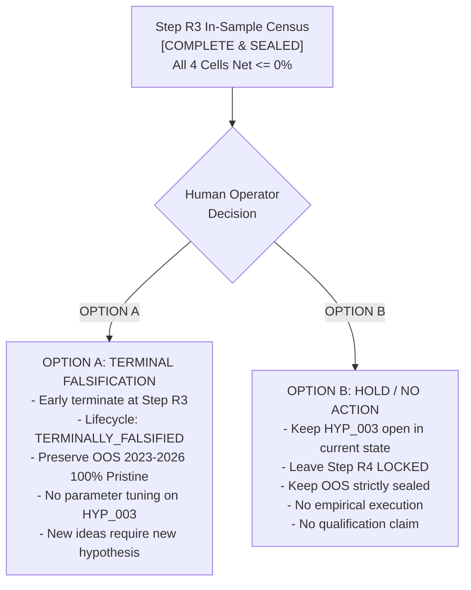

# HYP_003 Post-R3 Governance & Research Human Decision Surface

```text
[HUMAN DECISION REQUIRED]
[R3 COMPLETE]
[OOS SEALED]
[NO PARAMETER TUNING]
[NO PAPER/LIVE AUTHORITY]
```

- **Document ID:** `docs/phase14/hyp_003_post_r3_human_decision_surface.md`
- **Target Hypothesis:** `HYP_003` (Opening Range Breakout on `SPY` under MEC-0013 Price-Only Mechanics)
- **Current Canonical HEAD:** `93ab9cfa670a0be7edd7df43090dcb301c482840`
- **Governance Mandate:** Establish formal Human Decision Surface following deterministic completion of Step R3 In-Sample Census.
- **Authority Rule:** AI agents possess zero sovereign authority to ratify terminal states, advance lifecycle gates, unlock holdout data, or mutate capital boundaries. This document presents mutual governance options for explicit Human Operator ruling.

---

## 1. Canonical Step R3 Empirical Facts (Sealed Ledger)

Step R3 executed a strictly bounded, deterministic In-Sample empirical census across the complete pre-registered primary search space ($K=4$) using the frozen Step R2 canonical dataset (`data/parquet/research/HYP_003_SPY_1Min_IS_canonical.parquet`).

### 1.1 Census Cardinality & Anti-HARKing Invariant
$$K_{\text{declared}} \equiv K_{\text{executed}} \equiv K_{\text{reported}} \equiv 4$$

Zero candidate cells were omitted, pruned, or re-weighted based on observed returns. Zero post-hoc parameter adjustments, indicator additions, volume/VWAP filters, or regime conditioning were introduced.

### 1.2 Sealed Empirical Results (In-Sample: 2017-01-01 to 2022-12-31)
Frictions applied: 1.6 bps round-trip transaction costs (0.8 bps entry + 0.8 bps exit) + 1.0 bps round-trip adverse slippage (0.5 bps entry + 0.5 bps exit).

| Cell ID | Window | Direction | Sessions | Trades | Stop Exits | EOD Exits | Gross Return | Net Return | Win Rate | Max DD | Daily Ann. Sharpe | Asymptotic p-value |
| :--- | :---: | :---: | :---: | :---: | :---: | :---: | :---: | :---: | :---: | :---: | :---: | :---: |
| `ORB_5M_LONG` | 5m | LONG | 1,492 | 1,258 | 809 | 449 | +19.62% | **-13.75%** | 31.64% | 26.55% | -0.271506 | `0.508844` |
| `ORB_5M_SHORT` | 5m | SHORT | 1,492 | 1,206 | 862 | 344 | -31.01% | **-49.59%** | 23.71% | 50.93% | -1.370521 | `0.000854` |
| `ORB_15M_LONG` | 15m | LONG | 1,492 | 1,173 | 562 | 611 | +34.72% | **-0.69%** | 41.43% | 17.51% | +0.027911 | `0.945855` |
| `ORB_15M_SHORT` | 15m | SHORT | 1,492 | 1,094 | 612 | 482 | -23.31% | **-42.30%** | 32.54% | 43.50% | -0.977001 | `0.017441` |

### 1.3 Key Empirical Observations:
1. **Net Negative Drift Across All Primary Cells:** All four cells yielded net cumulative returns $\le 0$ under institutional frictions.
2. **Short Lane Severe Drag:** Both SHORT cells exhibited severe drawdowns (-49.59% and -42.30% net return) reflecting structural friction drag against the underlying secular upward drift of SPY.
3. **Long Lane Degradation:**
   - `ORB_5M_LONG` produced +19.62% gross return, but friction reduced net compounded return to -13.75% with a 31.64% win rate (64.3% stop-out rate).
   - `ORB_15M_LONG` produced +34.72% gross return, but friction eliminated cumulative profitability (-0.69% net return), with a 41.43% win rate and near-zero Sharpe (+0.028), offering no statistically significant evidence of tradable edge ($p = 0.946$).
4. **Out-of-Sample Window State:** The 4-year holdout partition (`2023-01-01` through `2026-12-31`) is **100% UNREAD, UNEXPOSED, AND PRISTINE**.

---

## 2. Precedent Audit: Early Termination at Step R3

The ACASH engineering operating system maintains established precedents for **Early Termination at Step R3** to prevent overfitting, data snooping, and wasteful expenditure of holdout data:

### 2.1 Precedent: `HYP_TSMOM_EURUSD_001` (Phase 8.5 Track B)
- **Precedent Document:** `docs/phase8.5/phase8_5_hyp_tsmom_eurusd_001_terminal_falsification_dossier.md`
- **Precedent Manifest:** `docs/phase8.5/manifests/terminal_decision_HYP_TSMOM_EURUSD_001.json`
- **Principle:** When an In-Sample census definitively fails to demonstrate economic or statistical edge across all pre-registered trials, advancing to downstream statistical validation (R4) or out-of-sample testing (R6/R7) is **scientifically redundant**.
- **Action Taken:** Early termination at Step R3; terminal lifecycle state recorded as `TERMINALLY_FALSIFIED_REJECTED`; OOS partition retained in an unexposed, pristine state.

### 2.2 Precedent: `HYP_TSMOM_EURUSD_HTF_002` (Phase 8.5 Track B)
- **Precedent Document:** `docs/phase8.5/phase8_5_r3_search_trial_census_audit_HYP_002.md`
- **Principle:** Negative empirical outcomes disconfirm candidate strategy formulations definitively within their tested boundary. Post-hoc tweaking within the same hypothesis is strictly forbidden by anti-HARKing rules.

---

## 3. Human Operator Decision Options

The Human Operator is requested to select one of the following two mutually exclusive governance options:



---

### OPTION A — Terminal Falsification / Early Termination at Step R3 (Recommended by Epistemic Protocol)

Under Option A, the Human Operator formally rules to:

1. **Lifecycle Classification:** Classify `HYP_003` as `TERMINALLY_FALSIFIED_REJECTED`.
2. **Early Termination:** Terminate downstream qualification steps (Step R4 Statistical Validation, Step R5 Economic Hurdle, Step R6 OOS Evaluation, Step R7 Runtime Eligibility) as scientifically redundant.
3. **OOS Preservation:** Preserve the entire 4-year Out-of-Sample partition (`2023-01-01` through `2026-12-31`) as **100% UNEXPOSED_PRISTINE**, ensuring no test set contamination has occurred.
4. **Artifact Preservation:** Seal and preserve all R1, R2, and R3 artifacts, ledgers, and manifests unchanged as durable scientific evidence.
5. **Anti-HARKing Boundary:** Strictly prohibit any post-hoc rescue tuning, indicator additions, or filter adjustments under `HYP_003`. Any future research into modified breakout concepts (e.g., volume confirmation, volatility filtering, multi-asset extensions) must be formulated as a **NEW hypothesis** with separate pre-registration and inception token lineage.

#### Epistemic Scope of Falsification (Strict Boundary):
Option A establishes that **naive, unconditioned price-only Opening Range Breakout on SPY** under the frozen $K=4$ mechanics, 1.6 bps round-trip transaction costs, and 1.0 bps round-trip adverse slippage over In-Sample 2017–2022 is **empirically disconfirmed**.

Option A does **NOT** claim:
- that Opening Range Breakouts can never work under any formulation;
- that conditioned ORB variants (e.g., incorporating volume, order flow, or volatility regimes) are disproven;
- that ORB is invalid on other instruments, asset classes, or historical epochs.

---

### OPTION B — Hold / No Further Action

Under Option B, the Human Operator rules to:

1. **Lifecycle State:** Retain `HYP_003` in its current completed R3 status without closing or falsifying the lifecycle.
2. **Step R4 Status:** Leave Step R4 strictly **LOCKED** (`STEP_R4_VALIDATION_OR_OOS_DECISION_LOCKED`).
3. **OOS Status:** Keep the Out-of-Sample window strictly **SEALED / UNREAD / FORBIDDEN**.
4. **No Empirical Execution:** No further empirical runs, simulations, or data processing will occur.
5. **No Qualification Claim:** No claim of strategy qualification or deployment readiness is made.

> [!IMPORTANT]
> Option B does **NOT** authorize future Out-of-Sample access, nor does it advance the research pipeline.

---

## 4. Strict Governance Prohibition: Zero Silent OOS Access

Repository governance strictly prohibits any automated progression or silent unlocking of Out-of-Sample data:

- Step R3 completion does **NOT** constitute authorization to open OOS.
- Step R4 (Validation) and any future OOS evaluation require an **explicit, independent Human Authorization** contract.
- If the Human Operator does not issue an explicit authorization specifically granting OOS access, the OOS partition remains hard-locked by the fail-closed boundary:
  ```python
  if bar.timestamp >= date(2023, 1, 1):
      raise DataContractError("Out-of-Sample data access is STRICTLY FORBIDDEN!")
  ```

---

## 5. Summary Verification Status

```markdown
### Governance Ledger
- Target Hypothesis: HYP_003 (Opening Range Breakout on SPY)
- Step R3 Status: COMPLETE / SEALED
- In-Sample Period: 2017-01-01 to 2022-12-31 (1,492 sessions, 581,880 bars)
- Out-of-Sample Period: 2023-01-01 to 2026-12-31 (SEALED / UNREAD / FORBIDDEN)
- K Census: K_declared = 4, K_executed = 4, K_reported = 4
- Post-Hoc Tuning: ZERO (Prohibited by Anti-HARKing Invariant)
- Capital Authority: $0.00
- Paper Trading Authorized: FALSE
- Live Trading Authorized: FALSE
- Execution Policy: NO_REAL_ORDERS=true
- Decision State: RATIFIED BY HUMAN OPERATOR (OPTION A APPROVED)
```

---

## 6. Formal Human Governance Ratification Record

Pursuant to explicit governance authority exercised by the Human Quantitative Operator:

```text
==================================================
HUMAN OPERATOR GOVERNANCE RULING
==================================================
SELECTED OPTION:    OPTION A — TERMINAL FALSIFICATION / EARLY TERMINATION
AUTHORITY:          HUMAN OPERATOR (EXPLICIT RATIFICATION)
LIFECYCLE STATE:    TERMINALLY_FALSIFIED_REJECTED
QUALIFICATION:      NOT QUALIFIED / NOT PAPER-ELIGIBLE / NOT LIVE-ELIGIBLE
DOWNSTREAM STEPS:   R4 (EARLY TERMINATED), R5 (EARLY TERMINATED), R6 (TERMINATED), R7 (INELIGIBLE)
OOS STATUS:         2023-01-01 THROUGH 2026-12-31 (100% UNEXPOSED_PRISTINE / SEALED / UNREAD)
CAPITAL AUTHORITY:  $0.00
EXECUTION POLICY:   NO_REAL_ORDERS=true
==================================================
```

### Binding Ratification Terms:
1. **Lifecycle Closure:** Hypothesis `HYP_003` is permanently closed as `TERMINALLY_FALSIFIED_REJECTED` following complete, deterministic In-Sample failure across all four pre-registered primary cells under institutional frictions.
2. **Early Termination:** Downstream statistical validation (Step R4), economic hurdle testing (Step R5), and holdout evaluation (Step R6/R7) are formally early-terminated as scientifically redundant.
3. **Pristine Holdout Certificate:** The 4-year Out-of-Sample window (`2023-01-01` through `2026-12-31`) is certified **100% UNEXPOSED_PRISTINE**. Zero OOS bars were loaded, read, or queried.
4. **Anti-HARKing Invariant:** `HYP_003` is permanently sealed. Zero post-hoc rescue tuning, indicator additions, or filter adjustments are permitted. Any modified breakout concept must be pre-registered as a **NEW hypothesis** with a separate ordinal and inception token lineage.
