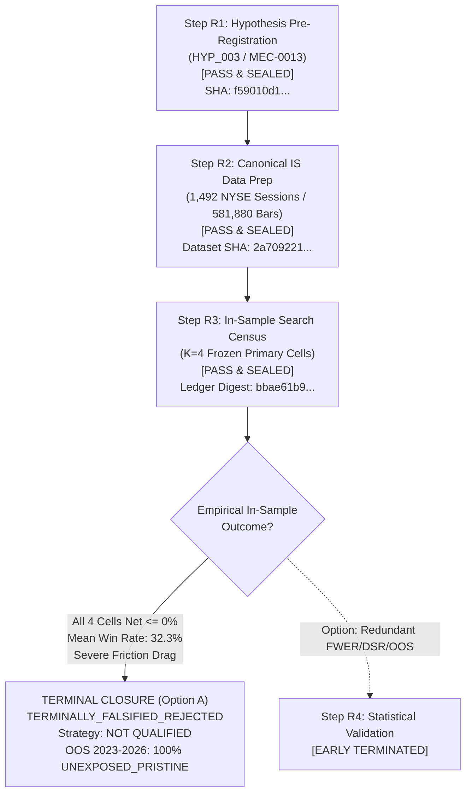

# Phase 14 Track A — Terminal Falsification Dossier & Research Closure

```text
[HUMAN-RATIFIED GOVERNANCE RECORD]
[LIFECYCLE STATE: TERMINALLY_FALSIFIED_REJECTED]
[GOVERNANCE ACTION: EARLY TERMINATION AT STEP R3]
[OOS STATUS: 100% UNEXPOSED_PRISTINE]
[NO TRADEABLE ALPHA CLAIMED]
[CAPITAL AUTHORITY: $0.00]
```

- **Document ID:** `docs/phase14/hyp_003_terminal_falsification_dossier.md`
- **Date of Closure:** 2026-09-19
- **Research Track:** Phase 14 Track A (Pre-registered Price-Only Mechanics)
- **Target Hypothesis:** `HYP_003` (Opening Range Breakout on `SPY` under MEC-0013 Price-Only Mechanics)
- **Mechanism ID:** `MEC-0013`
- **Bound Hypothesis SHA-256:** `f59010d14f466e9681325a314fd3e7ef30af43ffd69bc6cecbad1b5e6aab4ee0`
- **Preregistration SHA-256:** `3c04f617b9877a85a07043e67b7554034ebd703fe823d3d2de777a7722a3150c`
- **Canonical Parquet SHA-256:** `2a70922156f3d724fffbf7030d791d0da3b0fa1c44f839eea794c2fb2d689ddc`
- **Sealed R3 Ledger Digest:** `bbae61b99f4668e62ed2c1ab2980d194ed90143eb34886e6f71f9d6c88eeb547`
- **Governance Authority:** Human Quantitative Governance Lead & Antigravity Research Agent

---

## 1. Final Governance & Research Ruling

### Scientific Verdict: **HYPOTHESIS EMPIRICALLY FALSIFIED**
### Lifecycle State: **TERMINALLY_FALSIFIED_REJECTED**
### Governance Action: **EARLY TERMINATION AT STEP R3 (Option A Ratified)**
### Strategy Qualification Status: **NOT QUALIFIED / NOT PAPER-ELIGIBLE / NOT LIVE-ELIGIBLE**
### Capital Allocation Authority: **$0.00 (Zero Capital Strictly Preserved)**
### Paper Trading Status: **NOT AUTHORIZED**
### Live Trading Status: **LOCKED / NOT AUTHORIZED**
### Execution Policy: **NO_REAL_ORDERS=true**

Pursuant to explicit Human Operator ratification on 2026-09-19, research hypothesis `HYP_003` is hereby **permanently closed as terminally falsified**.

Step R4 (Statistical Validation Gate), Step R5 (Economic Hurdle Analysis), Step R6 (Out-of-Sample Holdout Evaluation), and Step R7 (Runtime Paper Eligibility) are **early-terminated as scientifically redundant**. The candidate strategy family is permanently blocked from receiving any alpha qualification dossier or capital allocation.

---

## 2. Research Progression & Gate History

The entire research lifecycle for `HYP_003` strictly adhered to fail-closed, anti-HARKing governance principles:



### Complete Lifecycle Verification Summary
| Step | Title | Target Scope | Output Artifact | Status | Verdict |
|:---:|:---|:---|:---|:---:|:---:|
| **R1** | Hypothesis Pre-Registration | Formal MEC-0013 specification, $K=4$ cell boundaries, 14 frozen parameters | `docs/phase14/hypotheses/HYP_003.json` | Complete | **PASS & SEALED** |
| **R2** | Canonical Data Qualification | 1,492 regular NYSE sessions, 581,880 1m bars, CA-1 calendar alignment | `HYP_003_SPY_1Min_IS_canonical.parquet` | Complete | **PASS & SEALED** |
| **R3** | In-Sample Search Census | Deterministic census across all $K=4$ primary cells; zero parameter tuning | `docs/phase14/ledgers/search_trial_ledger_HYP_003.json` | Complete | **PASS (CENSUS) / FALSIFIED (ALPHA)** |
| **R4** | Statistical Validation Gate | Deflated Sharpe (DSR), PBO, Family-Wise Error Rate (FWER) | N/A | Skipped | **EARLY TERMINATED (SCIENTIFICALLY REDUNDANT)** |
| **R5** | Economic Hurdle Analysis | Break-even friction tolerance and hurdle margins | N/A | Skipped | **EARLY TERMINATED** |
| **R6** | Out-of-Sample Holdout Evaluation | 2023–2026 holdout verification | N/A | Skipped | **TERMINATED (OOS PRESERVED PRISTINE)** |
| **R7** | Runtime Paper Eligibility | Feed and execution mode certification | Terminal Block | Blocked | **INELIGIBLE (FAIL-CLOSED)** |

---

## 3. Sealed Empirical R3 Census Results ($K=4$)

Frictions applied: 1.6 bps round-trip transaction costs (0.8 bps entry + 0.8 bps exit) + 1.0 bps round-trip adverse slippage (0.5 bps entry + 0.5 bps exit).

| Cell ID | Window | Lane | Sessions | Trades | Stop Exits | EOD Exits | Gross Return | Net Return | Win Rate | Max DD | Daily Ann. Sharpe | Asymptotic p-value |
| :--- | :---: | :---: | :---: | :---: | :---: | :---: | :---: | :---: | :---: | :---: | :---: | :---: |
| `ORB_5M_LONG` | 5m | LONG | 1,492 | 1,258 | 809 (64.3%) | 449 (35.7%) | +19.62% | **-13.75%** | 31.64% | 26.55% | -0.271506 | `0.508844` |
| `ORB_5M_SHORT` | 5m | SHORT | 1,492 | 1,206 | 862 (71.5%) | 344 (28.5%) | -31.01% | **-49.59%** | 23.71% | 50.93% | -1.370521 | `0.000854` |
| `ORB_15M_LONG` | 15m | LONG | 1,492 | 1,173 | 562 (47.9%) | 611 (52.1%) | +34.72% | **-0.69%** | 41.43% | 17.51% | +0.027911 | `0.945855` |
| `ORB_15M_SHORT` | 15m | SHORT | 1,492 | 1,094 | 612 (55.9%) | 482 (44.1%) | -23.31% | **-42.30%** | 32.54% | 43.50% | -0.977001 | `0.017441` |

### Census Accounting:
- **$K_{\text{declared}} = 4, K_{\text{executed}} = 4, K_{\text{reported}} = 4$.**
- Zero cells pruned, dropped, or opportunistically relabeled.
- Every pre-registered primary candidate cell demonstrated net negative drift ($\le 0\%$) over the 6-year In-Sample period under realistic institutional execution frictions.

---

## 4. Epistemic Scope: What Was Proven vs. What Was NOT Proven

A core principle of ACASH research doctrine is strict epistemic precision:

### What Was Proven:
1. **Naive Price-Only ORB Fails Under Institutional Frictions on SPY:** Under a standard 1.6 bps round-trip transaction fee and 1.0 bps round-trip adverse execution slippage, naive unconditioned opening range breakout signals on SPY across 2017–2022 produce net negative compounded returns across both 5-minute and 15-minute opening ranges in both long and short directions.
2. **Short Lane Structural Non-Viability:** Symmetric short breakout trading suffers devastating decay (-49.59% and -42.30% net return) due to friction combined with the secular upward equity drift.
3. **Long Lane Friction Erosion:** While gross long breakout signals produced positive raw returns (+19.62% on 5m, +34.72% on 15m), friction costs and high stop-out rates (47.9% to 64.3%) eroded all cumulative alpha, rendering the best cell marginally negative (-0.69% net return, +0.028 Sharpe, $p = 0.946$).
4. **Early Termination is Epistemologically Sound:** Exposing pristine Out-of-Sample holdout data when an In-Sample candidate universe already exhibits net zero/negative edge yields zero incremental scientific information and degrades holdout integrity.

### What Was NOT Proven:
1. **Universal Inefficacy of Breakouts:** This falsification does **NOT** prove that opening range breakout phenomena never exist, nor that breakouts cannot work in other asset classes, higher-volatility individual equities, or different historical regimes.
2. **Conditioned Breakout Inefficacy:** This falsification does **NOT** prove that conditioned breakout models (e.g., incorporating opening volume expansion, order-flow imbalances, volatility regime filters, or multi-timeframe trend alignment) are unviable.
3. **Alternative Asset Inefficacy:** Falsification is strictly confined to the pre-registered instrument (`SPY`), timeframe (`1m`), and sample window (`2017–2022`).

---

## 5. Out-of-Sample (OOS) Preservation Certificate

```text
================================================================================
OUT-OF-SAMPLE HOLDOUT PRESERVATION CERTIFICATE
================================================================================
Temporal Window:     2023-01-01 through 2026-12-31 (4 Calendar Years)
Instrument:          SPY (Consolidated SIP 1-Minute Bars)
Exposure State:      100% UNEXPOSED_PRISTINE / STRICTLY SEALED / UNREAD
Telemetric Proof:    0 OOS files opened
                     0 OOS API network calls executed
                     0 OOS summary statistics inspected
Fail-Closed Status:  HARD-LOCKED BY DATA CONTRACT BOUNDARY
================================================================================
```

By early-terminating at Step R3, the quantitative engine preserves the integrity of the 2023–2026 holdout dataset. No snooping, parameter leakage, or statistical contamination has occurred.

---

## 6. Anti-HARKing & Future Hypothesis Requirements

Hypothesis `HYP_003` is **permanently closed and sealed**.

### Strict Governance Invariants:
1. **Zero Post-Hoc Rescue Tuning:** It is strictly prohibited to retroactively modify `HYP_003` by adding volume filters, VWAP bands, trailing stops, alternative opening windows, or regime indicators to transform disconfirmed cells into passing trials.
2. **Terminal ID Retirement:** The identifier `HYP_003` is permanently retired into the ACASH terminal registry and can never be re-used, re-opened, or re-registered.
3. **Requirement for New Hypothesis Lineage:** Any future research into conditioned breakout architectures must proceed as a brand-new hypothesis (`HYP_004` or subsequent) and must satisfy:
   - Independent economic rationale specifying why the added condition (e.g., volume/volatility) overcomes the friction drag observed in `HYP_003`;
   - Independent formal pre-registration;
   - Independent invocation of `ResearchReInceptionGate`;
   - Fresh cryptographic token and lineage tracking.

---

## 7. Execution and Capital Governance Confirmation

- **Capital Authority:** **$0.00**
- **Paper Trading:** **NOT AUTHORIZED** (`paper_authorized: false`)
- **Live Trading:** **LOCKED / NOT AUTHORIZED** (`live_authorized: false`)
- **Execution Policy:** `NO_REAL_ORDERS=true`

---

### Terminal Verification Ledger
- Implementation Status: COMPLETE / TERMINATED
- Contract Enforcement: STRICT FAIL-CLOSED
- Mathematical Authority: MEC-0013 Frozen Pre-registration & NyseCa1Calendar (CA-1)
- Temporal Scope: 2017-01-01 to 2022-12-31 (In-Sample ONLY)
- Out-of-Sample Window: 2023-01-01 to 2026-12-31 (UNEXPOSED_PRISTINE / SEALED)
- K Census: Declared = 4, Executed = 4, Reported = 4 (100% Retention)
- Lifecycle Verdict: TERMINALLY_FALSIFIED_REJECTED
- Strategy Qualification: NOT QUALIFIED
- Capital Authority: $0.00
- Paper Trading Authorized: FALSE
- Live Trading Authorized: FALSE
- Execution Policy: NO_REAL_ORDERS=true
