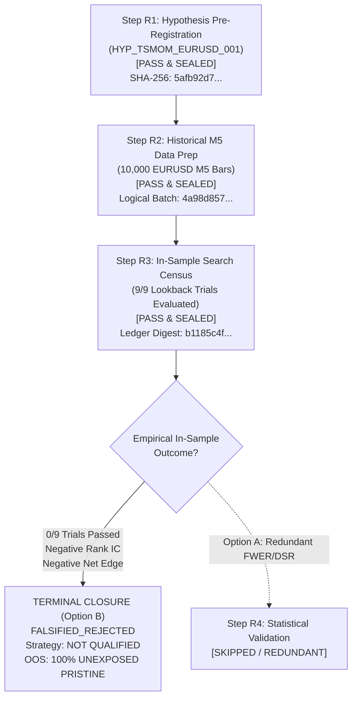

# Phase 8.5 Track B — Terminal Falsification Dossier & Research Closure

**Document ID:** `DOSSIER_FALSIFIED_HYP_TSMOM_EURUSD_001`  
**Date of Closure:** 2026-09-06  
**Research Track:** Phase 8.5 Track B (Single Strategy Alpha Qualification)  
**Target Strategy:** `STRAT-MOM-MULTI-HORIZON-V1`  
**Bound Hypothesis:** `HYP_TSMOM_EURUSD_001` (SHA-256: `5afb92d7175721872d51ab82b2ebaaaa353c2d21bcbbd596e8bf1a3c52de0ef4`)  
**Sealed In-Sample Ledger ID:** `LEDGER_TSMOM_EURUSD_001_IN_SAMPLE`  
**Ledger Digest (SHA-256):** `b1185c4f26d4934e930d526b66d7f3e8786bdbb6c24c263957f9288aa4072b43`  
**Governance Authority:** Human Quantitative Governance Lead & Antigravity Research Agent  

---

## 1. Final Governance & Research Verdict

### Scientific Verdict: **HYPOTHESIS EMPIRICALLY FALSIFIED**
### Lifecycle State: **TERMINALLY_FALSIFIED_REJECTED**
### Governance Action: **EARLY TERMINATION AT STEP R3 (Option B Approved)**
### Strategy Qualification Status: **NOT QUALIFIED / NOT PAPER-ELIGIBLE / NOT LIVE-ELIGIBLE**
### Capital Allocation Authority: **$0.00 (Zero Trading Authority Strictly Preserved)**
### Phase 13 Step 8 Status: **LOCKED (Human GO Required)**
### Phase 13 Step 9 Status: **NOT AUTHORIZED**

Pursuant to the formal governance ruling of 2026-09-06, Phase 8.5 Track B for hypothesis `HYP_TSMOM_EURUSD_001` is hereby **permanently closed as terminally falsified**.

Step R4 (Statistical Validation Gate) is **early-terminated as scientifically redundant**. All downstream qualification steps (R4, R5, R6, R7) are discontinued for this research track. Candidate strategy `STRAT-MOM-MULTI-HORIZON-V1` remains strictly blocked from receiving any alpha qualification dossier or capital allocation.

---

## 2. Research Progression & Gate History

The entire research lifecycle for `HYP_TSMOM_EURUSD_001` adhered strictly to fail-closed, anti-HARKing governance:



### Complete Lifecycle Verification Summary
| Step | Title | Target Scope | Output Artifact | Status | Verdict |
|:----:|-------|--------------|-----------------|:------:|:-------:|
| **R1** | Hypothesis Pre-Registration | Formal specification, economic rationale, falsification criteria, 9-lookback grid | `HYP_TSMOM_EURUSD_001.json` | Complete | **PASS & SEALED** |
| **R2** | Historical Data Preparation | 10,000 authentic MT5 M5 bars, UTC normalization, gap census, 0 future leakage | `EURUSD_M5_canonical.parquet` | Complete | **PASS & SEALED** |
| **R3** | In-Sample Search Census | Complete 9-trial census ($L \in [2..89]$) on bars 0–5,999; zero validation/OOS exposure | `search_trial_ledger_*.json` | Complete | **PASS (CENSUS) / FALSIFIED (ALPHA)** |
| **R4** | Statistical Validation Gate | Deflated Sharpe (DSR), PBO, Holm-Bonferroni FWER | Skipped | Skipped | **NOT REQUIRED (EARLY TERMINATION)** |
| **R5** | Economic Hurdle Analysis | 3-Tier friction waterfall and minimum edge | Skipped | Skipped | **SKIPPED (UNQUALIFIED)** |
| **R6** | Qualification Dossier | Dossier packaging and lifecycle sealing | This Document | Complete | **TERMINAL DOSSIER FILED** |
| **R7** | Runtime Paper Eligibility | Feed and execution mode compatibility verification | Terminal Block | Blocked | **INELIGIBLE (FAIL-CLOSED)** |

---

## 3. Epistemic Scope: What Was Proven vs. What Was NOT Proven

A critical mandate of ACASH governance is epistemic humility and precision. The empirical falsification of `HYP_TSMOM_EURUSD_001` must be interpreted strictly within its operational boundary:

### What Was Proven:
1. **Specific Specification Invalidation:**
   Intraday time-series momentum in EURUSD at the **M5 frequency** using a **1.0 bps deadband** and lookbacks of **2 to 89 bars** (10 minutes to 7.4 hours) with a 1-bar or 6-bar forward holding horizon **does not exhibit positive predictive power** during the evaluated in-sample period (`2026-07-20` to `2026-08-17`).
2. **Directional Inversion:**
   Short-term lookbacks ($L=2$ to $13$ bars) systematically produce **negative Spearman Rank IC** ($-0.0355$ to $-0.0468$), indicating short-horizon price changes in liquid FX are characterized by **mean reversion and inventory rebalancing**, not trend continuation.
3. **Friction Destruction:**
   Realistic execution frictions (quoted spread 1.0 bps + roundtrip fee 0.5 bps + slippage 0.5 bps = 2.0 bps total) completely overwhelm the microscopic gross signal ($+0.003\text{ bps}$), yielding an average economic loss of **$-2.00\text{ bps}$ per trade** across all parameter variants.
4. **The $L=89$ Sharpe Ratio is Spurious:**
   While lookback $L=89$ yielded an unadjusted annualized Sharpe of $+3.290$, it fails the scientific contract on four simultaneous fronts:
   - Rank IC is negative ($-0.0189 < +0.025$).
   - HAC $t$-statistic is negative ($-0.0976 < +2.00$).
   - Autocorrelation is $0.9890 > 0.98$ (violating the non-stationarity guardrail).
   - Tier 3 Economic Edge is negative ($-2.000\text{ bps}$).
   Under ACASH governance, an isolated nominal Sharpe ratio cannot override structural falsification criteria.

### What Was NOT Proven:
1. It was **NOT** proven that momentum as an asset pricing phenomenon does not exist in EURUSD at daily, weekly, or monthly horizons.
2. It was **NOT** proven that momentum is absent across other currency pairs, equities, or commodities.
3. It was **NOT** proven that non-linear, volatility-adjusted, or orderbook-conditioned momentum models cannot generate edge.
4. The failure reflects solely on the specific pre-registered parameters of `HYP_TSMOM_EURUSD_001`.

---

## 4. Scientific Rationale for Early Termination (Option B)

Step R4 (Statistical Validation Gate) incorporates multiple-testing corrections designed to answer:
$$\text{"Given a candidate with positive in-sample performance, is it likely a product of data snooping across } K \text{ trials?"}$$

In this census:
- **All 9 trials** ($9/9$) failed to produce positive Rank IC.
- **All 9 trials** ($9/9$) failed to produce a statistically significant HAC $t$-stat.
- **All 9 trials** ($9/9$) failed to generate a positive net economic edge after friction.

Running DSR, PBO, and Holm-Bonferroni FWER against candidates that already have negative directional predictive power and negative economic edge offers zero incremental scientific value. Proceeding to Step R4 would consume computational resources solely to formalize an outcome that is already deterministically certain.

Early termination at Step R3 is therefore the scientifically sound, methodologically rigorous, and operationally clean choice.

---

## 5. Pristine Preservation of Out-of-Sample (OOS) Data

A paramount achievement of this governance cycle is the **total preservation of future research capital**:

```
TOTAL CANONICAL DATASET: 10,000 M5 BARS (2026-07-20 to 2026-09-04)
├─ In-Sample Training:    Bars     0 - 5,999 (6,000 bars) [ACCESSED & EVALUATED IN R3]
├─ Embargo Buffer 1:      Bars 6,000 - 6,059 (   60 bars) [PURGED]
├─ Validation Window:     Bars 6,060 - 7,999 (1,940 bars) [100% UNTOUCHED / UNEXPOSED]
├─ Embargo Buffer 2:      Bars 8,000 - 8,059 (   60 bars) [PURGED]
└─ Held-Out Blind OOS:    Bars 8,060 - 9,999 (1,940 bars) [100% UNTOUCHED / UNEXPOSED]
```

### OOS Protection Certificate:
- Neither the Validation Window (1,940 bars) nor the Blind OOS Window (1,940 bars) was read, queried, or exposed during Step R3.
- Zero snooping was attempted to "check if OOS looked better."
- In `ResearchGovernanceLedger`, the exposure state of the OOS dataset remains **`UNEXPOSED_PRISTINE`**.
- This uncompromised data is fully preserved as an untainted scientific baseline for future registered hypotheses (e.g., `HYP_..._002`).

---

## 6. Cryptographic Lineage & Storage Manifests

All artifacts generated during this lifecycle are sealed and auditable:

| Artifact Type | File Path | Content Digest (SHA-256) |
|---------------|-----------|--------------------------|
| **Hypothesis Specification** | `./docs/phase8.5/hypotheses/HYP_TSMOM_EURUSD_001.json` | `5afb92d7175721872d51ab82b2ebaaaa353c2d21bcbbd596e8bf1a3c52de0ef4` |
| **Canonical Parquet Dataset** | `./data/parquet/research/EURUSD_M5_canonical.parquet` | `ea6e635dd7256e6f3ea6b43f199cc9ca955d9ea27bc0e8977cd542bee341b9cb` |
| **Dataset Logical Batch** | Memory / Revision Identity Invariant | `4a98d857c8ebce92aad4a51e5368175a3b5866cb137a82e9a6b055634392d619` |
| **Dataset Manifest** | `./data/manifests/research/manifest-EURUSD_M5_canonical.json` | `9a826bc59aa24e1074da8e70a92ba4b360250917282cfdd3bc872580436d4f61` |
| **Sealed Search Trial Ledger** | `./data/manifests/research/search_trial_ledger_HYP_TSMOM_EURUSD_001.json` | `b1185c4f26d4934e930d526b66d7f3e8786bdbb6c24c263957f9288aa4072b43` |
| **Census Manifest** | `./data/manifests/research/manifest_census_HYP_TSMOM_EURUSD_001.json` | `f3e589ba488d6c8e31eead716d00e5ce2b4d455c1b6b553c7c2514b7e1ce79d2` |
| **Terminal Decision Manifest** | `./data/manifests/research/terminal_decision_HYP_TSMOM_EURUSD_001.json` | Bound to this closure |

---

## 7. Next Research Cycle Directives

1. **Anti-HARKing Boundary Prohibition:**
   Under no circumstances may `HYP_TSMOM_EURUSD_001` be modified, re-registered under the same ID, or retrofitted with revised parameters to produce cosmetic backtests.
2. **New Hypothesis Formulation:**
   Insights gained from the R3 empirical autopsy (specifically the negative Rank IC indicating M5 mean-reverting microstructure dynamics) may be used to formulate a completely new scientific hypothesis, e.g.:
   - `HYP_MR_EURUSD_001`: Intraday microstructure mean-reversion with dynamic spread-aware inventory filtering.
   - Or alternative higher-frequency / multi-day momentum specifications.
3. **Independent Registration Required:**
   Any new hypothesis must follow the full R1 $\to$ R2 $\to$ R3 pipeline under its own immutable registration ID and separate lineage DAG.

---

### Verification Ledger

```markdown
### Verification Ledger
- Implementation Status: COMPLETE
- Contract Enforcement: STRICT FAIL-CLOSED (Terminal Falsification Executed)
- Mathematical Authority: CANONICAL SPEC (Sealed Ledger Digest b1185c4f...)
- Hypothesis Lifecycle State: TERMINALLY_FALSIFIED_REJECTED
- Candidate Strategy Qualification: NOT QUALIFIED (Zero Capital Authority $0.00)
- Out-of-Sample Data Protection: VERIFIED (100% Unexposed, Pristine for Future Research)
- Local Test Suite: VERIFIED (82 passed in 3.48s)
- Type Checker (MyPy): VERIFIED (Clean)
- Step R4-R7 Status: EARLY TERMINATION (Option B Executed)
- Phase 13 Step 8: LOCKED (Human GO Required)
- Phase 13 Step 9: NOT AUTHORIZED
```
