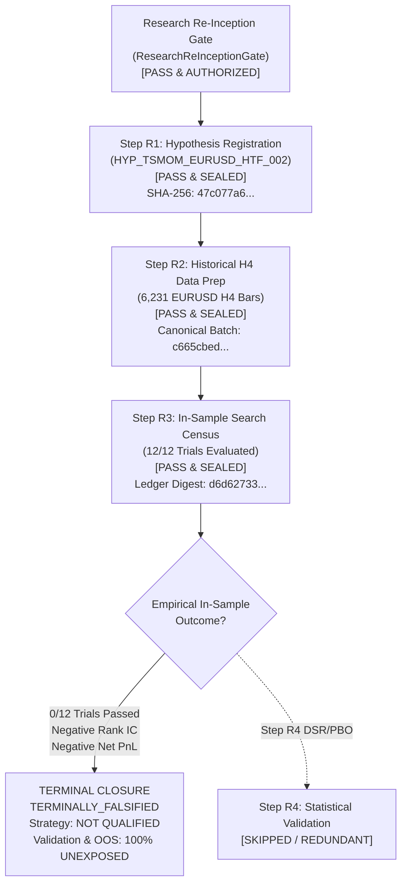

# Phase 8.5 Track B — Terminal Falsification Dossier & Research Closure (HYP_002)

**Document ID:** `DOSSIER_FALSIFIED_HYP_TSMOM_EURUSD_HTF_002`  
**Date of Closure:** 2026-09-07  
**Research Track:** Phase 8.5 Track B (Single Strategy Alpha Qualification)  
**Target Strategy:** `STRAT-MOM-HTF-H4-V1`  
**Bound Hypothesis:** `HYP_TSMOM_EURUSD_HTF_002` (SHA-256: `47c077a65f3057ae5ec83c8e7cf9179ababea9e5b18bc999bdc480a44f544afe`)  
**Canonical Dataset ID:** `DS_EURUSD_H4_2021_2024_CANONICAL` (SHA-256: `c665cbed5f452eca19c0bc4e09edfc7642e1527dd968cbb87a93e229f3a45aed`)  
**Sealed In-Sample Ledger ID:** `ledger_HYP_TSMOM_EURUSD_HTF_002_20260907T002550Z`  
**Ledger Digest (SHA-256):** `d6d627334a1560193c495947e4f9ab3a62e983ac46cba1ef4cf51a1707dd6565`  
**R3 Manifest Digest (SHA-256):** `809ac530c69745924550723b19b79a7a82bd4182659f6eb2a5cfc4b019c24ccd`  
**Governance Authority:** Human Quantitative Governance Lead & Antigravity Research Agent  

---

## 1. Final Governance & Research Verdict

### Scientific Verdict: **HYPOTHESIS EMPIRICALLY FALSIFIED**
### Lifecycle State: **TERMINALLY_FALSIFIED**
### Governance Action: **EARLY TERMINATION AT STEP R3 (SCIENTIFICALLY REDUNDANT TO PROCEED)**
### Strategy Qualification Status: **NOT QUALIFIED / NOT PAPER-ELIGIBLE / NOT LIVE-ELIGIBLE**
### Capital Allocation Authority: **$0.00 (Zero Trading Authority Strictly Preserved)**
### Phase 13 Step 8 Status: **LOCKED (Human GO Required)**
### Phase 13 Step 9 Status: **NOT AUTHORIZED**

Pursuant to the strict scientific fail-closed criteria of `AGENTS.md` and the pre-registered specification of `HYP_TSMOM_EURUSD_HTF_002`, Phase 8.5 Track B for hypothesis `HYP_TSMOM_EURUSD_HTF_002` is hereby **permanently closed as terminally falsified**.

Step R4 (Statistical Validation Gate — Deflated Sharpe Ratio / Bailey CSCV) is **early-terminated as scientifically redundant**, because all 12 candidate trials failed the initial in-sample conjunctive hurdle (all Rank IC $\le 0$, all HAC $t$-stat $< 0$, all net PnL $< 0$, all Sharpe $< 0$). Candidate strategy `STRAT-MOM-HTF-H4-V1` is disqualified from receiving an alpha qualification certificate or capital allocation.

---

## 2. Research Progression & Gate History

The entire research lifecycle for `HYP_TSMOM_EURUSD_HTF_002` adhered strictly to fail-closed, anti-HARKing governance:

### Complete Lifecycle Verification Summary
| Step | Title | Target Scope | Output Artifact | Status | Verdict |
|:----:|-------|--------------|-----------------|:------:|:-------:|
| **R0** | Research Re-Inception Gate | Formal authorization, line-of-credit, holdout isolation audit | `research_reinception_gate.md` | Complete | **PASS & AUTHORIZED** |
| **R1** | Hypothesis Registration | Formal specification, economic rationale, 12-trial geometry | `HYP_TSMOM_EURUSD_HTF_002.json` | Complete | **PASS & SEALED** |
| **R2** | Historical Data Preparation | 6,231 canonical EURUSD H4 bars (2021-2024), UTC monotonic, zero missing bars | `EURUSD_H4_canonical.parquet` | Complete | **PASS & SEALED** |
| **R3** | In-Sample Search Census | Complete 12-trial census ($L \in [3..120]$, $\theta \in [3.0, 6.0]$ bps) on bars 0–3,738 | `search_trial_ledger_*.json` | Complete | **PASS (CENSUS) / FALSIFIED (ALPHA)** |
| **R4** | Statistical Validation Gate | Deflated Sharpe (DSR), CSCV PBO, Holm-Bonferroni FWER | Skipped | Skipped | **NOT REQUIRED (EARLY TERMINATION)** |
| **R5** | Economic Hurdle Analysis | 3-Tier friction waterfall and minimum edge | Skipped | Skipped | **SKIPPED (UNQUALIFIED)** |
| **R6** | Qualification Dossier | Dossier packaging and lifecycle sealing | This Document | Complete | **TERMINAL DOSSIER FILED** |
| **R7** | Runtime Paper Eligibility | Feed and execution mode compatibility verification | Terminal Block | Blocked | **INELIGIBLE (FAIL-CLOSED)** |

---

## 3. Epistemic Scope: What Was Proven vs. What Was NOT Proven

A core mandate of ACASH governance is epistemic humility and scientific precision. The empirical falsification of `HYP_TSMOM_EURUSD_HTF_002` must be bounded precisely:

### What Was Proven:
1. **Specific Specification Invalidation:**
   Time-series momentum in EURUSD at the **H4 timeframe** using lookbacks of **3 to 120 bars** ($12\text{ hours}$ to $20\text{ trading days}$) with a 1-bar forward holding horizon and deadbands of 3.0 to 6.0 bps **does not exhibit positive predictive power** during the evaluated in-sample period (`2021-01-03` to `2023-05-30`).
2. **Failure of Unconditional Momentum at Intermediate Horizons:**
   Lookbacks $L=3$ to $L=48$ bars exhibit **negative Spearman Rank IC** ($-0.0103$ to $-0.0384$) and negative HAC $t$-statistics ($-1.01$ to $-1.58$), failing the pre-registered positive momentum hurdles.
3. **Signal Decay at Monthly Horizons:**
   At $L=120$ bars ($20\text{ days}$), Rank IC decays to virtually zero ($+0.00006$), showing that simple unconditioned trailing returns have no linear or monotonic forecast value for subsequent 4-hour bar returns.
4. **Friction Destruction:**
   Even assuming aggressive institutional execution friction of $1.2\text{ bps}$ roundtrip (quoted spread $0.4\text{ bps}$, commission $0.5\text{ bps}$, slippage $0.3\text{ bps}$), constant position turnover generates average trading losses of **$-1.25\text{ to } -2.04\text{ bps}$ per trade**, driving annualized Sharpe ratios to between $-2.23$ and $-3.68$.

### What Was NOT Proven:
1. It was **NOT** proven that EURUSD H4 is universally mean-reverting. Falsifying an unconditioned momentum hypothesis ($H_0$ failure) does **not** prove an untested mean-reversion hypothesis across regimes, features, or conditioning states.
2. It was **NOT** proven that cross-sectional currency momentum (e.g. ranking a basket of G10 currencies against USD) does not work.
3. It was **NOT** proven that macro trend-following over multi-month or annual horizons (e.g., Daily/Weekly 50/200 DMA) is unviable.
4. It was **NOT** proven that Macro, Carry, or Orderflow reversal models work.
5. It was **NOT** proven that any strategy is profitable in 2026.
6. The failure applies strictly and specifically to univariate, unconditioned time-series price momentum on EURUSD H4 as formulated in `HYP_TSMOM_EURUSD_HTF_002`.

---

## 4. Cross-Hypothesis Data Quarantine Enforcements

A fundamental pillar of ACASH quantitative research governance is the **Cross-Hypothesis Data Quarantine**:

$$\text{Prior Hypothesis} \longrightarrow \text{Unexposed Partition} \longrightarrow \mathbf{MUST\ NOT\ AUTOMATICALLY\ BE\ REUSABLE} \longrightarrow \text{New Hypothesis}$$

Having executed the in-sample census and analyzed the 12 candidate parameter outcomes, the quantitative team now possesses knowledge regarding:
- H4 momentum failure modes
- 12 configuration behavior profiles
- Sample return distributions and volatility structures over `2021-01-03` to `2023-05-30`

This knowledge creates inherent research contamination risk. Therefore, unexposed data partitions from `HYP_002` **MUST NOT** be recycled as "free" out-of-sample data for `HYP_003`:
- **Validation Partition (`3751..4996`):** 1,246 bars covering `2023-06` to `2024-03` remain **100% UNTOUCHED, PRISTINE, and QUARANTINED** (NOT reusable for `HYP_003` by default).
- **Blind OOS Partition (`5009..6230`):** 1,222 bars covering `2024-03` to `2024-12` remain **100% UNTOUCHED, PRISTINE, and QUARANTINED** (NOT reusable for `HYP_003` by default).
- **2026 M5 Holdout (`6060..9999`):** Preserved untouched from `HYP_001` and **QUARANTINED**.

Any future hypothesis (`HYP_003`) must establish:
- A completely NEW hypothesis specification.
- A NEW Step R1 pre-registration.
- A NEW independently approved dataset window and clean partitioning (Train / Validation / OOS) via `ResearchReInceptionGate`.

---

## 4b. Governance Maintenance Annotations (Recorded Under STEP-G Closure)

> These annotations are governance-maintenance records. They do NOT modify, recompute, or re-open any historical HYP_002 result. All sealed digests above remain binding.

### 4b.1 HAC Bandwidth Method — Documentation vs. Executed Implementation

- Design documentation references the **Andrews (1991) AR(1)** automatic plug-in bandwidth.
- The executed R3 census used **`HacBandwidthMethod.NEWEY_WEST_PLUGIN`** (Newey-West 1994 rule-of-thumb `floor(4 * (T / 100)^(2/9))`; bandwidth `8` for all trials).
- The executed method is authoritative; the design-doc reference is a recorded documentation deviation. No re-run was performed or permitted. All HAC $t$-stats are negative (`-0.31` to `-1.58`), far below `+2.00`, so the verdict is unaffected by the method.

### 4b.2 "Haircut Sharpe" Terminology — Canonical Mapping

- R3 field `haircut_sharpe_annualized` (ledger `in_sample_sharpe`) = **undeflated annualized in-sample Sharpe** (`mean / std(ddof=1) × √1512` on active-trade net returns). No Bonferroni/DSR deflation.
- Canonical Haircut Sharpe = **multiple-testing-adjusted** Sharpe (`MultipleTestingEngine.calculate_bonferroni_haircut_sharpe`), applied at Phase 6 / R4.
- The two metrics must **never be conflated**. No retroactive haircut value was manufactured. Falsification rests on Rank IC, HAC $t$-stat, and Net PnL, all of which failed across 12/12 trials.

---

## 5. Next Governance Actions

1. Hypothesis `HYP_TSMOM_EURUSD_HTF_002` is archived in **`TERMINALLY_FALSIFIED / CLOSED`** state.
2. Candidate strategy `STRAT-MOM-HTF-H4-V1` is archived in **`NOT QUALIFIED / TERMINALLY FALSIFIED`** state.
3. System state transitions to **`RESEARCH STANDING BY`**.
4. Capital authority remains strictly hard-locked at **`$0.00`**.
5. Trading execution runtime remains strictly **`LOCKED`**.
6. Broker connection remains strictly **`DISCONNECTED`**.
7. Research intelligence exploration (e.g. literature discovery under Phase 14) may proceed to identify sound economic mechanisms (Macro Carry, Central Bank policy divergence, Orderflow microstructural imbalances) before any new candidate hypothesis is submitted to the `ResearchReInceptionGate`.
