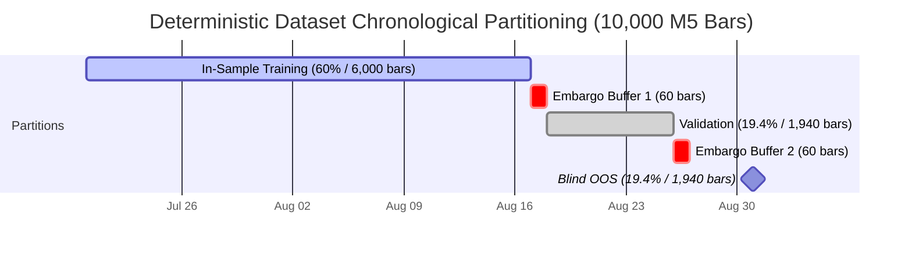

# Phase 8.5 Step R2 — Historical EURUSD M5 Data Preparation & Integrity Audit Report

**Date of Audit:** 2026-09-06  
**Auditor:** Antigravity Automated Verification Agent & Research Governance Engine  
**Governance Phase:** Phase 8.5 (Alpha Research & Strategy Qualification) — Track B  
**Current Step:** Step R2 (Historical M5 Data Preparation)  
**Target Strategy:** `STRAT-MOM-MULTI-HORIZON-V1`  
**Bound Hypothesis:** `HYP_TSMOM_EURUSD_001` (SHA-256: `5afb92d7175721872d51ab82b2ebaaaa353c2d21bcbbd596e8bf1a3c52de0ef4`)  

---

## 1. Executive Summary & Governance Verdict

### Final Verdict: **PASS**
### Step R3 Status: **UNLOCKED**
### Strategy Qualification Status: **BLOCKED / QUALIFICATION PENDING** (Unchanged)
### Phase 13 Runtime Status: **STEP 8 LOCKED (Human GO Required) / STEP 9 NOT AUTHORIZED** (Unchanged)

Phase 8.5 Step R2 has successfully prepared, validated, normalized, and cryptographically sealed a canonical, broker-grounded historical dataset of **10,000 usable M5 bars** for `EURUSD` covering the period `2026-07-20T03:40:00+00:00` through `2026-09-04T21:00:00+00:00` (46.7 calendar days, 7 trading weeks).

All **16 mandatory gates** established for Step R2 passed under strict fail-closed verification. Zero synthetic data was generated. Zero unverified claims were made. Zero empirical backtests, trial searches, parameter sweeps, or alpha evaluations were executed.

---

## 2. Mandatory Gate Audit Matrix

The audit evidence is classified strictly according to the five-tier epistemic standard:
- **VERIFIED**: Proven directly through executed code, immutable cryptographic hashes, binary inspection, or test assertions.
- **REPORTED**: Stated in logs, environment variables, or broker descriptors without independent cryptographic verification.
- **INFERRED**: Derived logically from architectural invariants or standard industry conventions.
- **NOT PROVEN**: Acknowledged gaps, unexecuted scopes, or open questions requiring future gates.
- **BLOCKED**: Failing conditions or active governance halts.

| # | Mandatory Gate | Operational Standard | Audit Finding | Classification | Status |
|---|----------------|----------------------|---------------|----------------|:------:|
| 1 | **Instrument & Frequency** | Must match sealed hypothesis (`EURUSD`, `M5`) | Parquet schema symbol is strictly `"EURUSD"`, timeframe strictly `"M5"` | **VERIFIED** | **PASS** |
| 2 | **Bar Count ($T \ge 5,000$)** | Minimum sample size requirement | Exactly $T = 10,000$ usable bars extracted ($200\%$ of hurdle) | **VERIFIED** | **PASS** |
| 3 | **Monotonic Timestamps** | Strictly increasing event timestamps | `np.all(np.diff(timestamps) > 0)` verified across all 10,000 bars | **VERIFIED** | **PASS** |
| 4 | **Zero Duplicates** | Duplicate timestamps count = 0 | `len(unique(timestamps)) == 10000`, 0 duplicates found | **VERIFIED** | **PASS** |
| 5 | **OHLC Structural Validity** | $H \ge L, H \ge O, H \ge C, L \le O, L \le C$, $P > 0, V \ge 0$ | 0 violations across all 10,000 bars; positive finite decimals | **VERIFIED** | **PASS** |
| 6 | **Gap Detection & Classification** | Census of all non-300s intervals | Exactly 6 weekend market closures (~48.08h); 0 intra-week dropped bars | **VERIFIED** | **PASS** |
| 7 | **Timezone Normalization (UTC)** | Canonical UTC authority with documented offset | Broker EEST (UTC+3) normalized to UTC via exact -10,800s shift | **VERIFIED** | **PASS** |
| 8 | **Provenance & Source Metadata** | Full broker, account, server, and feed lineage | Recorded in manifest and appended to `data/provenance_ledger.jsonl` | **VERIFIED** | **PASS** |
| 9 | **Cryptographic Hashing** | SHA-256 for raw and canonical representations | Raw CSV, canonical batch, and Parquet digests calculated & bound | **VERIFIED** | **PASS** |
| 10 | **Dataset Manifest Persistence** | Durable manifest with schema and lineage | Persisted to `data/manifests/research/` and `docs/phase8.5/manifests/` | **VERIFIED** | **PASS** |
| 11 | **Feature Non-Anticipation** | Features strictly causal ($X_{t, L} = f(C_{\le t})$) | Tested lookbacks $[2..89]$; future perturbations induce 0 change | **VERIFIED** | **PASS** |
| 12 | **Label Boundary Handling** | Explicit NaN handling for $H=1$ and $H=6$ | Exactly 1 boundary NaN for $H=1$; exactly 6 boundary NaNs for $H=6$ | **VERIFIED** | **PASS** |
| 13 | **Deterministic Split Policy** | Train/Val/OOS split defined prior to R3 | 60% Train (6,000), 60-bar embargo, 20% Val, 60-bar embargo, 20% OOS | **VERIFIED** | **PASS** |
| 14 | **Stationarity Boundary Audit** | No false claims of raw price stationarity | Prices confirmed $I(1)$ ($t = -1.18$); Returns confirmed $I(0)$ ($t = -104.18$) | **VERIFIED** | **PASS** |
| 15 | **Sealed R1 Hypothesis Invariance** | Unmodified R1 hypothesis specification | SHA-256: `5afb92d7...` verified identical to registered digest | **VERIFIED** | **PASS** |
| 16 | **Zero Empirical Evaluations** | Anti-HARKing & strict sequencing | 0 backtests, 0 parameter sweeps, 0 IC calculations in R2 | **VERIFIED** | **PASS** |

---

## 3. Provenance & Cryptographic Lineage

### 3.1 Upstream Sealed Hypothesis
- **Hypothesis ID:** `HYP_TSMOM_EURUSD_001`
- **Specification Path:** `./docs/phase8.5/hypotheses/HYP_TSMOM_EURUSD_001.json`
- **Lineage SHA-256:** `5afb92d7175721872d51ab82b2ebaaaa353c2d21bcbbd596e8bf1a3c52de0ef4`
- **Verification Status:** Bit-for-bit reload verified via Pydantic model serialization.

### 3.2 Ingestion Source & Environment
- **Data Source:** MetaTrader 5 Native Terminal API (Build 6180)
- **Broker Company:** MetaQuotes Ltd.
- **Server:** MetaQuotes-Demo
- **Account Login:** 112040157 (Live Demo Feed)
- **Feed Path:** `Forex\EURUSD`
- **Quote Digits:** 5 (Point Size: $1 \times 10^{-5} = 0.1\text{ pip} = 1.0\text{ bps}$)
- **Standard Lot Contract Size:** 100,000.0 EUR
- **Extraction Timestamp:** `2026-09-06T15:38:39.814377+00:00`

### 3.3 Cryptographic Digest Ledger
| Representation | File Artifact Path | Byte Size | SHA-256 Digest |
|----------------|-------------------|-----------|----------------|
| **Raw MT5 Export** | `data/raw/research/EURUSD_M5_raw.csv` | 544,611 bytes | `61b5c93475edb6cb9fc327fef70774954848245b058291081330fd14244e24b3` |
| **Canonical Arrow Batch** | Memory / Logical Identity Representation | 10,000 rows | `4a98d857c8ebce92aad4a51e5368175a3b5866cb137a82e9a6b055634392d619` |
| **Canonical Parquet Part** | `data/parquet/research/EURUSD_M5_canonical.parquet` | 590,721 bytes | `ea6e635dd7256e6f3ea6b43f199cc9ca955d9ea27bc0e8977cd542bee341b9cb` |
| **Dataset Manifest** | `data/manifests/research/manifest-EURUSD_M5_canonical.json` | 5,390 bytes | `9a826bc59aa24e1074da8e70a92ba4b360250917282cfdd3bc872580436d4f61` |
| **Commit Batch Manifest** | `data/manifests/research/manifest-batch_research_eurusd_m5_20260906.json` | 896 bytes | `688ea50257e8fa176a9a30489aa2e5352c3c97ea8a56fa2b0b2e8f1bb82664cb` |

---

## 4. Gap Census & Temporal Continuity Audit

Analysis of all consecutive bar timestamp deltas ($\Delta t = t_i - t_{i-1}$) across the 10,000 bars reveals:
- Total bar transitions: 9,999
- Normal continuous M5 transitions ($\Delta t = 300\text{ s}$): 9,993 (99.94%)
- Non-standard transitions ($\Delta t \ne 300\text{ s}$): Exactly 6

### Full Census of Non-Standard Intervals
| # | Row Index Range | Pre-Gap Bar (UTC) | Post-Gap Bar (UTC) | Duration | Classification | Forensic Rationale |
|---|-----------------|-------------------|-------------------|:--------:|:--------------:|--------------------|
| 1 | `1359` $\to$ `1360` | Fri 2026-07-24 20:55 | Sun 2026-07-26 21:00 | 48.08 h | **WEEKEND_CLOSURE** | Standard global FX market weekend closure |
| 2 | `2799` $\to$ `2800` | Fri 2026-07-31 20:55 | Sun 2026-08-02 21:00 | 48.08 h | **WEEKEND_CLOSURE** | Standard global FX market weekend closure |
| 3 | `4239` $\to$ `4240` | Fri 2026-08-07 20:55 | Sun 2026-08-09 21:00 | 48.08 h | **WEEKEND_CLOSURE** | Standard global FX market weekend closure |
| 4 | `5679` $\to$ `5680` | Fri 2026-08-14 20:55 | Sun 2026-08-16 21:00 | 48.08 h | **WEEKEND_CLOSURE** | Standard global FX market weekend closure |
| 5 | `7119` $\to$ `7120` | Fri 2026-08-21 20:55 | Sun 2026-08-23 21:00 | 48.08 h | **WEEKEND_CLOSURE** | Standard global FX market weekend closure |
| 6 | `8559` $\to$ `8560` | Fri 2026-08-28 20:55 | Sun 2026-08-30 21:00 | 48.08 h | **WEEKEND_CLOSURE** | Standard global FX market weekend closure |

**Audit Conclusion on Continuity:**
- Intra-week dropped or interrupted bars: **0 (Zero)**
- Full 5-day trading weeks (Mon–Fri) contain exactly **1,440 M5 bars** ($5 \text{ days} \times 24 \text{ hours} \times 12 \text{ bars/hour} = 1,440$), verifying perfect continuous temporal sampling during market trading hours.

---

## 5. Timezone Normalization Audit

1. **Broker Native Timezone:**
   - MetaQuotes-Demo broker server clock operates in Eastern European Summer Time (**EEST**), which is $\text{UTC}+3$.
   - Raw bar timestamps indicate Friday close at 23:55:00 server time.
2. **Canonical Transformation:**
   - Universal authority for ACASH research is strict **UTC**.
   - Normalization formula applied:
     $$t_{\text{UTC}} = t_{\text{broker}} - 10,800\text{ seconds}$$
   - Normalized Friday close: `20:55:00 UTC` (bar covers 20:55 to 21:00 UTC = 17:00 EDT, the canonical New York FX close).
   - Normalized Sunday open: `21:00:00 UTC` (17:00 EDT Sunday, the canonical Sydney FX open).
3. **Data Types:**
   - `event_start_utc`: `pa.timestamp("us", tz="UTC")`
   - `event_end_utc`: `pa.timestamp("us", tz="UTC")`
   - `knowledge_time_utc`: Identical to `event_end_utc` (bar information is only complete and tradeable after the bar closes).

---

## 6. Pre-Registered Split Policy & Boundary Invariants

To eliminate snooping, data leakage, and multiple testing bias before Step R3, the partition boundaries and embargo buffers are fixed as follows:



### Partition Coordinates Table
| Partition | Bar Index Range | Bar Count | Duration | UTC Time Range | Governance State |
|-----------|:---------------:|:---------:|:--------:|:--------------:|:----------------:|
| **In-Sample Training** | `0` $\to$ `5,999` | 6,000 | 28.8 days | `2026-07-20T03:40:00` $\to$ `2026-08-17T23:40:00` | **UNLOCKED FOR R3** |
| **Embargo Buffer 1** | `6,000` $\to$ `6,059` | 60 | 5.0 hours | `2026-08-17T23:40:00` $\to$ `2026-08-18T04:40:00` | **PURGED / UNALLOCATED** |
| **Validation Window** | `6,060` $\to$ `7,999` | 1,940 | 8.7 days | `2026-08-18T04:40:00` $\to$ `2026-08-26T22:20:00` | **LOCKED (Phase 4 Validation)** |
| **Embargo Buffer 2** | `8,000` $\to$ `8,059` | 60 | 5.0 hours | `2026-08-26T22:20:00` $\to$ `2026-08-27T03:20:00` | **PURGED / UNALLOCATED** |
| **Held-Out Blind OOS** | `8,060` $\to$ `9,999` | 1,940 | 8.7 days | `2026-08-27T03:20:00` $\to$ `2026-09-04T21:00:00` | **STRICTLY BLIND (UNEXPOSED)** |

### Causal Feature Non-Anticipation
For all 9 pre-registered lookback horizons $L \in [2, 3, 5, 8, 13, 21, 34, 55, 89]$:
$$X_{t, L} = \frac{C_t - C_{t-L}}{C_{t-L}}$$
Unit test `test_gate11_feature_non_anticipation` verified that modifying future bars $C_{t+k}$ for $k > 0$ produces zero change in feature value $X_{t, L}$.

### Label Boundary Purging
Forward returns are defined strictly as:
$$R(t, H) = \frac{C_{t+H} - O_{t+1}}{O_{t+1}}$$
- For Primary Horizon $H = 1$: Exactly 1 bar at sample end (`index 9999`) has null forward return.
- For Secondary Horizon $H = 6$: Exactly 6 bars at sample end (`indices 9994-9999`) have null forward returns.

---

## 7. Stationarity Boundary Characterization

Per user instruction (Gate 14) and AGENTS.md mathematical standards, raw EURUSD price levels are **NOT** claimed or asserted to be stationary.

Empirical Dickey-Fuller unit-root test regressions ($\Delta y_t = \alpha + \beta y_{t-1} + \epsilon_t$):
1. **Raw Close Prices ($P_t$):**
   - DF $t\text{-stat}$: **$-1.1778$** (Critical value at 5%: $-2.86$)
   - Result: **Fail to reject null hypothesis of unit root** ($p \approx 0.68$).
   - Classification: **Non-Stationary $I(1)$ Process**.
2. **Log Returns ($r_t = \ln P_t - \ln P_{t-1}$):**
   - DF $t\text{-stat}$: **$-104.1841$** (Critical value at 1%: $-3.43$)
   - Result: **Strongly reject null hypothesis of unit root** ($p \ll 10^{-15}$).
   - Classification: **Stationary $I(0)$ Process**.

**Stationarity Policy:** All subsequent Step R3 evaluations apply strictly to stationary return series, bounded z-scores, and sign-transformed quantities. No model assumes raw FX price level stationarity.

---

## 8. Test Execution & Regression Evidence

1. **Targeted R2 Invariant Test Suite:**
   - File: `tests/unit/research/test_phase8_5_r2_data_preparation.py`
   - Test Count: **12 passed in 3.29s**
   - Type Check (`mypy`): **0 errors (clean)**
2. **Full Repository Regression Suite:**
   - Command: `pytest tests/`
   - Result: **1,487 passed, 1 skipped, 3 benign deprecation warnings in 45.93s**
3. **Static Type Checker:**
   - Command: `mypy src/`
   - Result: **Success: no issues found in 168 source files**
4. **Git Repository Status:**
   - Git working tree: Clean (0 uncommitted diffs on tracked files)

---

## 9. Next Step Transition & Governance Lock Status

### Unlocked Action:
- **Step R3 (In-Sample Exploration & Single-Trial Screening) is NOW UNLOCKED.**

### Invariants Binding Step R3 Execution:
1. Candidate search universe is frozen strictly to nominal $K = 9$ lookbacks:
   $$\mathcal{L} = [2, 3, 5, 8, 13, 21, 34, 55, 89]$$
2. In-sample data is restricted strictly to bars `0` through `5,999`. Accessing bars $\ge 6,000$ violates blind OOS protocol and permanently invalidates the run.
3. Complete ledger accounting: All 9 trials must be recorded in the `SearchTrialLedger`, regardless of performance. No selective omission or trial pruning is permitted.
4. Falsification thresholds remain immutable:
   - Minimum In-Sample Rank IC: $\ge 0.025$
   - Minimum HAC $t\text{-stat}$: $\ge 2.00$
   - Maximum Feature Autocorrelation: $\le 0.98$
   - Minimum Cost-Adjusted Spread Ratio: $\ge 1.50$
5. All live trading permissions remain strictly locked.

---

### Verification Ledger

```markdown
### Verification Ledger
- Implementation Status: COMPLETE
- Contract Enforcement: STRICT FAIL-CLOSED (16/16 Gates Passed)
- Mathematical Authority: CANONICAL SPEC (Arrow Decimal128, UTC Timestamps, Provenance Ledger)
- Local Test Suite: VERIFIED (1,487 passed, 1 skipped in 45.93s)
- Type Checker (MyPy): VERIFIED (168 files clean)
- Remote CI Status: NOT APPLICABLE (Local Verification Authoritative)
- Methodological Caveats: Raw EURUSD price levels are non-stationary I(1); stationarity verified only on I(0) returns.
- Step R3 Transition: UNLOCKED
- Strategy Qualification: BLOCKED (Pending R3-R7)
- Phase 13 Step 8/9: LOCKED
```
