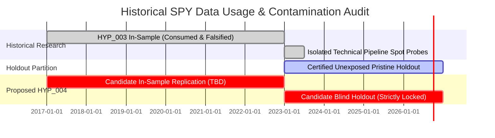

# MEC-0014: Data Architecture, Requirements Matrix & Contamination Governance

```text
[DATA REQUIREMENTS SPECIFICATION]
[INTENDED MECHANISM: MEC-0014 MARKET INTRADAY MOMENTUM]
[ZERO DATA LOADED / ZERO API CALLS EXECUTED]
```

- **Document ID:** `docs/research/MEC-0014-data-requirements.md`
- **Target Mechanism:** `MEC-0014`
- **Date:** 2026-09-19
- **Governing Standard:** AGENTS.md (Data Lineage & Strict Fail-Closed Boundaries)

---

## 1. Primary vs. Auxiliary Data Field Classification

Every data element under consideration for MEC-0014 is categorized under four strict operational classes:
- `REQUIRED_PRIMARY`: Mandatory for the foundational baseline statistical replication.
- `OPTIONAL_MECHANISM_ANALYSIS`: Useful for secondary economic attribution; strictly quarantined from primary tests.
- `NOT_REQUIRED`: Explicitly excluded to prevent unnecessary pipeline complexity or data snooping.
- `UNRESOLVED`: Requires formal Human governance or data engineering authority before pre-registration.

#### Comprehensive Field Classification Table

| Data Element | Operational Classification | Source / Feed Authority | Sampling Frequency | Justification & Governance Constraints |
| :--- | :---: | :--- | :---: | :--- |
| **SPY Regular-Session 1m Bars** | `REQUIRED_PRIMARY` | Consolidated SIP (Alpaca raw feed) | 1-minute (09:30:00–15:59:59 ET) | Core price series required to construct 10:00 ET predictor and 15:30–15:59 target interval. Already verified in CA-1 dataset. |
| **Historical Closing Auction Records** | `REQUIRED_PRIMARY / OPEN` | Alpaca Historical Auctions (`/v2/stocks/auctions`) | Daily closing cross | Required for authoritative closing auction price discovery. Ingestion pending contract test. |
| **Official Previous-Close Authority ($P_{\text{close}, t-1}$)** | `REQUIRED_PRIMARY / OPEN` | Alpaca Auction Cross / SIP Daily Bar Close | Daily (at $t-1$ Close) | Required for exact Gao et al. $r_1$ calculation ($\ln(P_{10:00,t} / P_{\text{close},t-1})$). 15:59 close is strictly prohibited as a silent proxy. |
| **Exact 15:30 Entry Price Authority** | `REQUIRED_PRIMARY / OPEN` | Consolidated SIP 15:30:00 Open | Per session at 15:30:00 | Required for non-anticipating execution translation. Must execute at open of 15:30 bar. |
| **Exact Final-Half-Hour Exit Authority** | `REQUIRED_PRIMARY / OPEN` | SIP 15:59:59 Close vs. 16:00:00 Auction | Per session at 16:00:00 | Requires unambiguous rule: continuous trading exit vs. MOC closing auction cross. |
| **Bid/Ask Spread / Quotes (if evaluating tradability)** | `REQUIRED_PRIMARY / OPEN` | Consolidated SIP Top-of-Book (NBBO) | At 15:30 and 16:00 prints | Required if moving from econometric replication to executable trading strategy evaluation. |
| **Corporate Action / Adjustment Policy** | `REQUIRED_PRIMARY` | Split-adjusted, Raw Cash Dividends | Daily / Event-driven | Intraday returns within day $t$ require split adjustment across overnight boundaries, but raw pricing during continuous session. |
| **NYSE CA-1 Trading Calendar** | `REQUIRED_PRIMARY` | `NyseCa1Calendar` | Daily session schedule | Defines valid 390-minute regular sessions, official holidays, and early closes (13:00 ET). |
| **Early-Close Session Exclusion** | `REQUIRED_PRIMARY` | CA-1 Calendar Policy | Session filter | Early-close sessions (13:00 ET) cannot accommodate a 15:30–16:00 target interval; must be fail-closed excluded. |
| **Institutional Friction Model** | `REQUIRED_PRIMARY` | Frozen ACASH Policy | Per-trade execution | 1.6 bps round-trip transaction costs (0.8 bps entry + 0.8 bps exit) + 1.0 bps round-trip adverse slippage (0.5 bps entry + 0.5 bps exit). |
| **Twelfth Half-Hour Bars ($r_{12}$, 15:00–15:30)** | `OPTIONAL_MECHANISM_ANALYSIS` | Consolidated SIP | 1-minute | Used in Gao et al. secondary regression ($r_1 + r_{12} \to r_{13}$). Quarantined from primary baseline. |
| **Intraday Trading Volume** | `OPTIONAL_MECHANISM_ANALYSIS` | Consolidated SIP | 1-minute | Evaluates Gao et al. high-volume day conditioning. Quarantined from primary baseline. |
| **CBOE Volatility Index (VIX)** | `OPTIONAL_MECHANISM_ANALYSIS` | CBOE Daily Historical Feed | Daily close | Evaluates volatility-regime conditioning. Quarantined from primary baseline. |
| **Macro Announcement Schedule (FOMC/CPI)** | `OPTIONAL_MECHANISM_ANALYSIS` | Bureau of Labor Statistics / Fed | Calendar dates | Evaluates announcement-day conditioning. Quarantined from primary baseline. |
| **Options Market Maker Gamma / GEX** | `NOT_REQUIRED` | OCC / Third-Party Vendor | Intraday / Daily | **REJECTED FOR PRIMARY:** ACASH lacks authoritative historical GEX feeds. Supportive theory only. |
| **Order Book / L2 Depth** | `NOT_REQUIRED` | Direct Exchange Feeds | Tick-level | MEC-0014 is a 30-minute macro intraday anomaly; microsecond depth is unneeded and computationally prohibitive. |

---

## 2. Critical Implementation Seams

### 2.1 The Previous-Close Authority Seam (`PREVIOUS_CLOSE_AUTHORITY = PROVISIONALLY_RESOLVABLE_PENDING_CONTRACT_TEST`)
Gao et al. explicitly formulate the early-session predictor as:
$$r_{1,t} \equiv \ln\left(\frac{P_{10:00, t}}{P_{\text{close}, t-1}}\right)$$

In the historical ACASH Step R2 canonical dataset (`HYP_003_SPY_1Min_IS_canonical.parquet`), sessions contain exactly 390 bars spanning timestamps `09:30` through `15:59` ET. The 16:00 closing auction print was intentionally excluded under HYP_003 rules.

**MANDATE:** The 15:59 minute close **MUST NOT** be treated as exact previous official close.

**Discovery & Resolution Pathway:**
Alpaca provides dedicated historical stock auction endpoints (`/v2/stocks/{symbol}/auctions` and `/v2/stocks/auctions`) that provide historical auction prices for US equities. Furthermore, Alpaca documentation explicitly distinguishes:
1. Minute-bar close (e.g. 15:59 continuous close),
2. Daily-bar close,
3. Market-center closing/auction trade prints (which can execute after 16:00:00).

Alpaca explicitly documents that the official daily close can differ from the final continuous minute bar and cannot be trivially manufactured from 15:59/16:00 minute bars alone.

**Resolution State:** $\mathbf{PREVIOUS\_CLOSE\_AUTHORITY = PROVISIONALLY\_RESOLVABLE\_PENDING\_CONTRACT\_TEST}$.
- **Preferred Authority Candidate:** Alpaca historical closing-auction / official-close record under SIP semantics.
- **Fallback Candidate:** Alpaca SIP daily bar close.
- Equivalence between auction price and daily close must be verified empirically and contractually before HYP_004 pre-registration.

**Future Contract Test Requirement:**
Before any hypothesis proposal, an authorized contract test on a small historical sample must:
1. Retrieve historical auction closes via `/v2/stocks/SPY/auctions`;
2. Retrieve SIP daily bar closes;
3. Inspect closing trade condition semantics;
4. Compare exact equality vs. differences;
5. Determine which field best reproduces Gao's "previous market close".
*(No market data is authorized or fetched in this intake task).*

---

### 2.2 Execution Mapping Seam (`EXECUTION_MAPPING = PARTIALLY_RESOLVED / ACASH CONTRACT OPEN`)
The source literature contains **both**:
1. Predictive linear regressions ($r_{13,t} = \alpha + \beta r_{1,t} + \epsilon_t$);
2. An explicit market-timing strategy translation based on $\text{sign}(r_1)$:
   - If $r_{1,t} > 0 \implies \text{Long final half-hour } (15:30 \to 16:00)$;
   - If $r_{1,t} < 0 \implies \text{Short final half-hour } (15:30 \to 16:00)$.

However, ACASH has not yet audited whether the original execution, spread, cost, auction, and slippage assumptions map cleanly to the current Alpaca SIP data contract and contemporary execution environment.

```text
Information Set:              Execution Trigger:           Holding Interval:               Exit Trigger:
All bars <= 15:29:59 ET  -->  Entry at 15:30:00 Open  -->  Holding 15:30 to 15:59:59  -->  Exit at 15:59:59 Close
(r1 sign determined)          (Market / Limit Order)                                       (or 16:00 Closing Auction)
```

1. **Lookahead Vulnerability:** Entry must execute strictly at the opening of the 15:30 bar based on information finalized by 10:00:00 (for $r_1$) or 15:29:59 (for $r_{12}$).
2. **Exit Ambiguity:** Continuous 15:59:59 exit vs. MOC 16:00:00 auction cross. Continuous exit avoids auction imbalances but may incur wider spread; auction cross matches literature target $P_{16:00}$ but requires earlier MOC order submission.

**Status:** $\mathbf{EXECUTION\_MAPPING = PARTIALLY\_RESOLVED\ /\ ACASH\ CONTRACT\ OPEN}$. The primary research architecture must decouple statistical replication (`MEC-0014A`) from market-timing trading replication (`MEC-0014B`).

---

## 3. Data Contamination & Historical SPY Usage Map

To prevent statistical snooping and maintain the integrity of ACASH partitions, all historical interactions with SPY data are cataloged below:



### 3.1 Contamination Boundary Definitions:
1. **Strategy-Unexposed vs. Never Technically Queried:**
   - The period `2017-01-01` through `2022-12-31` was consumed during `HYP_003` for *Opening Range Breakout* testing. It was **never evaluated for 10:00 $\to$ 15:30 market intraday momentum**.
   - Isolated timestamps in 2023 were queried strictly for schema validation and provider pagination checks during technical qualification, without evaluating alpha metrics or strategy rules.
   - The full 4-year holdout window (`2023-01-01` through `2026-12-31`) is certified **UNEXPOSED_PRISTINE** under the HYP_003 terminal dossier.
2. **Partition Invariant:** Any future candidate In-Sample partition for MEC-0014 must be explicitly bounded, and the pristine 2023–2026 holdout must remain **strictly sealed** during initial statistical replication.

**Status:** `HYP_004_PARTITION_POLICY = OPEN` (Must be formally ratified before any new hypothesis proposal).
