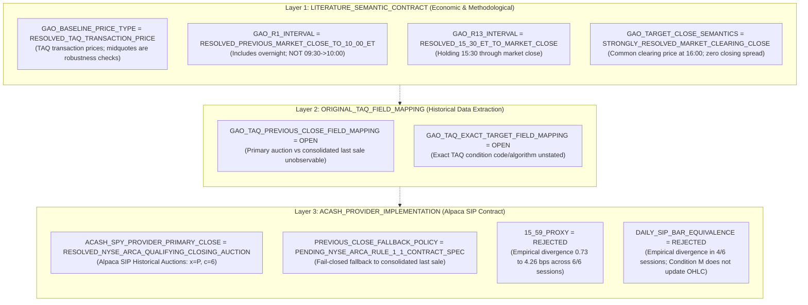
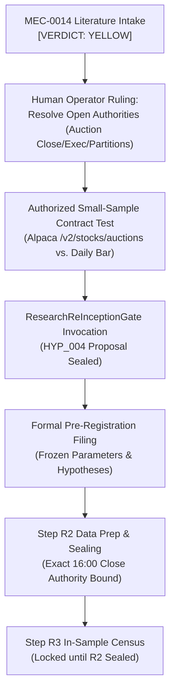

# MEC-0014: Architectural Open Decisions & Literature Q&A Audit

```text
[GOVERNANCE & ARCHITECTURAL INTAKE ARTIFACT]
[TARGET MECHANISM: MEC-0014 MARKET INTRADAY MOMENTUM]
[HYP_004 STATUS: UNBORN / NOT AUTHORIZED]
[RESEARCH READINESS: YELLOW]
```

- **Document ID:** `docs/research/MEC-0014-open-decisions.md`
- **Target Mechanism:** `MEC-0014`
- **Date:** 2026-09-19
- **Governing Standard:** AGENTS.md (Single Canonical Authority & Strict Non-Anticipation)

---

## 1. The Three Critical Open Architectural Decisions

Before any hypothetical `HYP_004` can be proposed or submitted to `ResearchReInceptionGate`, three architectural decisions must be formally ratified by the Human Operator:

### 1. Decision 1: Close Authority & Literature Methodology Contract Freeze

Following the empirical market-data probe and Gao et al. (2018) methodology audit, the relationship between published literature, historical data extraction, and the ACASH provider is frozen across **three strictly separated layers**:



#### Detailed Layer Classifications:
1. **`LITERATURE_SEMANTIC_CONTRACT` (What Gao et al. describe economically):**
   - **`GAO_BASELINE_PRICE_TYPE = RESOLVED_TAQ_TRANSACTION_PRICE`:** Gao et al.'s baseline half-hour return construction uses TAQ transaction-price returns. Bid-to-bid, ask-to-ask, and midquote-to-midquote returns are robustness analyses for microstructure/bid-ask bounce evaluation and must **NOT** be represented as the baseline Gao construction.
   - **`GAO_R1_INTERVAL = RESOLVED_PREVIOUS_MARKET_CLOSE_TO_10_00_ET`:** The first-half-hour predictor explicitly incorporates the overnight component: $r_{1,t} := \ln(P_{10:00, t} / P_{\text{close}, t-1})$. It is *not* merely 09:30 $\to$ 10:00 ET.
   - **`GAO_R13_INTERVAL = RESOLVED_15_30_ET_TO_MARKET_CLOSE`:** The holding interval covers the beginning of the final half-hour through regular market close.
   - **`GAO_TARGET_CLOSE_SEMANTICS = STRONGLY_RESOLVED_MARKET_CLEARING_CLOSE`:** Gao's transaction-cost methodology treats the 16:00 close as a common market-clearing price rather than applying the 15:30 bid/ask spread to the close.
2. **`ORIGINAL_TAQ_FIELD_MAPPING` (Historical TAQ implementation detail):**
   - **`GAO_TAQ_PREVIOUS_CLOSE_FIELD_MAPPING = OPEN`:** The literature establishes a TAQ transaction-price baseline from previous market close, but the accessible methodology does *not* establish whether the original extraction code selected the primary-listing official closing auction, the consolidated final eligible transaction, or another TAQ-derived close.
   - **`GAO_TAQ_EXACT_TARGET_FIELD_MAPPING = OPEN`:** Exact historical TAQ condition codes remain unstated in published texts.
3. **`ACASH_PROVIDER_IMPLEMENTATION` (Alpaca SIP execution contract):**
   - **`ACASH_SPY_PROVIDER_PRIMARY_CLOSE = RESOLVED_NYSE_ARCA_QUALIFYING_CLOSING_AUCTION`:** Qualified Alpaca SIP Historical Auctions record (`x=P, c=6`).
   - **`PREVIOUS_CLOSE_FALLBACK_POLICY = PENDING_NYSE_ARCA_RULE_1_1_CONTRACT_SPEC`:** Fail-closed fallback to most recent eligible consolidated last sale per NYSE Arca Rule 1.1 for sessions lacking a qualifying auction.
   - **`15_59_PROXY = REJECTED`:** 15:59 continuous close is strictly rejected as an official close proxy.
   - **`DAILY_SIP_BAR_EQUIVALENCE = REJECTED`:** Daily SIP bar close and primary closing auction are distinct semantic objects; calling them equivalent is rejected.

---

### 2. Decision 2: `EXECUTION_MAPPING = PARTIALLY_RESOLVED / ACASH CONTRACT OPEN`
- **Status:** The source literature (Gao et al. 2018) contains **both**:
  1. Predictive linear regressions ($r_{13,t} = \alpha + \beta r_{1,t} + \epsilon_t$);
  2. An explicit market-timing strategy translation based on $\text{sign}(r_1)$ (positive $r_1 \implies$ Long 15:30 $\to$ 16:00; negative $r_1 \implies$ Short 15:30 $\to$ 16:00).
- **Core Governance Seam:** While the literature contains both predictive-regression evidence and an explicit market-timing translation, **ACASH has not yet audited whether the original execution, spread, cost, auction, and slippage assumptions map cleanly to the current Alpaca SIP data contract and contemporary execution environment.**
- **Primary Research Architecture:**
  - `MEC-0014A`: Exact predictive-relation econometric replication (OLS slope, $t$-stat, Campbell-Thompson $R^2_{OOS}$).
  - `MEC-0014B`: Exact literature market-timing strategy replication under ACASH friction model.
  - Only after both contracts are understood should the Human Operator decide whether HYP_004 binds to statistical replication, trading replication, or a separate pair of hypotheses.
- **Governing Verdict:** $\mathbf{PARTIALLY\_RESOLVED\ /\ ACASH\ CONTRACT\ OPEN}$.

---

### 3. Decision 3: `HYP_004_PARTITION_POLICY = OPEN`
- **Problem:** How to partition time for a future hypothesis given that 2017–2022 was consumed in HYP_003 and 2023–2026 is certified pristine holdout.
- **Competing Policies:**
  - **Policy 3A (Reuse 2017–2022 as In-Sample for Statistical Replication):** Permissible under AGENTS.md because HYP_003 tested local breakouts, not afternoon momentum. 2023–2026 remains strictly sealed.
  - **Policy 3B (Extended Historical Window):** Fetch 2010–2022 to provide higher statistical power for 30-minute OLS regressions.
  - **Policy 3C (Two-Stage Gated Holdout):** Maintain 2023–2024 as In-Sample/Validation and preserve 2025–2026 as pristine blind holdout.
- **Governing Verdict:** `OPEN`. Awaiting formal Human Operator partition ratification.

---

## 2. Systematic Audit of the 15 Literature Research Questions

### Q1. What exactly is the Gao et al. predictor?
**Answer:** The primary predictor is $r_{1,t}$, defined as the log return from the previous trading day's regular-session market close ($P_{16:00, t-1}$) to 10:00:00 ET on day $t$ ($P_{10:00, t}$). In secondary joint regressions, Gao et al. also include $r_{12,t}$, the return from 15:00:00 to 15:30:00 ET.

### Q2. Does the predictor include overnight return?
**Answer:** **YES.** This is a critical semantic distinction. $r_{1,t}$ is *not* merely the 30-minute return from 09:30 to 10:00 ET. It explicitly spans overnight non-trading hours ($\approx 17.5$ hours). Any implementation calculating $r_1$ solely from 09:30 open to 10:00 close would violate the published literature specification.

### Q3. What exactly is the target interval?
**Answer:** The target interval is $r_{13,t}$, the final 30-minute return of the regular trading session, measured from 15:30:00 ET to 16:00:00 ET (closing cross).

### Q4. What independent replication exists?
**Answer:** Limkriangkrai, Chai, and Zheng (2023, *Pacific-Basin Finance Journal*) independently replicated the US SPY setup over 1996–2013 and confirmed the baseline relationship: $R^2_{IS} \approx 1.7\%$, $R^2_{OOS} \approx 1.7\%$ for $r_1$, and $R^2_{IS} \approx 2.6\%$, $R^2_{OOS} \approx 2.3\%$ for $r_1 + r_{12}$.

### Q5. Is the phenomenon cross-market universal?
**Answer:** **NO.** The APAC evidence demonstrates material cross-market heterogeneity. China and Japan exhibit stronger evidence, South Korea weaker evidence, and Hong Kong/Singapore do not exhibit comparable intraday momentum. Market-structure differences may be candidate explanations, but no single closing-auction mechanism is treated here as an established causal fact.

### Q6. What economic mechanisms have been proposed?
**Answer:**
1. *Infrequent Portfolio Rebalancing (Gao et al.):* Institutions aggregate daily flows and execute large market-on-close rebalancing into peak end-of-day liquidity.
2. *Late-Informed Trading (Gao et al.):* Informed participants wait until the final 30 minutes to trade on morning information when market depth is deepest.
3. *Hedging Demand (Baltussen et al.):* Short-gamma market makers and daily leveraged/inverse ETFs mechanically buy when markets rise and sell when markets fall into the close.

### Q7. What evidence supports gamma hedging?
**Answer:** Baltussen et al. (2021, *JFE*) demonstrated that late-day momentum across 60+ global futures contracts is strongly correlated with options market maker delta-hedging needs and leveraged ETF end-of-day rebalancing mandates. However, ACASH has *not* verified or licensed direct options gamma/GEX data feeds, so gamma remains supportive theory rather than an empirical input.

### Q8. What execution translation is scientifically defensible?
**Answer:** A two-phase translation is the only scientifically defensible path:
- *Phase 1 (MEC-0014A):* Pure statistical replication of the OLS predictive relationship ($r_{13} = \alpha + \beta r_1 + \epsilon$).
- *Phase 2 (MEC-0014B):* Exact literature market-timing strategy entering at 15:30:00 open and exiting at 15:59:59/16:00 close, evaluated under the frozen ACASH friction model (2.6 bps round-trip).

### Q9. What data would be needed to reproduce the published relation?
**Answer:**
1. SPY 1-minute consolidated SIP bars for regular hours (09:30–15:59 ET);
2. Authoritative daily official closing prints ($P_{16:00}$ via Alpaca historical auction endpoints or daily bar close);
3. NYSE CA-1 trading calendar (with early closes excluded);
4. Corporate action adjustment tables (splits/cash dividends).

### Q10. What would ACASH need beyond its existing HYP_003 dataset?
**Answer:** ACASH requires an authoritative source for the **previous-day 16:00 close print** and the **current-day 16:00 close print**, because the `HYP_003` dataset terminates at 15:59:00 ET and excluded the 16:00 closing cross. The qualified Alpaca historical auction endpoint (`x=P, c=6`) resolves this primary close authority for SPY under the ACASH provider contract (`ACASH_SPY_PROVIDER_PRIMARY_CLOSE = RESOLVED_NYSE_ARCA_QUALIFYING_CLOSING_AUCTION`).

### Q11. What parts of the literature are statistical predictability rather than demonstrated after-cost tradability?
**Answer:** The literature contains both predictive-regression evidence and an explicit market-timing translation. However, ACASH has not yet audited whether the original execution, spread, cost, auction, and slippage assumptions map cleanly to the current Alpaca SIP data contract and contemporary execution environment. Tradability after realistic institutional frictions remains unproven in ACASH.

### Q12. What contemporary-decay risk exists?
**Answer:**
1. *Post-Publication Decay:* Gao et al. was published in 2018 using data up to 2013; systematic funds may have arbitraged the gross anomaly over 2018–2026.
2. *Evolution of Options-Market Structure:* Same-day expiring option activity is a contemporary mechanism-risk candidate (`RESEARCH QUESTION / UNVERIFIED IN THIS INTAKE`).
3. *Closing Auction Participation:* Shifting market share between continuous 15:30–15:59 trading and 16:00 closing crosses (`RESEARCH QUESTION / UNVERIFIED IN THIS INTAKE`).

### Q13. What alternative explanations exist?
**Answer:**
1. *Microstructure Bid-Ask Bounce:* Measured positive covariance can be partially distorted by trade classification and midpoint bounce.
2. *Intraday Overreaction / Subsequent Reversal:* Baltussen et al. show that late-day momentum frequently reverses overnight and over subsequent days, suggesting temporary liquidity price pressure rather than fundamental price discovery.
3. *Overnight Fading:* Iwanaga & Sakemoto (2026, *NAJEF*) show overnight returns are faded in the first 30 minutes, meaning $r_1$ combines two opposing forces: overnight sentiment reversal and morning 09:30–10:00 continuation.

### Q14. Which parameters can be justified externally BEFORE looking at ACASH results?
**Answer:**
- Predictor window: Prior close to 10:00:00 ET (Gao et al. 2018; Limkriangkrai et al. 2023).
- Holding window: 15:30:00 to 16:00:00 ET (Gao et al. 2018).
- Optional secondary predictor: 15:00:00 to 15:30:00 ET ($r_{12}$).
- Frictions: 1.6 bps round-trip commission + 1.0 bps round-trip adverse slippage (frozen ACASH standard).
- Asset: `SPY` (primary literature asset).

### Q15. What must remain OPEN before HYP_004 can legally be preregistered?
**Answer:**
1. `PREVIOUS_CLOSE_FALLBACK_POLICY` (formalization of NYSE Arca Rule 1.1 consolidated last-sale fallback for zero-auction sessions; normal primary close authority is `RESOLVED_FOR_SPY_TO_PRIMARY_LISTING_OFFICIAL_CLOSE`);
2. `GAO_TAQ_PREVIOUS_CLOSE_FIELD_MAPPING` & `GAO_TAQ_EXACT_TARGET_FIELD_MAPPING` (unobservable historical TAQ algorithm details preserved as OPEN);
3. `EXECUTION_MAPPING` (MEC-0014A statistical replication vs. MEC-0014B market-timing strategy);
4. `HYP_004_PARTITION_POLICY` (formal date boundaries preserving pristine 2023–2026 holdout);
5. Explicit Human governance pre-registration decision.

---

## 3. Mandatory Preconditions Before Any HYP_004 Inception

To prevent governance bypass, the following gates must be cleared in sequential order:



---

## 4. Final Research Readiness Verdict: **YELLOW**

```text
================================================================================
FINAL VERDICT: YELLOW
================================================================================
Grounding:       Exceptional academic foundation (JFE 2018, JFE 2021).
Replicability:   Verified by independent peer-reviewed literature (PBFJ 2023, NAJEF 2026).
Fatal Blockers Before HYP_004 Can Be Incepted:
  1. Previous-close / auction data contract test (Alpaca /v2/stocks/auctions vs. daily bar).
  2. Exact 15:30-to-close execution and target return semantics.
  3. Replication-vs-trading hypothesis architecture (MEC-0014A vs. MEC-0014B).
  4. HYP_004 partition policy (preserving pristine 2023-2026 holdout).
  5. Explicit Human pre-registration decision.
  6. Formal invocation of ResearchReInceptionGate after all above are resolved.
Next Step:       Present open decisions to Human Operator for governance ruling.
                 DO NOT create HYP_004. DO NOT load market data.
================================================================================
```
