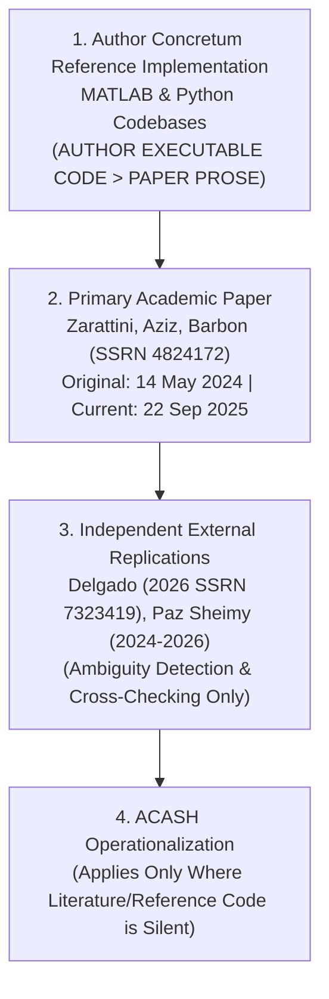

# MEC-0015 Strategy Contract & Implementation Audit

```text
[GOVERNANCE ARTIFACT: STRATEGY CONTRACT AUDIT & RESOLUTION]
[GENERATED: 2026-09-20T17:50:00Z]
[UPDATED: 2026-09-21]
[CANONICAL STARTING HEAD: dd249d54e59c471bfdc98bc3c6d17781cbc2a08e]
[CURRENT STATE: MEC-0015 ALL PRE-INCEPTION CONTRACTS RESOLVED]
[HYP_005: NOT CREATED]
[RESEARCH RE-INCEPTION GATE: NOT INVOKED]
[BACKTEST: NOT STARTED]
[NEW MARKET DATA ACCESS: QUALIFICATION PROBES ONLY (< 2024-05-01)]
[2024-05-01 ONWARD: STRICTLY NOT ACCESSED]
[PAPER: NOT AUTHORIZED]
[LIVE: LOCKED]
[CAPITAL: $0.00]
[NO_REAL_ORDERS: true]
```

- **Document ID:** `docs/research/MEC-0015-strategy-contract-audit.md`
- **Mechanism ID:** `MEC-0015` (Noise-Area Intraday Momentum Strategy)
- **Target Asset:** `SPY` (SPDR S&P 500 ETF Trust)
- **Date:** 2026-09-21
- **Governing Standard:** ACASH AGENTS.md (Zero Unverified Claims; Strict Fail-Closed; Single Canonical Authority)

---

## 1. Executive Summary & Scope Invariants

This audit formalizes the mathematical, operational, and execution contracts for **MEC-0015** based on the primary authors' (Zarattini, Aziz, Barbon) reference implementation (Concretum Group) and independent academic replications (Delgado 2026, Paz Sheimy 2024–2026).

All contractual, econometric, friction, provider data, and operational decisions required prior to registering `HYP_005` have now been resolved and sealed.

| Governance Invariant | Enforced State | Verification Note |
| :--- | :--- | :--- |
| **`HYP_005` Registration** | `NOT_CREATED` | No hypothesis candidate registered in this phase |
| **`ResearchReInceptionGate`** | `NOT_INVOKED` | Inception gate requires explicit human authorization |
| **Empirical Backtest** | `NOT_STARTED` | Zero return or P&L computations executed |
| **Market Data Access** | `QUALIFICATION_PROBES_ONLY` | Authorised probe dates only ($< 2024-05-01$, max date 2024-03-01) |
| **$\ge$ 2024-05-01 Observations** | `NOT_ACCESSED` | Historical holdout / recent data strictly untouched |
| **Paper Trading Authority** | `NOT_AUTHORIZED` | Runtime flag remains `false` |
| **Live Trading Authority** | `LOCKED` | Runtime flag remains `false` |
| **Capital Allocation** | `$0.00` | Zero sovereign capital allocated |
| **Execution Invariant** | `NO_REAL_ORDERS = true` | Real orders strictly prohibited |

---

## 2. Methodology Authority Hierarchy

To prevent conflicting interpretations between paper prose, author code, third-party replications, and internal assumptions, ACASH establishes the following binding authority hierarchy:



1. **Author Reference Implementation (MATLAB Canonical):**
   Concretum Group technical publications and reference implementations:
   - *"Backtesting Riding Intraday Trends in US Markets Using MATLAB"* (Concretum Group).
   - *"Backtesting 7 Years of Free Data: Beat the Market — An Effective Intraday Momentum Strategy for the S&P500 ETF (SPY)"* (Concretum Group).
   *Rule:* Canonical author executable code is the supreme authority. Specifically, MATLAB reference code generated the headline published results. Where Python educational code diverged due to syntax/indexing, MATLAB governs.
2. **Primary Academic Paper:**
   Zarattini, Carlo; Aziz, Andrew; Barbon, Andrea. *"Beat the Market: An Effective Intraday Momentum Strategy for S&P500 ETF (SPY)"*.
   SSRN Working Paper 4824172 / Swiss Finance Institute Research Paper Series No. 24-97.
   - **Originally Posted:** 14 May 2024.
   - **Current SSRN Revision:** 22 September 2025.
3. **Independent Academic Replications:**
   - Delgado, M. (2026). *"Replicating Intraday Momentum in US Equities: Implementation Sensitivity and Regime Dynamics"*, SSRN 7323419.
   - Paz Sheimy (2024–2026). Public Python replication repository.
   *Rule:* Independent replications serve exclusively for ambiguity detection, stress testing, and cross-checking. Under no circumstances may third-party code override explicit author reference implementation.
4. **ACASH Operationalization:**
   Applied strictly where both the academic literature and the author reference code are silent (e.g., realistic broker friction, borrow locate fees, regulatory fee schedules, feed qualification).

---

## 3. Entry Signal Semantics & Conditions

### 3.1. Mathematical Formulation
The author reference implementation evaluates directional signals strictly at 30-minute rebalance epochs using 1-minute `Close` prices and enforces **joint confirmation** with both the Noise Area boundary and the session VWAP.

For decision epoch $t$:
$$\mathbf{LONG}: \quad \text{Close}_t > \text{UpperBand}_t \quad \mathbf{AND} \quad \text{Close}_t > \text{VWAP}_t$$
$$\mathbf{SHORT}: \quad \text{Close}_t < \text{LowerBand}_t \quad \mathbf{AND} \quad \text{Close}_t < \text{VWAP}_t$$
$$\mathbf{FLAT / NEUTRAL}: \quad \text{otherwise} \implies \text{Signal}_t = 0$$

### 3.2. Classifications
- `SIGNAL_PRICE_FIELD = RESOLVED_AUTHOR_REFERENCE_IMPLEMENTATION` (`1-minute Close`)
- `ENTRY_REQUIRES_VWAP_CONFIRMATION = RESOLVED_TRUE`
- `DECISION_FREQUENCY = 30_MINUTES` (`min_from_open % 30 == 0`, `America/New_York` / ET).

---

## 4. Execution Exposure Lag vs. Real Fill Modeling

### 4.1. Literature Reference Backtest Exposure Lag
In the author reference Python/MATLAB implementation:
1. Signal is evaluated at the end of 1-minute bar $t$ (where $t$ corresponds to a 30-minute epoch: `min_from_open % 30 == 0`).
2. The discrete signal is forward-filled across subsequent 1-minute bars until the next epoch.
3. Exposure is lagged by exactly one 1-minute period (`position = signal.shift(1)`).
4. Consequently, a signal calculated at the close of minute $t$ begins generating P&L from minute $t+1$.

$$\text{Exposure}_{t+1} = \text{Signal}_t$$
$$\text{Return}_{t+1} = \text{Exposure}_{t+1} \cdot \left(\frac{\text{Close}_{t+1}}{\text{Close}_t} - 1\right)$$

### 4.2. Real Fill Modeling Contract (RESOLVED)
ACASH decouples theoretical lag from realistic simulated execution:
- `PRIMARY_EXECUTION_MODEL = FIRST_VALID_SIP_NBBO_AT_OR_AFTER_EXECUTION_BOUNDARY`
  - For a BUY: `fill_price = ask`
  - For a SELL: `fill_price = bid`
- Preserves conservative latency ordering: signal depends on completed bar ending at boundary $T$; order fills at the first valid SIP quote arriving at or after $T$.
- Rejected if `bid <= 0`, `ask <= 0`, `ask < bid`, or required NBBO fields are missing.

---

## 5. VWAP Definition & Numerator Convention

### 5.1. Mathematical Specification
Author reference code establishes that the regular-session VWAP is calculated using **Typical Price** $(H+L+C)/3$:
$$\text{TypicalPrice}_i = \frac{\text{High}_i + \text{Low}_i + \text{Close}_i}{3}$$
$$\text{VWAP}_t = \frac{\sum_{i=1}^t \text{TypicalPrice}_i \cdot \text{Volume}_i}{\sum_{i=1}^t \text{Volume}_i}$$
where $i = 1$ is the first 1-minute bar of the regular trading session (09:30–09:31 ET) and $t$ is the current intraday minute. The numerator and denominator reset to zero at the beginning of each regular trading day.

### 5.2. Classifications & Baseline Restrictions
- `VWAP_NUMERATOR = RESOLVED_TYPICAL_PRICE_HLC3`
- `VWAP_SESSION = RESOLVED_REGULAR_SESSION_CUMULATIVE`
- `VWAP_REFERENCE_IMPLEMENTATION_AUTHORITY = AUTHOR_CODE`

*Prohibition:* Close-only VWAP, provider-native synthesized VWAP, and tick SIP VWAP are explicitly rejected for baseline replication.

---

## 6. Noise Area Formulation & Warm-Up Logic

### 6.1. Historical Move Magnitude
For trading day $t$ and intraday minute $m$ (from 09:30 to 16:00 ET):
$$\text{move\_open}[t, m] = \left| \frac{\text{Close}[t, m]}{\text{Open}[t, 09:30]} - 1 \right|$$

### 6.2. Lookback & Leakage Prevention
For each minute-of-day $m$, the expected noise volatility $\sigma_{\text{open}}[t, m]$ is calculated across the preceding 14 completed trading days:
$$\sigma_{\text{open}}[t, m] = \frac{1}{14} \sum_{i=1}^{14} \text{move\_open}[t-i, m]$$
Current session observations MUST NOT enter the calculation:
$$\text{NOISE\_AREA\_CURRENT\_SESSION\_LEAKAGE = PROHIBITED}$$

### 6.3. Warm-Up Policy Resolution (RESOLVED)
- **Ratification:** `NOISE_AREA_WARMUP_POLICY = REQUIRE_FULL_14_PRIOR_COMPLETED_SESSIONS`.
- Baseline ACASH calculation must NOT emit a Noise Area value until all 14 prior completed sessions exist.
- Author Python: `.rolling(window=14, min_periods=13).mean().shift(1)` is preserved as `AUTHOR_CODE_WARMUP_VARIANT = MIN_PERIODS_13` but excluded from the baseline ACASH `HYP_005` specification.
- *Reason:* Nominal literature rule is strictly 14 sessions; deterministic, conservative, eliminates library-specific early warmup behavior.

---

## 7. Dividend Treatment for Noise Area Bands

### 7.1. Author Implementation Anchor Formula
The author reference code explicitly adjusts the previous close for current-day cash dividends:
$$\text{prev\_close\_adjusted} = \text{Close}[t-1, 16:00] - \text{dividend}[t]$$
$$\text{UpperAnchor}[t] = \max(\text{Open}[t, 09:30], \text{prev\_close\_adjusted})$$
$$\text{LowerAnchor}[t] = \min(\text{Open}[t, 09:30], \text{prev\_close\_adjusted})$$

The Noise Area boundaries at minute $m$ are:
$$\text{UpperBand}[t, m] = \text{UpperAnchor}[t] \cdot (1 + \sigma_{\text{open}}[t, m])$$
$$\text{LowerBand}[t, m] = \text{LowerAnchor}[t] \cdot (1 - \sigma_{\text{open}}[t, m])$$

### 7.2. Provider Contract & Fail-Closed Invariant (RESOLVED)
- Alpaca corporate-actions endpoint (`/v1/corporate-actions`) qualified for historical cash dividends (`types=cash_dividend`, `data_quality=complete`).
- Classification:
  - `DIVIDEND_PROVIDER_MAPPING = QUALIFIED_HISTORICAL_COMPLETE_SNAPSHOT`
  - `DIVIDEND_POINT_IN_TIME_VINTAGE = NOT_GUARANTEED_BY_PROVIDER`
- Fail-closed contract: If an ex-date dividend required by strategy is absent or ambiguous, raise `DATA_CONTRACT_EXCLUSION`. Never assume dividend = 0 under uncertainty.

---

## 8. Trailing Stop & Rebalance Logic

1. **Stop Evaluation Frequency:** `STOP_EVALUATION_FREQUENCY = RESOLVED_30_MINUTE_DECISION_EPOCHS`.
2. **Flat & Flip Transitions:**
   - $\text{Signal}_t = 0 \implies$ `FLAT_SIGNAL_AT_REBALANCE_CLOSES_POSITION = RESOLVED_AUTHOR_IMPLEMENTATION`.
   - $\text{Signal}_t = -\text{Signal}_{t-1} \implies$ `OPPOSITE_SIGNAL_FLIPS_POSITION = RESOLVED_AUTHOR_IMPLEMENTATION`.
3. **Forced EOD Flat:** Forced flat at 16:00 ET. Strictly zero overnight inventory.

---

## 9. Dynamic Volatility Position Sizing

$$\text{Shares}_t = \text{round}\left( \frac{\text{AUM}_{t-1}}{\text{Open}[t, 09:30]} \cdot \min\left(4.0, \frac{\sigma_{\text{target}}}{\sigma_{\text{realized}, t}}\right), 0 \right)$$
- `TARGET_DAILY_VOL = 0.02` (2.0% daily volatility)
- `MAX_LEVERAGE_MULTIPLIER = 4.0` (4.0× leverage cap)
- `SIZING_PRICE = SESSION_OPEN` (`Open[t, 09:30]`)
- `SHARE_ROUNDING = NEAREST_INTEGER_AUTHOR_IMPLEMENTATION` (`round(..., 0)`)
- `AUM_REFERENCE = PRIOR_DAY_ENDING_AUM`

---

## 10. Daily Volatility Targeting Exact Definition (RESOLVED)

### 10.1. Mathematical Contract
Auditing both canonical author implementations reveals:
- Canonical author MATLAB reference executes `std(spy_return(d-15:d-1))` on 1-indexed arrays $\implies$ exactly **15 daily simple returns**, ending at yesterday ($d-1$), $ddof=1$.
- Canonical author Python tutorial copied `spy_ret.iloc[d-15:d-1]`. Due to Python's 0-indexed half-open slice semantics, this accidentally omitted yesterday ($d-1$), yielding 14 returns ending at $d-2$.
- Authority Hierarchy: Author MATLAB code is the canonical research engine that produced the published paper results.

### 10.2. Resolved Parameters
- `DAILY_VOL_RETURN_TYPE = SIMPLE_CLOSE_TO_CLOSE` ($\text{Close}_t / \text{Close}_{t-1} - 1$)
- `DAILY_VOL_WINDOW_RETURNS_COUNT = 15`
- `DAILY_VOL_DDOF = 1`
- `DAILY_VOL_SHIFT = 1` (ends at $t-1$, yesterday)
- `DAILY_VOL_CURRENT_DAY_INCLUDED = false` (current day strictly excluded)
- `DAILY_VOL_DIVIDEND_TREATMENT = UNADJUSTED_CLOSE_TO_CLOSE`
- `AUTHOR_IMPLEMENTATION_DIVERGENCE = MATLAB_CANONICAL_AUTHORITY`

---

## 11. Spread, Slippage & Friction Contracts (RESOLVED)

### 11.1. Bid-Ask Spread Crossing
- `ACASH_SPREAD_MODEL = EMBEDDED_IN_NBBO_FILL`
  - BUY executed at Ask, SELL executed at Bid.
  - `EXPLICIT_HALF_SPREAD_DEDUCTION_WITH_NBBO = PROHIBITED` (Zero additional half-spread deduction).

### 11.2. Slippage Model
- `BASELINE_STANDALONE_SLIPPAGE = $0.001/share` per executed side (adverse direction):
  - BUY: $\text{Ask} + \$0.001$
  - SELL: $\text{Bid} - \$0.001$

### 11.3. Commission Model
- Literature baseline commission: $\max(\$0.35, \$0.0035 \times \text{shares})$ per order side.

### 11.4. 2× Friction Stress Specification
- Retain observed NBBO bid/ask fill.
- Multiply all non-spread explicit costs (commissions, regulatory fees) by 2.0.
- Apply an additional adverse slippage stress component equal to one observed half-spread per side:
  $$\text{Adverse Slippage Stress} = \frac{\text{Ask} - \text{Bid}}{2}$$

---

## 12. Regulatory Fees, Short Borrow & Operational Policies (RESOLVED)

### 12.1. Regulatory Fees (SEC Section 31 & FINRA TAF)
- `ACASH_REGULATORY_FEE_MODEL = RESOLVED_HISTORICAL_SCHEDULES`.
- Sourced and pinned across 2007-05-01 through 2024-04-30:
  - SEC Section 31: `docs/research/manifests/MEC-0015-sec31-fee-schedule.json` (25 rate intervals, covered sales only).
  - FINRA TAF: `docs/research/manifests/MEC-0015-finra-taf-fee-schedule.json` (5 rate tiers, per-trade caps, covered sales only).
- Implemented in `src/acash/execution/regulatory_fees.py` using pure Decimal arithmetic.

### 12.2. Short Borrow Mechanics
- `SHORT_LOCATE_ASSUMPTION = SPY_AVAILABLE_UNLESS_PROVIDER_OR_BROKER_MARKS_UNAVAILABLE`.
- `HISTORICAL_BORROW_RATE = UNOBSERVED`.
- Baseline borrow cost: 0 bps.
- Mandatory Stress: 50 bps annualized pro-rated to intraday holding duration, included in the mandatory 2× friction stress test. Long-only substitution prohibited.

### 12.3. Early-Close Policy
- `EARLY_CLOSE_POLICY = EXCLUDE_NON_STANDARD_REGULAR_SESSIONS`.
- Non-standard sessions (closing at 13:00 ET, 210 minutes) are strictly excluded from baseline `HYP_005`.

---

## 13. Historical Partitions & Acceptance Gates (RESOLVED)

### 13.1. Partitions
- M1: 2007-05-01 through 2024-04-30 (`PUBLICATION_EXPOSED_REPLICATION_SAMPLE`).
- M2: 2024-05-01 through last publicly exposed date (`PUBLICLY_EXPOSED_POST_PUBLICATION_STRESS_SAMPLE`).
- M3: `PROSPECTIVE_ONLY` (genuine out-of-sample holdout).

### 13.2. Pre-Declared Acceptance Gates
- **M1 Replication Gates:**
  - `NET_TOTAL_RETURN > 0`
  - `NET_SHARPE >= 1.00` (annualized)
  - `MAX_DRAWDOWN <= 30%`
  - `2X_FRICTION_STRESS_NET_RETURN > 0`
  - `2X_FRICTION_STRESS_NET_SHARPE >= 0.75`
  - `MINIMUM_COMPLETED_TRADES = 100` (`HUMAN_RATIFIED_SAMPLE_ADEQUACY_FLOOR`)
- **M2 Continuation Gates:**
  - `NET_TOTAL_RETURN > 0`
  - `NET_SHARPE >= 0.50` (annualized)
  - `MAX_DRAWDOWN <= 35%`
  - `2X_FRICTION_STRESS_TOTAL_RETURN >= 0`
  - `NO_CATASTROPHIC_RISK_FAILURE = ZERO`

---

## 14. Master Resolution Status Table

| Strategy Specification | Resolution Status | Canonical Value / Governing Authority |
| :--- | :--- | :--- |
| **Signal Price Field** | `RESOLVED` | 1-minute `Close` (Author Reference Code) |
| **Entry VWAP Confirmation** | `RESOLVED` | Mandatory (`Close > VWAP` for Long, `Close < VWAP` for Short) |
| **VWAP Definition** | `RESOLVED` | Cumulative RTH Typical Price $(H+L+C)/3$ (Daily Reset) |
| **Noise Area Move Formula** | `RESOLVED` | $\text{move}[t,m] = \|\text{Close}[t,m]/\text{Open}[t,09:30] - 1\|$ (14 prior sessions) |
| **Noise Area Current Session** | `RESOLVED` | Strictly prohibited (`shift(1)`) |
| **Dividend Adjustment for Bands** | `RESOLVED` | $\text{prev\_close} - \text{dividend}[t]$ applied to gap anchor |
| **Rebalance Epoch Frequency** | `RESOLVED` | 30 minutes (`min_from_open % 30 == 0`, ET timezone) |
| **Execution Exposure Lag** | `RESOLVED` | 1-minute lag (`signal.shift(1)` P&L from $t+1$) |
| **Target Daily Volatility** | `RESOLVED` | $2.0\%$ ($\sigma_{\text{target}} = 0.02$) |
| **Maximum Leverage Cap** | `RESOLVED` | $4.0\times$ |
| **Sizing Reference Price** | `RESOLVED` | Session Open (`Open[t, 09:30]`) |
| **Share Sizing Rounding** | `RESOLVED` | Nearest integer (`round(..., 0)`) |
| **Literature Commission** | `RESOLVED` | $\max(\$0.35, \$0.0035 \times \text{shares})$ |
| **Position State at Rebalance** | `RESOLVED` | Flat signal closes position; opposite signal flips |
| **Noise Area Warm-Up Cardinality**| `RESOLVED` | Strict 14 full completed sessions (`min_periods=13` excluded) |
| **Daily Volatility Window** | `RESOLVED` | Canonical MATLAB: 15 simple returns, `ddof=1`, shift 1 |
| **ACASH Execution Fill Price** | `RESOLVED` | First valid SIP NBBO at or after execution boundary |
| **ACASH Spread Model** | `RESOLVED` | Embedded in NBBO fill; explicit half-spread prohibited |
| **ACASH Standalone Slippage** | `RESOLVED` | Baseline standalone $\$0.001$/share per side |
| **ACASH Regulatory Fees** | `RESOLVED` | Time-varying SEC Section 31 & FINRA TAF schedules pinned |
| **Short Borrow Model** | `RESOLVED` | 0 bps baseline + 50 bps annualized mandatory stress |
| **Early-Close Session Policy** | `RESOLVED` | Strict exclusion of non-standard 210-minute sessions |
| **Provider Data Qualification** | `RESOLVED` | Alpaca SIP bars, quotes, and dividends qualified |
| **Partition Governance** | `RESOLVED` | M1 (2007–2024), M2 (2024–exposed), M3 (prospective) |
| **Economic Acceptance Gates** | `RESOLVED` | Pre-declared M1 & M2 gates frozen; minimum trades = 100 |

---

## 15. Audit Sign-Off & Next Actions

1. **HYP_005 Status:** `NOT_CREATED`.
2. **Backtest Status:** `NOT_STARTED`.
3. **Strategy P&L:** `NOT_COMPUTED`.
4. **Market Data Status:** Qualification probes complete; zero access $\ge 2024-05-01$.
5. **Pre-Inception Blockers Remaining:** `0`.
6. **HYP_005 Readiness:** `READY_FOR_HUMAN_INCEPTION_AUTHORIZATION`.
7. **Expected Next Action:** `CREATE_AND_SEAL_HYP_005_R1` under separate human authorization.
