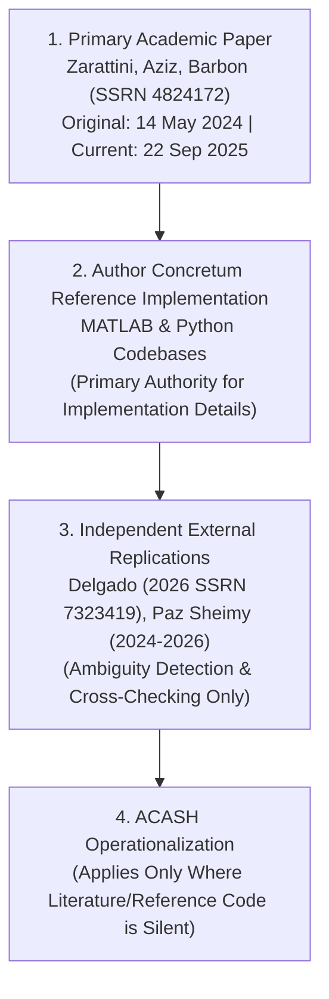

# MEC-0015 Strategy Contract & Implementation Audit

```text
[GOVERNANCE ARTIFACT: STRATEGY CONTRACT AUDIT & RESOLUTION]
[GENERATED: 2026-09-20T17:50:00Z]
[CANONICAL STARTING HEAD: 97e20d7f64a75b63bcf9a309a993fd96bd3d45f6]
[CURRENT STATE: MEC-0015 CONTRACT RESOLUTION]
[HYP_005: NOT CREATED]
[RESEARCH RE-INCEPTION GATE: NOT INVOKED]
[BACKTEST: NOT STARTED]
[NEW MARKET DATA ACCESS: ZERO]
[2023-2026 MARKET OBSERVATIONS: STRICTLY NOT ACCESSED]
[PAPER: NOT AUTHORIZED]
[LIVE: LOCKED]
[CAPITAL: $0.00]
[NO_REAL_ORDERS: true]
```

- **Document ID:** `docs/research/MEC-0015-strategy-contract-audit.md`
- **Mechanism ID:** `MEC-0015` (Noise-Area Intraday Momentum Strategy)
- **Target Asset:** `SPY` (SPDR S&P 500 ETF Trust)
- **Date:** 2026-09-20
- **Governing Standard:** ACASH AGENTS.md (Zero Unverified Claims; Strict Fail-Closed; Single Canonical Authority)

---

## 1. Executive Summary & Scope Invariants

This audit formalizes the mathematical, operational, and execution contracts for **MEC-0015** based on the primary authors' (Zarattini, Aziz, Barbon) reference implementation (Concretum Group) and independent academic replications (Delgado 2026, Paz Sheimy 2024–2026).

This resolution addresses ambiguities identified during the initial research intake, freezes literature-canonical specifications, separates backtest replication exposure lag from live execution fill modeling, and defines the remaining blockers required before registering `HYP_005`.

| Governance Invariant | Enforced State | Verification Note |
| :--- | :--- | :--- |
| **`HYP_005` Registration** | `NOT_CREATED` | No hypothesis candidate registered in this phase |
| **`ResearchReInceptionGate`** | `NOT_INVOKED` | Inception gate blocked until open contracts resolve |
| **Empirical Backtest** | `NOT_STARTED` | Zero return or P&L computations executed |
| **Market Data Access** | `ZERO` | No network queries to Alpaca or any external provider |
| **2023–2026 Observations** | `NOT_ACCESSED` | Historical holdout / recent data strictly untouched |
| **Paper Trading Authority** | `NOT_AUTHORIZED` | Runtime flag remains `false` |
| **Live Trading Authority** | `LOCKED` | Runtime flag remains `false` |
| **Capital Allocation** | `$0.00` | Zero sovereign capital allocated |
| **Execution Invariant** | `NO_REAL_ORDERS = true` | Real orders strictly prohibited |

---

## 2. Methodology Authority Hierarchy

To prevent conflicting interpretations between paper prose, author code, third-party replications, and internal assumptions, ACASH establishes the following binding authority hierarchy:



1. **Primary Academic Paper:**
   Zarattini, Carlo; Aziz, Andrew; Barbon, Andrea. *"Beat the Market: An Effective Intraday Momentum Strategy for S&P500 ETF (SPY)"*.
   SSRN Working Paper 4824172 / Swiss Finance Institute Research Paper Series No. 24-97.
   - **Originally Posted:** 14 May 2024.
   - **Current SSRN Revision:** 22 September 2025.
   *(Note: The paper must be cited distinguishing the original publication date from the current revision).*
2. **Author Reference Implementation:**
   Concretum Group technical publications and reference implementations:
   - *"Backtesting Riding Intraday Trends in US Markets Using MATLAB"* (Concretum Group).
   - *"Backtesting 7 Years of Free Data: Beat the Market — An Effective Intraday Momentum Strategy for the S&P500 ETF (SPY)"* (Concretum Group).
   *Rule:* Author reference code is the primary canonical authority for operationalization details omitted from the paper prose.
3. **Independent Academic Replications:**
   - Delgado, M. (2026). *"Replicating Intraday Momentum in US Equities: Implementation Sensitivity and Regime Dynamics"*, SSRN 7323419.
   - Paz Sheimy (2024–2026). Public Python replication repository.
   *Rule:* Independent replications serve exclusively for ambiguity detection, stress testing, and cross-checking. Under no circumstances may third-party code override explicit author reference implementation.
4. **ACASH Operationalization:**
   Applied strictly where both the academic literature and the author reference code are silent (e.g., realistic broker friction, borrow locate fees, regulatory fee schedules, feed qualification).

---

## 3. Entry Signal Semantics & Conditions

### 3.1. Mathematical Formulation
The author reference implementation evaluates directional signals strictly at 30-minute rebalance epochs using 1-minute `Close` prices and enforces **joint confirmation** with both the Noise Area boundary and the session VWAP.

For decision epoch $t$:
$$\mathbf{LONG}: \quad \text{Close}_t > \text{UpperBand}_t \quad \mathbf{AND} \quad \text{Close}_t > \text{VWAP}_t$$
$$\mathbf{SHORT}: \quad \text{Close}_t < \text{LowerBand}_t \quad \mathbf{AND} \quad \text{Close}_t < \text{VWAP}_t$$
$$\mathbf{FLAT / NEUTRAL}: \quad \text{otherwise} \implies \text{Signal}_t = 0$$

### 3.2. Intake Wording Correction
The initial intake described entry as a band breakout alone, treating VWAP solely as an exit/trailing stop mechanism. Author reference code and the 2026 Delgado replication establish that **VWAP confirmation is required at entry**. A band breach without VWAP confirmation results in $\text{Signal}_t = 0$.

### 3.3. Classifications
- `SIGNAL_PRICE_FIELD = RESOLVED_AUTHOR_REFERENCE_IMPLEMENTATION` (`1-minute Close`)
- `ENTRY_REQUIRES_VWAP_CONFIRMATION = RESOLVED_TRUE`

---

## 4. Execution Exposure Lag vs. Real Fill Modeling

### 4.1. Literature Reference Backtest Exposure Lag
In the author reference Python/MATLAB implementation:
1. Signal is evaluated at the end of 1-minute bar $t$ (where $t$ corresponds to a 30-minute epoch: `min_from_open % 30 == 0`).
2. The discrete signal is forward-filled across subsequent 1-minute bars until the next epoch.
3. Exposure is lagged by exactly one 1-minute period (`position = signal.shift(1)`).
4. Consequently, a signal calculated at the close of minute $t$ begins generating P&L from minute $t+1$.

$$\text{Exposure}_{t+1} = \text{Signal}_t$$
$$\text{Return}_{t+1} = \text{Exposure}_{t+1} \cdot \left(\frac{\text{Close}_{t+1}}{\text{Close}_t} - 1\right)$$

### 4.2. Separation of Contracts
ACASH strictly decouples the theoretical backtest exposure lag from real-world order execution:
- `SIGNAL_OBSERVATION = ONE_MINUTE_CLOSE_AT_DECISION_EPOCH`
- `EXECUTION_EFFECTIVE_EXPOSURE = NEXT_ONE_MINUTE_PERIOD`
- `REFERENCE_BACKTEST_EXPOSURE_LAG = RESOLVED_1_MINUTE`
- `ACASH_EXECUTION_FILL_PRICE_MODEL = OPEN` *(Still open for empirical trading; real orders fill at next bar Open or prevailing NBBO quote, not synthetic lagged close).*

---

## 5. VWAP Definition & Numerator Convention

### 5.1. Mathematical Specification
Author reference code establishes that the regular-session VWAP is calculated using **Typical Price** $(H+L+C)/3$:
$$\text{TypicalPrice}_i = \frac{\text{High}_i + \text{Low}_i + \text{Close}_i}{3}$$
$$\text{VWAP}_t = \frac{\sum_{i=1}^t \text{TypicalPrice}_i \cdot \text{Volume}_i}{\sum_{i=1}^t \text{Volume}_i}$$
where $i = 1$ is the first 1-minute bar of the regular trading session (09:30–09:31 ET) and $t$ is the current intraday minute. The numerator and denominator reset to zero at the beginning of each regular trading day.

### 5.2. Classifications & Baseline Restrictions
- `VWAP_NUMERATOR = RESOLVED_TYPICAL_PRICE_HLC3`
- `VWAP_SESSION = RESOLVED_REGULAR_SESSION_CUMULATIVE`
- `VWAP_REFERENCE_IMPLEMENTATION_AUTHORITY = AUTHOR_CODE`

*Prohibition:* Close-only VWAP, provider-native synthesized VWAP, and tick SIP VWAP are explicitly rejected for baseline replication. They may only be evaluated as secondary robustness specifications under separate human authorization.

---

## 6. Noise Area Formulation & Warm-Up Logic

### 6.1. Historical Move Magnitude
For trading day $t$ and intraday minute $m$ (from 09:30 to 16:00 ET):
$$\text{move\_open}[t, m] = \left| \frac{\text{Close}[t, m]}{\text{Open}[t, 09:30]} - 1 \right|$$

### 6.2. Lookback & Leakage Prevention
For each minute-of-day $m$, the expected noise volatility $\sigma_{\text{open}}[t, m]$ is calculated across the preceding 14 completed trading days:
$$\sigma_{\text{open}}[t, m] = \frac{1}{14} \sum_{i=1}^{14} \text{move\_open}[t-i, m]$$
Current session observations MUST NOT enter the calculation:
$$\text{NOISE\_AREA\_CURRENT\_SESSION\_LEAKAGE = PROHIBITED}$$
In author Python: `.rolling(window=14, min_periods=13).mean().shift(1)`.

### 6.3. Warm-Up Detail Distinction
- Nominal literature lookback is strictly 14 sessions (`NOISE_AREA_LOOKBACK = 14_PRIOR_SESSIONS`).
- The author implementation uses `min_periods=13`, which acts as an early 1-session warm-up acceleration.
- Decision on whether ACASH baseline permits 13-observation acceleration or enforces strict 14 full sessions remains:
  `NOISE_AREA_WARMUP_MIN_PERIODS = OPEN_NARROW_DECISION`.

---

## 7. Dividend Treatment for Noise Area Bands

### 7.1. Author Implementation Anchor Formula
The author reference code explicitly adjusts the previous close for current-day cash dividends:
$$\text{prev\_close\_adjusted} = \text{Close}[t-1, 16:00] - \text{dividend}[t]$$
$$\text{UpperBand}[t, m] = \max(\text{Open}[t, 09:30], \text{prev\_close\_adjusted}) \cdot (1 + \sigma_{\text{open}}[t, m])$$
$$\text{LowerBand}[t, m] = \min(\text{Open}[t, 09:30], \text{prev\_close\_adjusted}) \cdot (1 - \sigma_{\text{open}}[t, m])$$

### 7.2. Materiality & Scope
- `BAND_PREVIOUS_CLOSE_DIVIDEND_TREATMENT = RESOLVED_AUTHOR_IMPLEMENTATION`
- This adjustment applies strictly to the gap anchor price ($\text{prev\_close\_adjusted}$) on ex-dividend dates.
- It does **NOT** apply total-return backward adjustments to intraday price series, which must remain unadjusted to preserve real execution boundaries.

---

## 8. Rebalance Frequency & Timestamp Convention

### 8.1. Decision Epochs
Author reference code specifies `trade_freq = 30` with decision minutes selected by:
$$\text{min\_from\_open} \pmod{30} == 0$$
- `DECISION_FREQUENCY = 30_MINUTES`
- Timezone authority: `America/New_York` / `ET` (accounting dynamically for EST and EDT).
- Conceptual epoch sequence:
  $$\{10:00, 10:30, 11:00, 11:30, 12:00, 12:30, 13:00, 13:30, 14:00, 14:30, 15:00, 15:30\} \text{ ET}$$
- Exact bar-indexing offset (whether bar timestamp reflects bar open or bar close) must be verified against the provider bar schema before freezing canonical bar timestamp strings.

---

## 9. Position State, Trailing Stops & Flips

### 9.1. Evaluated at Rebalance Epochs
Because signals are sampled at 30-minute rebalance epochs and forward-filled:
- Position holding conditions are evaluated strictly at 30-minute decision epochs, not continuously every minute.
- If at an epoch the price drops back inside the bands or violates VWAP, $\text{Signal}_t = 0$, which closes the open position at the next exposure transition.
- If at an epoch the price satisfies the opposite entry condition, the signal flips from $+1$ to $-1$ (or vice versa).
- At 16:00 ET, all open positions are forced flat (zero overnight inventory).

### 9.2. Classifications
- `STOP_EVALUATION_FREQUENCY = RESOLVED_30_MINUTE_DECISION_EPOCHS`
- `INTRAEPOCH_CONTINUOUS_STOP = NOT_BASELINE`
- `FLAT_SIGNAL_AT_REBALANCE_CLOSES_POSITION = RESOLVED_AUTHOR_IMPLEMENTATION`
- `OPPOSITE_SIGNAL_FLIPS_POSITION = RESOLVED_AUTHOR_IMPLEMENTATION`

---

## 10. Dynamic Volatility Sizing Basics

### 10.1. Formula & Parameters
Author reference implementation sizes positions daily at the market open:
$$\text{shares}_t = \text{round}\left(\frac{\text{AUM}_{t-1}}{\text{Open}[t, 09:30]} \cdot \min\left(4.0, \frac{\sigma_{\text{target}}}{\sigma_{\text{realized}, t}}\right), 0\right)$$
- `TARGET_DAILY_VOL = 0.02` (2.0% daily volatility)
- `MAX_LEVERAGE_MULTIPLIER = 4` (4.0× maximum gross leverage)
- `SIZING_PRICE = SESSION_OPEN`
- `SHARE_ROUNDING = NEAREST_INTEGER_AUTHOR_IMPLEMENTATION` (`round(..., 0)`)
- `AUM_REFERENCE = PRIOR_DAY_ENDING_AUM`

*Governance Notice:* This sizing formula defines the academic replication contract only. It does NOT authorize leverage or trading capital in ACASH.

---

## 11. Daily Volatility Window Exact Audit (Blocker)

### 11.1. Resolved Elements
- `DAILY_VOL_RETURN_TYPE = SIMPLE_CLOSE_TO_CLOSE`
  $$\text{daily\_ret}_t = \frac{\text{Close}_t}{\text{Close}_{t-1}} - 1$$
- `CURRENT_DAY_RETURN_IN_VOL = PROHIBITED` (Only completed historical sessions $t-1, t-2, \dots$ may enter).

### 11.2. Unresolved Cardinality & Normalization
The author literature text and code snippets contain inconsistencies regarding:
1. Exact cardinality: whether 14 or 15 daily returns enter the rolling window.
2. Degree of freedom normalization: pandas `std(ddof=1)` vs MATLAB default `std(0)` ($N-1$ vs $N$).
3. Dividend adjustment in the daily return series.
- Classification: `DAILY_VOL_WINDOW_EXACT_CARDINALITY = OPEN_BLOCKER`.

---

## 12. Corrected Spread & Tick Terminology

### 12.1. Correction of Erroneous Intake Text
The initial intake referenced a "$0.01 half-spread". Under standard US equity market structure for securities priced $> \$1.00$:
- The minimum quotation increment (tick size) under SEC Rule 612 is $\$0.01$.
- In a one-tick market (typical for SPY during RTH):
  $$\text{Full Spread} = \text{Ask} - \text{Bid} = \$0.01/\text{share}$$
  $$\text{Half-Spread (Cost per Share)} = \frac{\text{Full Spread}}{2} = \$0.005/\text{share}$$
- Claiming a $\$0.01$ half-spread implies a $\$0.02$ bid-ask spread, which is double the actual minimum tick.

### 12.2. SEC Rule 612 Amendments Status
The SEC adopted amendments to Rule 612 creating a $\$0.005$ minimum quoting increment for qualifying NMS stocks with an average quoted spread of $\$0.015$ or less. However, as of September 2026, the compliance date has been formally delayed to the first business day of **November 2026**. Historical and current backtests must not assume sub-penny quotation prior to effective implementation.

### 12.3. Policy Classification
- `FIXED_MINIMUM_HALF_SPREAD = NOT_A_VALID_UNIVERSAL_COST_MODEL`
- `ACASH_SPREAD_MODEL = OPEN_BLOCKER` (Must use contemporaneous NBBO quote widths or an explicitly audited conservative proxy).

---

## 13. Literature Friction & Slippage Model Audit

### 13.1. Author Reference Commission Model
The author implementation establishes:
$$\text{Commission} = \max(\$0.35, \$0.0035 \times \text{shares}) \quad \text{per order execution}$$
- Per-share rate: $\$0.0035$/share.
- Minimum ticket charge: $\$0.35$/order.

### 13.2. Slippage Separation
- `PAPER_REPORTED_SLIPPAGE = 0.0010` ($\$0.001$/share reported in the text of Zarattini et al.).
- `AUTHOR_REFERENCE_CODE_APPLIED_SLIPPAGE = NONE_STANDALONE` (The reference code models commissions and execution delay, but does not add a standalone continuous $\$0.001$ deduction).
- ACASH will not conflate paper-reported text approximations with the reference codebase.

---

## 14. Regulatory Fees, Short Borrow & Operational Blockers

### 14.1. Regulatory Fees (SEC Section 31 & FINRA TAF)
- `REGULATORY_FEES = TIME_VARYING`
- SEC Section 31 sell-side fees vary by fiscal year (e.g. FY2026 rate effective 4 April 2026 is $\$20.60$ per $\$1,000,000$ of principal; earlier years had rates ranging from $\$5.10$ to $\$31.20$).
- Hardcoding contemporary rates across 2007–2024 is mathematically invalid.
- `ACASH_REGULATORY_FEE_MODEL = OPEN_BLOCKER`.

### 14.2. Short Availability & Borrow Fees
- SPY is generally Easy-To-Borrow (ETB), but realistic institutional backtesting must confirm locate policies and intraday borrow fees.
- Long-only substitution is **PROHIBITED** as an undeclared baseline replacement.
- `SHORT_AVAILABILITY_MODEL = OPEN`, `BORROW_FEE_MODEL = OPEN`.

### 14.3. Early-Close Policy
- Non-standard sessions (closing at 13:00 ET) are not addressed in literature.
- `EARLY_CLOSE_POLICY = OPEN_BLOCKER`.

### 14.4. Provider Data Contract
- Alpaca SIP 1-minute bars must be qualified for RTH filtering, volume completeness vs IQFeed, missing-minute handling, and split/dividend boundaries.
- `ALPACA_SIP_BAR_MAPPING = UNQUALIFIED`.

---

## 15. Historical Partitioning & Contamination Governance

- The Zarattini et al. paper sampled data through April 2024 (SSRN revision Sept 2025).
- Public replications (Paz Sheimy, Delgado) exposed performance through March 2026.
- ACASH previously evaluated SPY in 2017–2022 (`HYP_003`, `HYP_004`).
- **Conclusion:** 2023–2026 **CANNOT** be claimed as a pristine, unexposed external holdout for this mechanism.
- `MEC_0015_PARTITION_POLICY = OPEN_MAJOR_GOVERNANCE_DECISION`.

---

## 16. Edge-Decay Evidence & Nuance

The intake's initial summary of edge decay has been audited and refined:
- **Paz Sheimy (2024–2026):** Pooled OOS Sharpe dropped to $\approx 0.39$ across May 2024–March 2026.
- **Delgado (2026 SSRN 7323419):** Demonstrates that performance remained robust through approximately August 2025 before experiencing sharp degradation. Delgado argues the evidence reflects **regime-specific deterioration** (e.g., shifts in intraday volatility clustering and opening gap distribution) rather than immediate post-publication market arbitrage.
- **Classification:**
  - `CURRENT_EDGE_PERSISTENCE = NOT_ESTABLISHED`
  - `RECENT_EDGE_DEGRADATION_EVIDENCE = MATERIAL`
  - `IMMEDIATE_POST_PUBLICATION_DECAY = NOT_ESTABLISHED`

---

## 17. Master Resolution Status Table

| Strategy Specification | Resolution Status | Canonical Value / Governing Authority |
| :--- | :--- | :--- |
| **Signal Price Field** | `RESOLVED` | 1-minute `Close` (Author Reference Code) |
| **Entry VWAP Confirmation** | `RESOLVED` | Mandatory (`Close > VWAP` for Long, `Close < VWAP` for Short) |
| **VWAP Definition** | `RESOLVED` | Cumulative RTH Typical Price $(H+L+C)/3$ (Daily Reset) |
| **Noise Area Move Formula** | `RESOLVED` | $\text{move}[t,m] = \|\text{Close}[t,m]/\text{Open}[t,09:30] - 1\|$ (14 prior sessions) |
| **Noise Area Current Session** | `RESOLVED` | Strictly prohibited (`shift(1)`) |
| **Dividend Adjustment for Bands** | `RESOLVED` | $\text{prev\_close} - \text{dividend}[t]$ applied to gap anchor |
| **Rebalance Epoch Frequency** | `RESOLVED` | 30 minutes (`min_from_open % 30 == 0`, ET timezone) |
| **Execution Exposure Lag** | `RESOLVED` | 1-minute lag (`signal.shift(1)` P&L from $t+1$) |
| **Target Daily Volatility** | `RESOLVED` | $2.0\%$ ($\sigma_{\text{target}} = 0.02$) |
| **Maximum Leverage Cap** | `RESOLVED` | $4.0\times$ |
| **Sizing Reference Price** | `RESOLVED` | Session Open (`Open[t, 09:30]`) |
| **Share Sizing Rounding** | `RESOLVED` | Nearest integer (`round(..., 0)`) |
| **Literature Commission** | `RESOLVED` | $\max(\$0.35, \$0.0035 \times \text{shares})$ |
| **Position State at Rebalance** | `RESOLVED` | Flat signal closes position; opposite signal flips |
| **Noise Area Warm-Up Cardinality**| `OPEN` | 13 min_periods warm-up vs strict 14 full sessions |
| **Daily Volatility Window** | `OPEN_BLOCKER` | 14 vs 15 days; pandas `ddof=1` vs MATLAB default |
| **ACASH Execution Fill Price** | `OPEN` | Next bar Open vs NBBO quote simulation |
| **ACASH Spread Model** | `OPEN_BLOCKER` | Historical NBBO spread vs conservative proxy |
| **ACASH Regulatory Fees** | `OPEN_BLOCKER` | Time-varying SEC Section 31 & FINRA TAF schedules |
| **Short Borrow Model** | `OPEN` | SPY locate availability & intraday borrow fee |
| **Early-Close Session Policy** | `OPEN_BLOCKER` | Quarantine/exclusion vs truncated schedule |
| **Provider Data Qualification** | `OPEN_BLOCKER` | Alpaca SIP 1-minute bars unqualified |
| **Partition Governance** | `OPEN_BLOCKER` | Historical partition design under publication exposure |
| **Economic Acceptance Gates** | `OPEN_BLOCKER` | Net Sharpe, Max Drawdown, and Cost-Stress ratios |

---

## 18. Audit Sign-Off & Next Actions

1. **HYP_005 Status:** `NOT_CREATED`.
2. **Backtest Status:** `NOT_STARTED`.
3. **Market Data Status:** `ZERO_ACCESS`.
4. **Next Governance Action:** Resolve remaining provider qualification, realistic friction, partition, and economic acceptance contracts before registering `HYP_005`.
